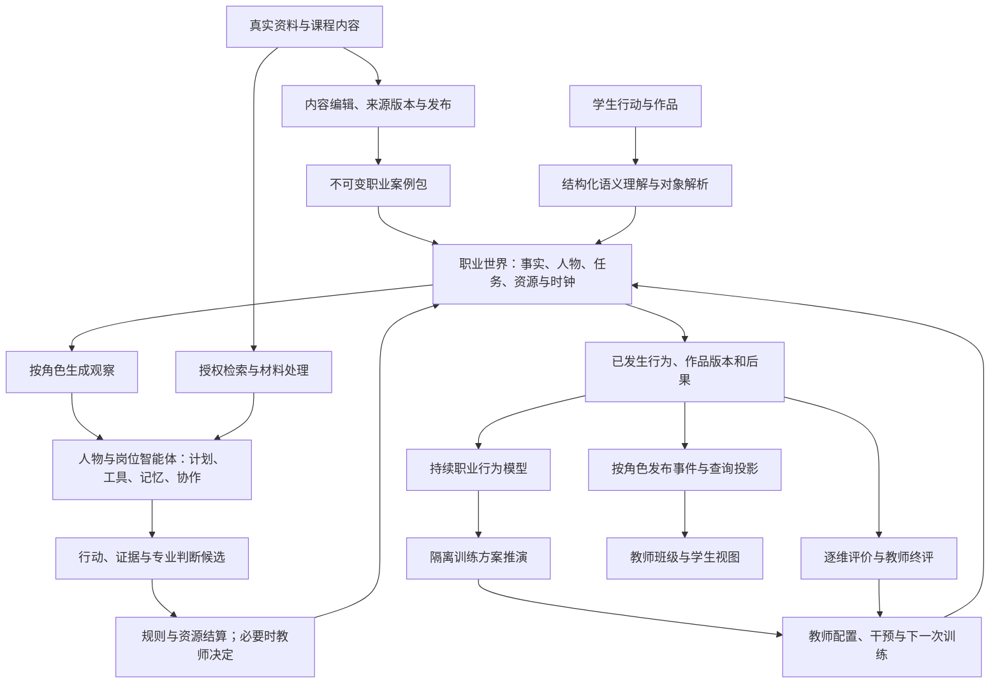
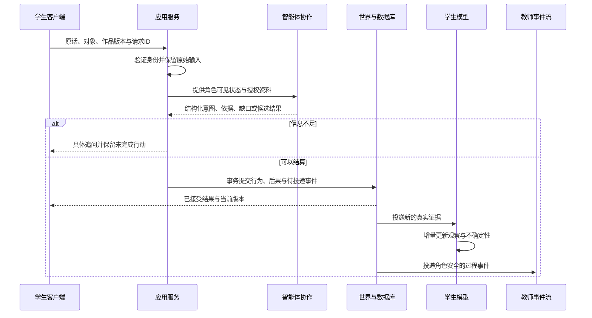
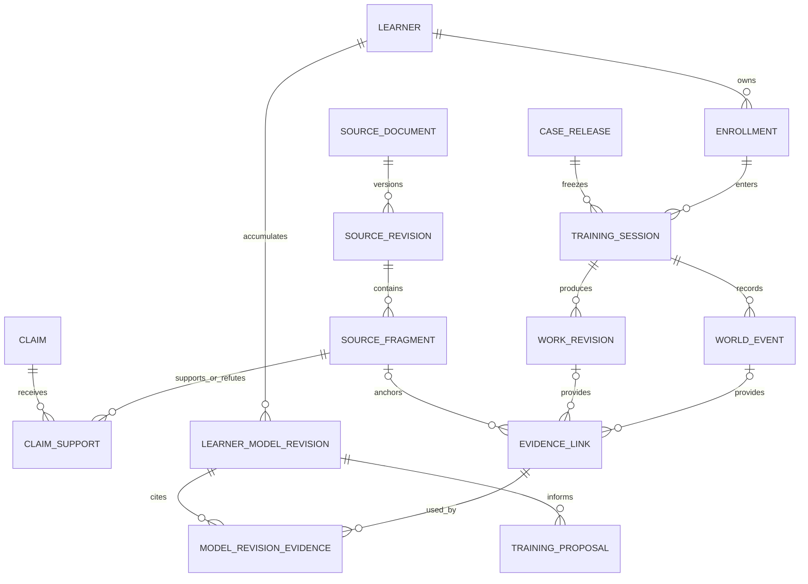

# 岗链智训 — 技术实现审查与冲刺架构

> 该文档隶属于[开发者文档](../01-开发者文档.md#0-先看结论)，保存2026-09-07的审查结论与当时目标设计。正文中的“当前”“本轮”和缺陷状态按该时点理解；此后实现与修复见[当前手册](../01-开发者文档.md)，新一轮讨论和实施安排见[项目规划](../02-项目规划.md)。
>
> **文档梗概**：对照真实职业世界、智能体群、学生职业行为分身、内容与数据库、教师管理五条开发主线，区分当前事实、已确认产品方向和待实现技术方案。
>
> **具体规划法则**：代码与可复现行为决定现状；2026-09-07 用户授权主控重审旧方案并制定本体开发冲刺计划。旧架构图只作参考，不冻结节点数量、技术栈和交互步骤。本文不把目标图当成已实现能力。
>
> **最后一次更新时间**：2026-09-12（明确历史适用范围，保留原审查与设计）
>
> **更新者**：主控与系统架构组

## 目录

- [1. 审查范围与结论](#1-审查范围与结论)
- [2. 当前实现与问题](#2-当前实现与问题)
- [3. 目标技术架构（待实现）](#3-目标技术架构待实现)
- [4. 内容与数据库设计（待实现）](#4-内容与数据库设计待实现)
- [5. 世界与智能体机制（待实现）](#5-世界与智能体机制待实现)
- [6. 学生模型与教师系统（待实现）](#6-学生模型与教师系统待实现)
- [7. 修改与迁移顺序](#7-修改与迁移顺序)
- [8. 本轮验证与限制](#8-本轮验证与限制)

## 1. 审查范围与结论

### 1.1 基线与范围

审查基线是 `010c761`（V2.4.9），当前工作分支为 `演示`，运行包仍为 `1.0.0`。开始时唯一未跟踪内容是用户的 `演示/学生到教师全流程视频/`，本轮不编辑该目录，也不变更业务代码或数据库。

本轮沿以下链路检查实现、调用方、持久化及现有测试：

| 范围 | 主要入口 | 本轮关注 |
| --- | --- | --- |
| 世界运行 | `packages/world-core/src/simulation-v3.ts`、`autonomous-world-v4.ts`、`dialogue-episode-v4.ts` | 动作、人物状态、规则、后果及跨轮记忆 |
| 智能体协作 | `packages/agent-orchestrator/src/semantic-action-v4.ts`、`grounded-collaboration-v4.ts`、`simulation-orchestrator-v3.ts` | 理解、候选、分工、引用、实际自由度 |
| 模型与工具 | `packages/model-gateway`、`packages/iflytek-adapter`、`apps/api/src/flagship-model-adapters-v4.ts` | 模型端口、调用、能力范围与降级 |
| 内容与素材 | `packages/course-content`、`packages/context-engine`、`packages/media-processing` | 内容深度、来源结构、检索、采集与多模态分析 |
| 评价与学习者 | `apps/api/src/flagship-assessment-v4.ts`、`learner-adaptation-v4.ts` | 证据起源、评价依据、跨场身份、持续更新与预测目标 |
| API 与客户端接线 | `apps/api/src/server.ts`、`apps/web/src/v2/gateway.tsx` 及对应页面 | 后端能力是否被实际消费，课程/作品聚合是否同源 |
| 存储与恢复 | JSONL/JsonFile Store、`business-operation-receipt.ts`、`recovery-checkpoint-coordinator.ts` | 一致性、查询、迁移和真实教学数据的承接 |

这是架构及关键链路审查，不宣称逐行证明所有源码正确。本轮不新增 PPT、视频、视觉重绘、用户试点或研究级消融任务；工程测试仍用于确认代码行为。

### 1.2 总体判断

当前项目是**具有较完整控制与追溯底座、由内容配置和规则驱动的岗位仿真原型**。已经存在多智能体执行、受控模型端口、不可变作品、教师复核及第二场创建。主要短板不是缺更多后台节点，而是：

1. 部分核心能力止于后端，跨模块事实尚未完全贯通。
2. 自然语言理解、协作立场和事件路径过度依赖预先固定的模式。
3. 内容可追溯性较强，但真实材料摄入、职业知识覆盖和内容维护能力不足。
4. 学生模型偏向终评之后的单场摘要，尚不是持续更新的职业行为分身。
5. 文件持久化适合当前单进程演示；面向班级管理、跨场学习与资料检索，需要正式数据模型。

技术深度与最终可交互表达同等重要。本周期先完成机制与真实接口接线；美术、演示包装和用户体验研究留到后续。

## 2. 当前实现与问题

### 2.1 已确认缺陷与接线断点

优先级含义：P1 为会影响当前训练正确性、证据语义或主要功能的缺陷；P2 为限制目标能力的结构问题。能力缺口不等同于当前代码运行错误。

| 编号 | 优先级/类别 | 当前事实与后果 | 代码证据 | 承接任务 |
| --- | --- | --- | --- | --- |
| R01 | P1 / 接线缺陷 | V4 后端有开始、读取、继续多轮对话接口；Web 没有对应方法、回合状态或接口调用，仍走单次 `semantic-actions`。后端对话测试通过不能证明学生使用到多轮能力。 | [客户端 gateway](../../apps/web/src/v2/gateway.tsx)、[对话路由](../../apps/api/src/flagship-experience-v4-routes.ts)、[学生现场](../../apps/web/src/v2/pages/student-flagship-world-v4.tsx) | GAME-007 |
| R02 | P1 / 语义缺陷 | 安全正则匹配不处理否定范围，明确拒绝违规的表述仍会被拒绝。对话意图和信号也先用关键词筛选合法规则，大模型选择器无法恢复已被过滤的正确理解。 | [安全规则与分类](../../packages/agent-orchestrator/src/semantic-action-v4.ts)、[对话分类](../../packages/world-core/src/dialogue-episode-v4.ts)、[岗位质量规则](../../packages/agent-orchestrator/src/xunpu-action-policy-v3.ts) | AI-023 |
| R03 | P1 / 证据语义缺陷 | `decisionRationale.trim() || ...` 在学生没有填写理由时自动生成完整标准理由，然后作为决定提交。行为选择是真实的，但文字并非学生自述；现有记录未表达这一区别。 | [decideSuggestion](../../apps/web/src/v2/pages/student-flagship-world-v4.tsx) | DATA-004 |
| R04 | P1 / 聚合缺陷 | 旗舰送审只安排 `refresh_assessment_projection`，课程旧进度与作品集使用另一套 Enrollment/Portfolio 记录；存在旗舰已送审而课程仍为 0/7、作品集为空的已记录结果。 | [submitRevision](../../apps/api/src/flagship-student-work-v3.ts)、[课程服务](../../apps/api/src/course-learning.ts)、[历史实测记录](../03-开发历史.md#120-v249-全功能架构与交互演示手册记录) | BE-006 |
| R05 | P1 / 状态接线缺陷 | 多轮对话保存了承诺与已披露事实；自主 NPC 的权威同步却始终传 `npcCommitmentUpdates: []`、`npcLocalFactUpdates: []`。自主决策观察虽有这些字段，公共桥并未把对话事实送进去。 | [synchronizeAutonomy](../../apps/api/src/flagship-experience-v4.ts)、[NPC 观察与初态](../../packages/world-core/src/autonomous-world-v4.ts) | GAME-007、AI-026 |
| R06 | P1 / 预测语义缺陷 | 第二场校准用“动词是否在预置集合内”的比例代表观察结果，与 `predictedSuccessProbability` 相减；一旦有动作就可进入 `calibration_completed`，后续整场表现不再进入此分支。动词匹配不能证明核验成功、采访质量或学习效果。 | [calibrateIfReady](../../apps/api/src/learner-adaptation-v4.ts) | AI-024、AI-029 |

R02 的本轮直接函数探针（当前构建产物）结果：

| 输入 | 实际输出 | 应有处理 |
| --- | --- | --- |
| 我拒绝冒充游客，我会先说明学生记者身份并申请采访。 | `refused`，理由为隐瞒身份/偷拍 | 理解为拒绝冒充，继续解析申请采访；缺少信息时具体追问 |
| 我不会伪造官方通知，我要核对原始文件。 | `refused`，理由为伪造权威来源 | 理解为核查原始文件；对象不明确时追问 |
| 不要删除 AI 标识，请保留标识后送审。 | `refused`，理由为删除 AI 标识 | 理解为保留标识并送审；作品版本未选时追问 |

修复不能只为这三句话增加例外。安全判断需要区分“本人要做的动作、否定、引用他人的说法、提问及假设”，并对实际执行权限另作确定性检查。

### 2.2 技术能力与内容缺口

| 编号 | 类别 | 当前边界 | 需要改变的内容 | 承接任务 |
| --- | --- | --- | --- | --- |
| R07 | P2 / 协作深度 | Grounded 服务内置三套 recipe，每套固定五步、角色和 position；模型要求保持 `expectedPosition` 并回传全部指定引用，主要做受限改写。 | 智能体依据各自可见证据形成判断，允许支持、质疑、补证、撤回；根据尚未解决的事实争议调度下一步。 | AI-026 |
| R08 | P2 / 世界自由度 | 位置和阶段依赖已处理事件类型，意图匹配第一个固定事件模板，动作再由模板构造；存在跨多类动作的默认开场回退。NPC 主要在发布的有限计划中选择。 | 以任务前置条件、资源、人物可达性和世界状态开放可组合动作；保留有限规则边界，支持多条有效路径与任务重排。 | GAME-008 |
| R09 | P2 / 学生连续性 | 评价主体哈希来自 `learnerActorId + learnerBindingId`；适配 Store 按来源 session 保存，模型在终评后创建六维状态与四候选，不提供跨课程稳定学习者档案。 | 用稳定学习者 ID 关联多场证据；拆开实时形成性观察、教师终评与训练预测，不能因换绑定建立互不关联的学生。 | DATA-006、AI-028 |
| R10 | P2 / 评价深度 | 确定性初判把结构化证据映射为 38/70/88 三档；部分证据间接来自关键词产生的世界后果。模型质量端口存在，但不能由后果变量反证学生说法必然正确。 | 保留原话/原始材料、来源片段和作品差异，依据行为锚点逐维分析；缺失能力维度继续显示未知，不能补造成完成或高分。 | DATA-004、AI-027 |
| R11 | P2 / 内容供给 | 四课程 25 节、基础 60 条知识、28 个不同来源 URL；旗舰另有 12 条扩展知识，形成 36 项旗舰复核对象。基础知识与扩展知识有不同结构，均不能把记录 hash 当成原始文档字节 hash。 | 统一来源版本与专业知识结构；补任务技能映射、案例材料、专业正反例、作品与评语，支持编辑和发布。 | DATA-005、CONTENT-012/013 |
| R12 | P2 / 检索与材料 | 通用 RAG 为词项检索；旗舰 Grounded 按预置 claim/knowledge 引用构造观察。知识来源多为元数据和教学改写，素材台只处理已登记资产。 | 建立资料摄入、正文分段、可阅读定位、中文混合检索和任务证据绑定，支持课程内新增资料。 | BE-007、AI-025 |
| R13 | P2 / 多模态边界 | 有实际文件加工、图像、音频频谱和视频关键帧；当前未装配授权 ASR，频谱不能提供采访语义，离散关键帧不能代表完整视频理解。 | 建立明确的 OCR/ASR/时间片段分析端口，先处理语义转写与素材证据定位，再扩展时序分析。 | BE-007、AI-027 |
| R14 | P2 / 数据与教学服务 | 存在多种 JSONL/JsonFile Store、目录租约、CAS 和恢复机制；身份入口为 DemoAuthService，尚非正式班级身份体系；教师课程页面只读，缺少完整资料维护与教学配置服务、班级聚合和持续事件订阅。 | 引入关系数据库，完成课程发布/班级组织/教学指令与基于游标的角色事件流。 | DATA-005/006、BE-008 |
| R15 | P2 / 职责复杂度 | `server.ts` 6161 行、旧 `WorldEngine` 8788 行、V4 适配服务 2035 行；六组合根存在，但具体装配和大量生命周期仍集中在 server。新旧运行时并存。 | 按本轮变更提取装配函数和领域服务；活动会话使用唯一指定运行时，旧版本显式兼容。不为减少行数另造一套运行内核。 | 随 DATA-006、GAME-008、BE-008 实施 |

R07 入口为 [Grounded 服务](../../packages/agent-orchestrator/src/grounded-collaboration-v4.ts) 与 [模型适配器](../../apps/api/src/flagship-model-adapters-v4.ts)；R08 入口为 [内容运行时定义](../../packages/course-content/src/xunpu-flagship-v4/runtime-definition.ts) 与 [编译器](../../apps/api/src/flagship-world-runtime-v4.ts)；R13 入口为 [多模态准备](../../apps/api/src/flagship-multimodal-quality-v4.ts)。

### 2.3 已有实现应保留什么

- 继续沿 contracts 维护公共 Schema、角色安全投影、版本和引用约束。
- 保留世界结算的唯一权威、教师终裁、作品版本、源引用及 Outbox 恢复语义。
- 保留模型供应方适配层；根据能力选择文本、视觉、语音和检索供应方，不把星辰接入作为准入条件。
- 保留当前内容作为首批种子与历史版本，而不是假称其已经过外部专业复核。
- 复用已有测试，增加针对本轮根因的回归；不再用节点数量、字段数量或测试总数代替功能完成判断。

## 3. 目标技术架构（待实现）

### 3.1 产品目标与旧图取舍

用户已确认的方向是：学生像在职业游戏世界中一样自主完成融媒体工作，平台实时采集资料与操作，智能体群协同理解和审查，教师便捷组织教学并观察学生职业行为分身。技术与可交互表达共同承接这个目标。

旧图中的鉴权、调度、任务、知识与记忆、治理、评价、教师终裁继续保留。以下内容不再作为新设计上限：精确十四节点、固定五步协作、固定四候选、所有能力绑定蟳埔标识，以及必须等整场终评后才观察学生。

### 3.2 目标关系图

下图全部表示**待实现目标**；现有模块的复用范围见第 2.3 节。

原始资料、学习者预测、模型候选和权威世界事实分别具有明确身份。资料进入库仅意味着可追溯和可使用，不意味着其全部主张已经核实；学生的预测行为也不能进入正式训练行为记录。

### 3.3 单次行动目标链

用户原话只保存一次；抽取出的意图、事实判断和系统建议各自引用它。客户端不能补写“学生理由”，后台也不能用模型摘要覆盖原文。耗时模型、OCR/ASR 和材料处理作为可恢复任务运行，事务中不等待远端模型。

## 4. 内容与数据库设计（待实现）

### 4.1 选择与权威边界

本轮目标采用 **PostgreSQL + 独立文件对象存储**。先建内容资料库，再迁移活动运行数据。继续使用现有 Store/服务接口承接迁移，不新增一套绕开 WorldEngine 的数据库写入路径。模型推理只消费授权投影，不直接连接数据库。

关系、状态、版本和检索元数据使用明确列；复杂不可变事件载荷可使用 JSONB。正文片段和结构化知识保存在库中；原始 PDF、图像、音视频放对象存储，数据库保存 object key、真实字节 hash、大小及媒体类型。DATA-005 候选已把这一边界落成 `packages/content-store/src/migrations.ts` 与 `SqlContentStore`，但仍待主控装配、QA 验收和后续活动数据迁移。

事务、外键和唯一约束参考 [PostgreSQL 事务](https://www.postgresql.org/docs/current/tutorial-transactions.html) 与 [约束说明](https://www.postgresql.org/docs/current/ddl-constraints.html)。向量检索可使用 [pgvector](https://github.com/pgvector/pgvector)，但它只是候选召回组件，不能代替权限、来源版本、引用定位或专业核验。

### 4.2 数据域

这是目标模型，表名用于说明职责；对 DATA-005 已实现的内容域，`packages/content-store/src/migrations.ts` 是字段定义的权威来源，尚未实现的教学组织、世界运行、评价与投递域仍是目标设计。

| 数据域 | 目标实体 | 关键关联与约束 |
| --- | --- | --- |
| 专业与课程 | professional_group、job_role、job_task、competency、course、task_competency | 一个首要岗位；任务、能力、量规和教学依据可相互定位，不将拟定专业群写成院校既有认定 |
| 来源资料 | source_document、source_revision、source_fragment、asset、usage_grant | 来源版本不可变；片段绑定页码/时间码/坐标；授权按用途和对象绑定；真实源字节 hash 与教学条目 hash 分开 |
| 知识与案例 | knowledge_item、knowledge_revision、claim_support、case_draft、case_release、content_review | 知识可支持/反驳具体主张；草稿与发布版分开；复核针对确定版本，不原地把全部记录改成 verified |
| 教学组织 | principal、learner、class、membership、enrollment、training_session | learner 是稳定身份；membership/binding 是授权关系；每场训练冻结 release |
| 世界与协作 | world_event、world_snapshot、npc_memory、npc_commitment、agent_task、agent_run、agent_message | 同一 session 的版本顺序唯一；事件与幂等键唯一；NPC 承诺与局部事实绑定产生它们的对话/事件 |
| 作品与证据 | work、work_revision、work_source_link、behavior_event、evidence_link | 每份作品有父版本；证据明确 human/model/system/simulation 来源，模型建议与人类决定分别记录 |
| 评价与成长 | rubric_release、criterion_observation、assessment_decision、learner_model_revision、training_proposal、prediction_outcome | 形成性观察与终评分开；模型修订绑定证据游标；预测与结果使用同一个指标定义和观察窗口 |
| 投递与恢复 | operation_receipt、outbox、projection_checkpoint、processing_job | 业务写入与 Outbox 同事务；投递允许重复且消费幂等；长任务具有取消、失败与恢复状态 |

证据链接至少具有一类实际来源；图中的事件、作品和来源片段为可选来源关系，不要求每项证据同时拥有三种来源。模型版本通过关联记录引用具体证据，便于追溯与幂等更新。

### 4.3 必须实现的数据约束

- 保留现有 release、session、revision、event 和 evidence ID；迁移映射显式登记，旧版本引用不可静默重签。
- `UNIQUE(session_id, state_version)`、作用域内 request ID 唯一、`UNIQUE(work_id, revision_number)`，模型修订与事件游标有明确唯一键。
- 常用检索按 course/release/status 过滤；学生记录按 learner/session 查询；班级按 membership 聚合。对应外键、过滤与游标列建立索引，使用 EXPLAIN 验证目标查询，不声称仅加索引就满足容量。
- 使用有上限的连接池；每次业务事务尽量短。远端模型和媒体处理不占用长事务。
- 两个有效观点不因冲突被强制合并。事实状态至少能表达待核、已核、争议和已失效；引用保留立场与适用条件。
- 对已经发布的内容执行新版本发布；既有活动会话继续引用旧发布版。迁移完成后移除新活动路径的重复可写源，历史只读/恢复适配按实际需要保留。

### 4.4 内容深度与广度

不采用“再堆几百条知识”的策略。先统一现有基础 60 条与旗舰新增 12 条的结构，逐条登记：专业结论、适用条件、例外、来源片段、正反例、关联任务、错误后果及复核状态。

内容分三层：

1. **岗位通用层**：选题价值、信源分级、采访提问、现场记录、事实核查、叙事编辑、多平台适配、授权与标识、发布更正、协作交接。
2. **完整案例层**：旗舰蟳埔包含任务工单、相互冲突的信源、采访资料、素材台账、作品版本、编辑意见及发布后回应。每一段剧情明确训练什么能力、需要哪份资料、允许哪些合理取舍。
3. **迁移层**：从已存在的村超、暴雨、AI 内容治理中选一个完整异题案例，证明同一规则与智能体内核能换资料运行；其余课程继续保留真实完成边界，不宣称同等深度。

浙传资源用于提供教学材料、原始作品、采编工作过程和专业审查。用户已说明资源可协调，但本轮未取得其具体文件入口；公开来源整理、数据模型、导入工具和案例结构可先推进。具体校内素材到位后按同一摄入链接入，不伪造采访、教师意见、授权文件或实际合作关系。

### 4.5 材料采集与检索

摄入链为：登记来源/授权 → 原件入库 → 解析文本或 OCR/ASR → 页码/时间码片段 → 教学知识与主张关系 → 复核/发布 → 授权检索。

中文检索先结合词项、同义词、岗位/任务标签与语义召回，再重排并校验原片段。查询和模型输出均绑定课程发布与可见范围；结果必须可读、可打开定位、可引用。缺失、冲突或仅有过期资料时返回实际缺口，不生成不存在的来源。

支持来源 URL 摄入时，服务端限制可访问地址、重定向、大小、类型和超时；不能让资料导入变成访问内网服务的通道。处理用户文档时，文档内指令只作为材料文本，不改变 Agent 权限。

### 4.6 DATA-005 工作区实现（待验收）

DATA-005 已在独立 `codex/team-data-v25` 工作树形成候选实现，当前边界如下：

- migration 建立 `source_document`、`source_revision`、`source_fragment`、`usage_grant`、`knowledge_item`、`knowledge_revision`、`claim`、`claim_support`、`asset`、`processing_job`、`case_draft`、`case_release`、`content_review` 及迁移表，并为常用课程/状态/外键查询建立索引。
- `SqlContentStore` 对写入使用短事务和幂等键；来源版本、知识修订和发布版本冲突时失败关闭，不覆盖旧记录。PGlite 适用于本地持久运行，SQL client 端口保持独立 PostgreSQL 兼容方向。
- seed 导入来自现有 60 条基础知识与 12 条旗舰扩展。教学摘要仅作为 `paraphrase/metadata-only` 派生片段参与定位；没有原件时 `sourceByteHash` 保持 `null`，不把教学条目 hash 冒充原件字节 hash。共享来源版本不把课程字段原地覆盖，课程 grant 与片段关联共同限制检索可见性。
- API 层只提供注册/处理/检索端口并注入授权回调；当前不声称真实 PDF/OCR/ASR 已接通，也不声称公共 `server.ts`、Web、BE-007 或 AI-025 已完成。
- 实现入口：[content-store](../../packages/content-store/src/store.ts)、[migration](../../packages/content-store/src/migrations.ts)、[API content-library](../../apps/api/src/content-library.ts)；定向证据见 [content-store tests](../../packages/content-store/test/content-store.test.ts)。

## 5. 世界与智能体机制（待实现）

### 5.1 可组合职业世界

世界需要维护可操作对象、任务依赖、人物可达性、材料状态、资源/时间、公开事实与局部信念。剧情阶段只是教学组织信息，不能替代所有行动的业务前置条件。

把 `意图 → 第一个固定事件模板` 改为 `意图和对象 → 校验当前条件 → 可执行动作计划 → 规则结算`。学生可以先访谈再核查，也可以先读材料再预约；每条路径的时间、证据与关系代价由规则解释。无法执行的动作返回具体缺口，并保持未完成意图以便补充，不回退成无关开场动作。

### 5.2 人物与智能体职责

- 模板登记职责、工具、输入/输出类型和订阅；人物实例登记目标、已知事实、关系、记忆与承诺。解除“人物姓名等于岗位模板”的显示与执行混用。
- 人物对话保留议题、已回答内容、承诺、授权范围和撤回；结算后把这些状态同步到 NPC 下一次决策观察。
- 计划可以包含若干有依赖的步骤；模型提出计划、引用和理由，世界检查每一步能否执行。允许等待、撤回或重排，不要求所有智能体每轮发言。
- 使用现有 agent-runtime/orchestrator 的强类型端口逐步实现，不引入第二套同职责通用 Agent 框架。

### 5.3 围绕真实争议协作

协作以未解决的主张和材料缺口开始，而不是为了展示而固定走五步。编辑、核查、权利和运营智能体分别读取职责所需资料，可提出不同判断；调度器依据缺口派发补充任务，达到充分性或轮次/时间预算后给出仍存在的分歧与可执行建议。

不再预写本轮所有 position 和全部必须引用的列表。服务端规定可访问材料、合法引用和不可越过的权限，模型负责从允许材料中选择相关证据并作专业判断。候选提交前验证事实支持、引用定位和状态变化；教师拥有高风险决定与最终评价权。

### 5.4 模型与媒体工具

沿现有模型网关增加明确的能力绑定：文本推理、视觉理解、OCR、ASR、嵌入/重排。厂商可配置；不以任一供应方为参赛前置。

材料解析、知识检索、事实核查和作品评价应使用同一资料 ID 与版本。ASR 返回时间片段和不确定处，OCR 返回页码/位置；频谱仅用于音频技术质量观察，关键帧仅用于对应时点视觉证据。缺少能力时明确返回缺失任务，不宣称完整听过或看过素材。

## 6. 学生模型与教师系统（待实现）

### 6.1 三类记录分开

| 记录 | 何时更新 | 可以用于什么 |
| --- | --- | --- |
| 形成性职业行为观察 | 新行动、采访轮次、资料核验或作品修订后 | 呈现具体表现、缺口和变化，支持教师及时指导；维度可以未知 |
| 教师确认的能力评价 | 已具备必要证据并完成复核时 | 正式评分、评语、课程达成情况；绑定量规和作品版本 |
| 训练方案预测 | 基于当前学生模型推演候选任务时 | 推荐任务、难度与支架；不作为真实行为或成绩 |

“职业人格模型”在产品方向上对应可变的职业行为分身。维度应围绕信源判断、采访沟通、编辑独立性、风险取舍、协作和纠错策略，而非由一次选择推断稳定心理人格。

### 6.2 连续学生模型

由稳定 learner ID 聚合跨场证据；班级和场次权限分别校验。每次修订记录来源证据游标、支持/反证、适用任务、观察时间、支架条件和不确定性。教师终评与学生申诉可以修订判断，不能改写原始事件。

先采用可解释的证据更新规则与模型辅助解释，明确规则权重是产品策略，不宣称已经获得经验校准。相同证据重复投递不增加置信度；新证据与旧结论冲突时允许回到不确定状态。不能因为某一维度暂缺证据就停止展示其他已有观察。

### 6.3 学生分身与训练方案推演

模型先表达学生在具体条件下的行动偏好和能力边界，再在隔离沙箱中试跑候选任务路径；沙箱可复用世界结算器，但预测事件与正式训练事件完全分离。

预测必须说明目标是什么，例如在规定时间内形成两条独立有效来源、遵守明确采访条件、完成有依据的稿件修订。真实结果必须用同一目标与观察窗口计算；窗口不足就保持待观察，不用一次动作动词替代成功率。当前四候选可作为首批种子，后续候选由能力缺口与任务库生成。

### 6.4 教师服务与实时反馈

教师服务须使用正式登录、角色及班级成员关系，演示 profile 切换仅用于隔离演示环境。教师可以配置课程案例、材料可见性、任务目标、难度/时限和量规，发布后建立班级与训练场次；能暂停、恢复、追加资料或干预任务。改变事实与规则的指令必须留业务事件，不能直接改数据库状态。

基于 Outbox 生成按角色授权的增量事件流，采用 SSE + 游标补取；断线后恢复缺失事件，并以权威查询重建当前投影。教师端消费班级异常、学生卡点、作品变化、行为模型变化与待复核事项。该服务建设属于本体开发；视觉布局和演示呈现不在本周期展开。

## 7. 修改与迁移顺序

1. 先修原始行为证据、课程作品聚合、否定语义、多轮接线和 NPC 承诺同步。
2. 建内容数据库与资料摄入，统一课程、知识、片段和素材引用；完善岗位映射与案例包。
3. 在有真实材料的基础上深化世界任务图、智能体协作与作品评价。
4. 迁移活动运行数据与稳定学生身份，再实现持续行为模型、训练推演和教师事件流。

每个阶段保留可以运行的完整链。新增能力按契约兼容情况发布版本，不能先把整个仓库统一改名为 V5。数据库迁移以旧数据读取、ID/内容 hash 一致、幂等导入、切换后单一写入源为准；新发布回放比较应证明业务语义保持。

上述顺序为当时冲刺设计；已完成结果见[ABC交付记录](../03-开发历史.md#abc-20260908-delivery)，未完成方向见[后续保留任务](../02-项目规划.md#5-后续保留任务)。新的执行顺序由后续讨论确定。

## 8. 本轮验证与限制

本轮已直接复现 R02 的三条否定误判，并核对 R01/R03/R05/R06 的调用方与状态写入位置。R04 同时有当前代码路径与历史真实运行记录支撑；本轮未重新开启浏览器课程全流程。

| 本轮检查 | 实际结果 | 证明范围 |
| --- | --- | --- |
| `corepack pnpm typecheck:packages` | 13 工作区通过，退出码 0 | 当前源码类型检查 |
| `corepack pnpm test:packages` | 1281 项通过，7 项跳过，退出码 0；API 402 项、Web 252 项通过 | 现有包级回归；跳过项不计入通过 |
| 语义分类直接探针 | 三条否定误判均复现 | R02 是实际缺陷，不是仅凭代码风格推测 |
| 文档整理结构检查 | 0 errors / 0 warnings；无待归档任务，17 项未开始任务 | 文档字段、归属与任务记录 |
| 项目 `check:docs` | 5 主文档、23 链接文档、17 任务；运行包 V1.0.0、规划 V2.5.0—V2.5.16 | 项目文档与版本预留格式 |
| Mermaid 解析与浏览器渲染 | 目标架构、行动时序、数据关系、开发依赖共 4/4 成功，并检查实际图像 | 目标图可读，不证明图中功能已实现 |
| Git 差异检查 | 文档及 README 改动；业务源码、包版本和用户未跟踪视频目录未改 | 本轮为审查与规划，不是功能交付 |

API 全量包测试约 1425 秒，过程没有计入实际模型能力或教学效果。测试通过与本轮发现缺陷并存，说明既有测试没有覆盖相应自然表达和公共接线语义；后续回归必须围绕根因增加。

本轮未重跑完整浏览器课程链、生产构建或 Live 模型；此前同会话已有生产构建及代表性页面结果，本文未将其改写成本轮新验证。外部模型质量、目标职业院校适用性、教师专业审查和教学效果也不属于本轮已验证事实。
