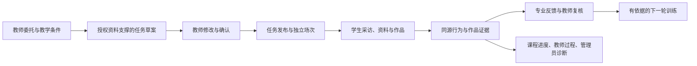

# 岗链智训 — V2.6阶段闭环设计

> 该文档隶属于[开发者文档](../01-开发者文档.md)，保留2026-09-11确定的V2.6阶段目标设计。该阶段已交付，实际完成范围与限制见[16号验收记录](16-V2.6验收记录.md)，提交见[开发历史](../03-开发历史.md#v260-release)。新的讨论、任务和版本只见[02](../02-项目规划.md)，本文不作为下一轮执行清单。
>
> **文档梗概**：把岗位委托教学化、采访作品同源、专业反馈和下一轮训练组成可运行阶段作品。
>
> **具体规划法则**：保留原WorldEngine、内容SQL、作品和评价权威；改动围绕业务结果，不建立第二套学生事实。
>
> **最后一次更新时间**：2026-09-12
>
> **更新者**：主控与系统架构组

## 1. 起点与阶段结果

V2.5.58能运行节点采访、人物问答、约定与资料消息、作品草稿、真实媒体处理和教师过程。复审发现新采访证据未进入评价，课程采访汇总与管理员日志仍读旧链，资料召回先按ID截断，人物理解及预算存在缺陷。

V2.6.0让具体融媒体岗位委托成为学习任务并进入原实训；同一份学生工作证据能用于作品、课程过程、教师判断及后续训练。

教学适用范围为高职融媒体技术与运营及相关采编方向，记者为核心岗位。教师输入实际委托、目标学生和课时条件；自带样例标明教学改编或仿真，不默认声称实际院校合作或专业复核成立。

## 2. 目标业务链

这是目标链。生成结果引用输入与可使用知识，不替学生完成成果或自称已发生现实采访；教师确认与学生执行是独立事实。

## 3. 采访与证据统一

服务端共享来源解释回答：证据是什么、属于谁、来自哪个发布/场次/回合、是否已发生、能证明什么。材料、问答、安排、公开来源、方法提示和教学案例保留各自性质。

作品目录、保存、送审、课程、评价和观察复用这一解释。问候/阅读计数不直接计分；专业判断回指原话、作品、引用关系或已执行处置。缺证保持未知，教师不能凭空补分。

保留已发生的source_drift作品及收据，修复后可继续原投递。诊断收据独立于评价加载，当前日志按冻结体验代际读取真实世界，历史流明确标识。

## 4. 资料与人物执行

- 授权先于检索和模型。相关性计算先于最终截断，覆盖索引、词法回退、撤回与空范围。
- 程序可处理问候；专业问题、含糊请求、否定/转述及安排确认有明确语义边界，资料未到不能成为证据。
- 实际模型尝试不依赖世界提交成功而留痕；预算预留、结算和恢复覆盖并发、超时、失败、冲突与重试。
- 模型只产生受约束候选，正式权限、世界后果和评价终裁保持原权威。

## 5. 岗位委托到学习任务

输入至少包含岗位委托、目标受众/交付、学生基础或学习目标和课时约束。缺信息先补充；生成限定在已有任务、知识技能、材料、人物与世界能力内。

草案呈现情境、目标、步骤与可重排部分、知识/技能映射、资料来源、成果要求、风险、评价依据和支架。教师修改确认后发布；后续修改产生新版本，不覆盖已开始场次。

复用内容SQL、发布、课程引用、世界启动和体验描述。任务须实际改变学生看到的委托、工作要求或条件，不能生成与运行无关的文本卡。至少验证两份不同委托的生成、修改、发布与运行；不生成任意地图或未经支持的规则。

## 6. 专业反馈与训练适配

补齐岗位任务与六维评价依据，使用不同质量样例验证反馈；规则档位可解释，不以字数、点击、代理预测或代填理由充当能力。

训练中先显示支持、反证和缺口，不为未结束场次补造总分。教师读取本场过程，终裁与申诉沿既有版本、权限和证据门。

下一轮根据实际证据选择目标与机制变化，保留学生同意、教师授权、独立场次和结果窗口，解释为什么训练、改变了什么、怎样验证后续表现。长期跨课程模型、全量数据库迁移与全面沙箱推演留后续。

## 7. 验收场景

| 场景 | 必须观察到 |
| --- | --- |
| 教师新委托 | 草案与输入相关、映射与来源可检查，确认后进入真实场次 |
| 居民采访 | 引荐、本人问答、资料、作品和反馈贯通，记录与公开用途分别处理 |
| 公共资料路径 | 可以不经同一门卫链完成合理作品，评价依据可达且不漏记 |
| 缺证与修订 | 补证可继续，原作品与收据能恢复，旧版本保留 |
| 角色与场次 | 学生之间不混用对话和作品，角色范围明确，客户端不能伪造权限 |
| 学情与下一场 | 真实行为形成观察，教师反馈与机制变化对应，预测不当成绩 |
| 重启 | 发布、采访、资料、作品、待决门和后续训练可恢复，同请求不重复写入 |
| 阶段交付 | main完整，运行包2.6.0，文档、操作与复现材料一致 |

外部专业复核及目标用户试用提供可执行材料和记录入口；真实结果由参与者补充。阶段报告区分工程、内容内部核验、真实模型与尚未取得的外部证据。
