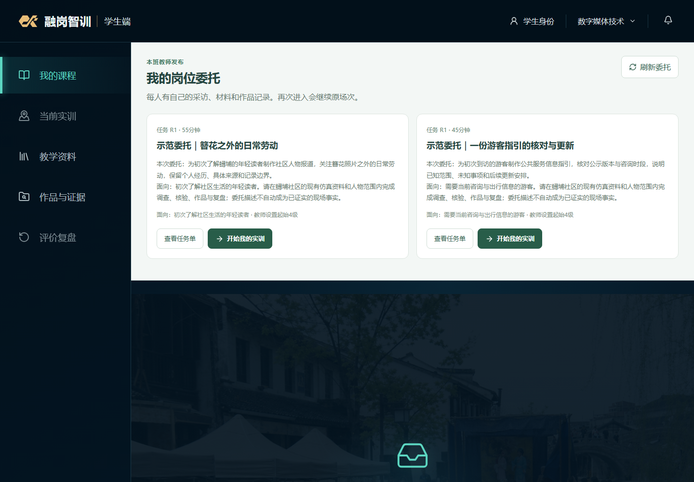
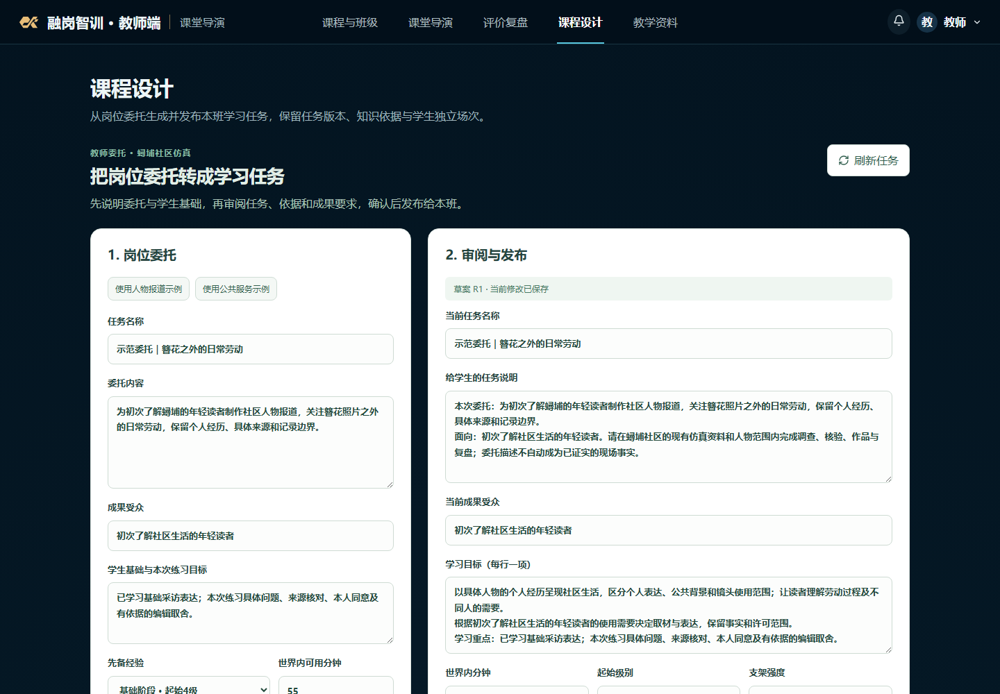
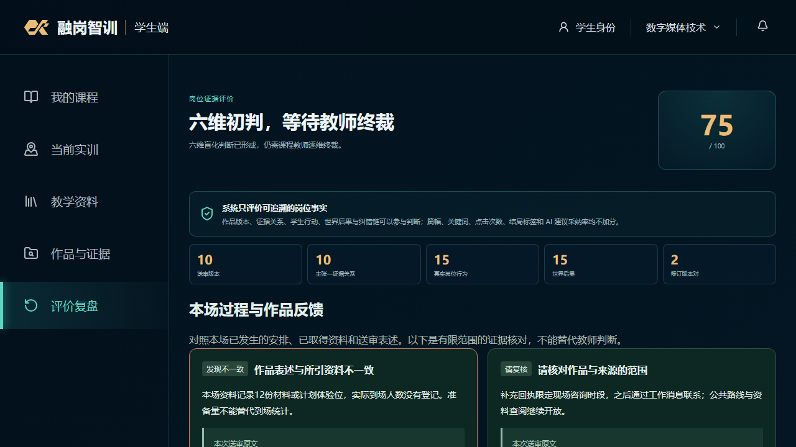
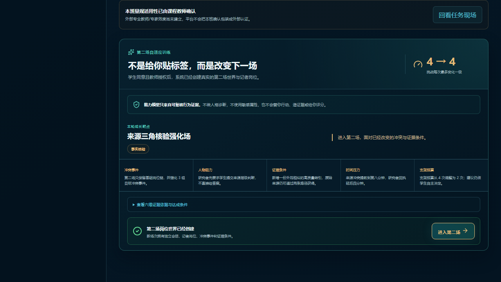
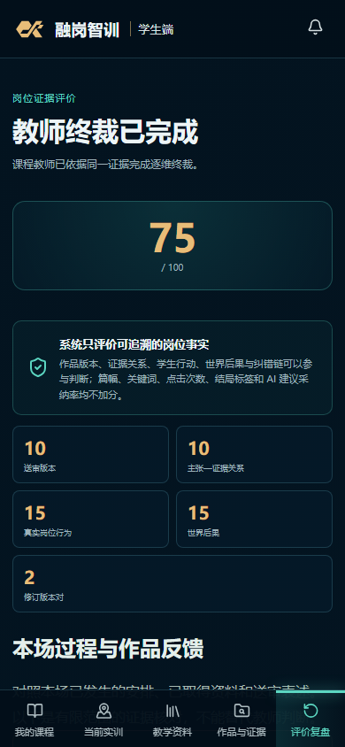

# 岗链智训 — V2.6验收记录

> 该文档隶属于[开发者文档](../01-开发者文档.md)。
>
> **文档梗概**：记录V2.6.0实际受检范围、验证结果和未取得的外部证据；后续任务只见[02](../02-项目规划.md)。
>
> **具体规划法则**：依据命令、真实API、浏览器、持久回读与原始收据；模拟师生、规则、模型与外部意见分开。
>
> **最后一次更新时间**：2026-09-12
>
> **更新者**：质量验证组

## 1. 结论与环境

V2.6.0阶段工程验收通过，沿main交付。环境为Windows、Node 24.20.0、仓库pnpm 11.9.0配置及Playwright Chromium。实际生产模式入口为Web http://127.0.0.1:4173 / API http://127.0.0.1:3001，health返回2.6.0。默认数据为.local/data，预置两份标注为项目教学仿真的委托，学生开始时创建个人场次。

本轮没有新增付费Live调用，也没有产生真实师生试用意见。浏览器连接工具曾因请求头策略加载失败而不可用，本轮改用仓库Playwright，未冒称外部Edge连接成功。

## 2. 检查结果

| 检查 | 实际结果 |
| --- | --- |
| 共享包 | 12包，共737项通过；6项可选Live测试跳过 |
| API完整回归 | 90个文件通过、2个Live文件跳过；489项通过、2项跳过 |
| Web完整回归 | 40个文件、274项通过 |
| 浏览器完整回归 | 17项全部通过；包含旧角色兼容、当前采访、迁移课程、教师发布及第二场校准 |
| 类型与构建 | 全部包、API、Web通过；15个manifest和ProductVersion均为2.6.0 |
| 文档与密钥 | 项目链接、结构、版本与规划检查通过；活动发布源码密钥扫描通过 |
| 隔离构建 | 排除node_modules、dist、.env.local、.local及密钥后，离线按冻结锁文件安装构建通过；使用build-only/allow-dirty候选检查，未把工作区副本冒称已提交HEAD的完整门禁 |
| 启动 | 生产模式冒烟、代理和关闭通过；冒烟使用.local/smoke-runs独立目录，未复用正常数据 |
| 恢复与隔离 | 教师发布跨重启、独立学生回读、角色拒绝和原请求恢复通过；第二API从apps/api启动时解析到同一根数据目录并被现存租约拒绝 |
| SQL备份 | 空目录保留、目录缺失检测、真实PGlite备份后重新打开并读回记录通过 |

可复验命令见[运行手册](../01-开发者文档.md#12-测试基线及其证明边界)。本机原始日志位于.local/v260；源代码回归和本页截图随项目交付，不依赖原测试数据目录。

## 3. 真实用户链覆盖

1. 教师输入两种岗位委托，生成带当前知识依据的草案，保存修改、确认发布；刷新后能够回读原输入和当前修订。
2. 两名学生从页面进入不同场次，刷新与再次进入保持原记录；新发布不改旧场。教师与管理员按权限回读。
3. 居民采访与公共资料两条路线均完成九类文字成果和真实图像、音频、视频派生文件；公共路线没有进入居民小院。
4. 同一表述与实际来源对照，准备量误写到场量能被定位；否定、讨论、未知、本人约定及尚未到达的材料保留区别。三类媒体齐全不会自动被当作语义一致。
5. 教师在页面确认或逐维修订，学生同意后由教师授权，分别生成来源核验和编辑独立性两种不同第二场。
6. 第二场使用真正不同的采访条件，实际执行后到冻结窗口末端才校准；原场分数不变，窄屏无横向溢出。

原件：[当前采访黄金链](../../e2e/v2-flagship.spec.ts)、[教师发布](../../e2e/v260-teaching-task.spec.ts)、[作品到下一场](../../e2e/v260-learning-loop.spec.ts)。这些输入和教师操作明确标为工程模拟，没有混作外部教学效果。

## 4. 本轮额外关闭的问题

- 旧浏览器测试仍使用已退役控件和4门/25章断言，已与当前真实流程及发布内容对齐。
- 只读权限用例反复冷建整栈，超时后启动未被清理器等待。现按实际初始化阶段管理生命周期，性能测试复用应用并逐轮重置场景，保留业务时延断言。
- 无历史教学任务的空目录曾为了恢复而提前初始化SQL；现在仅恢复已有数据库，首次真实内容请求按需初始化。
- 备份仅复制文件会丢失PGlite需要的空目录。新formatVersion=2把完整目录集合纳入清单和验证；旧v1纯JSON备份仍兼容，缺目录的旧v1 SQL备份明确要求从原目录重新备份。PGlite的目录持久化模型见[官方说明](https://pglite.dev/docs/filesystems)。
- 本机DATA_DIR、DEMO_DATA_DIR仍指向旧演示目录，已只更新数据路径并保留密钥值；正式API和整栈默认目录统一。--smoke和--fresh-data不再被旧环境路径覆盖。
- 清理采用可恢复归档；隔离构建排除.local，避免复制本机运行数据、依赖和退役目录。用户未提交材料保留。

## 5. 尚未验证的外部事项

完整开放域专业语义、多模态评价效度、2—3名真实目标职教师生的具体反馈、正式签字盖章及最终参赛材料仍须真实证据。教师任务生成当前限定两类知识/规则模板，长期画像、生产身份/数据库和全面反事实推演继续留在后续任务，不借阶段验收全部标完成。

## 6. 当前截图

正式入口的两份仿真委托：

教师回读原委托并审阅任务：

工程模拟作品的具体来源反馈与后续训练：

390px窄屏反馈：

