# 岗链智训 — 交互骨架与档案首页

> **文档梗概**：说明档案入口、个人课程、现场人物与课前创作的权威实现及边界。本文维护架构与操作方式；开发任务只在 [02-项目规划](../02-项目规划.md) 中维护，版本验收写入 [03-开发历史](../03-开发历史.md)。
>
> **最后更新**：2026-09-13；V2.8.0阶段记录见第7节，当前黑色首页工作区实现见第8节。
>
> 该文档隶属于[开发者文档](../01-开发者文档.md)。

V2.9接入的三地区内容、轮换委托、按课成果与作品评价见[18号内容手册](18-V3课程内容与作品评价.md)。本页第7节保留V2.8验收事实，最新首页见[黑色档案复刻](#black-archive-implementation)。

## 1. 产品流程

学生从课程档案选择课程，进入自己的场次；探索地点、与人物交流、记录私人笔记，再完成并送审作品。教师从学生档案查看当前课程、已提交作品、评价与历次记录。教师课程导演在开课前配置人物、知识与流程，发布后供之后的新场次使用。

同一学生始终只有一门在学课程。返回首页只是离开画面；完成课程要求并选择完成，或主动放弃，才释放当前课程。切换到别的课时，先选择继续或放弃，再单独确认放弃；新场次准备失败不会先结束旧课。旧作品、交流和已提交附件保留，取消不能显示成完成。

### 1.1 V2.8阶段视觉方向

V2.8阶段采用深绿档案室、纸张厚度、黄铜封签与清楚的中文信息。未展开时轻微摆动，悬停或键盘聚焦抬升，点击抽出；展开模式方便比较，窄屏使用可点选的档案排列。当前黑色波浪、局部暂停和横向抽出已替换首页呈现，详见第8节；下图保留为历史参考。

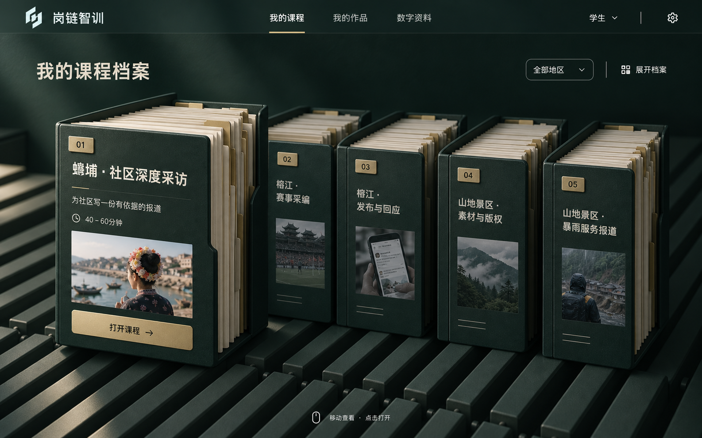

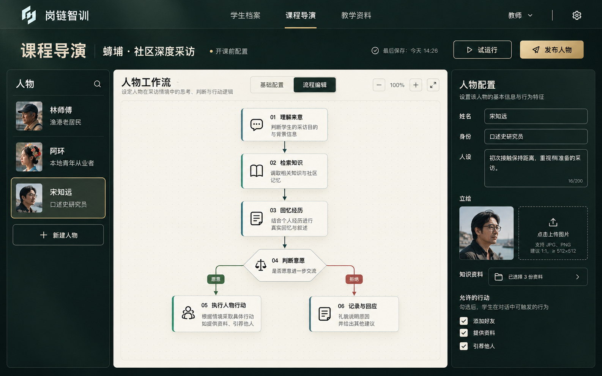

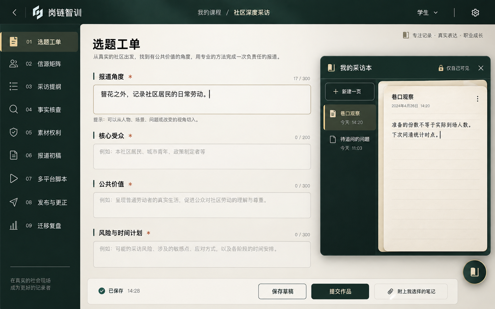

以上为生成的设计参考，并非测试截图。最终页面与运行截图在阶段验收中另行核对。用户原参考保存在 `资料/91-视觉与演示资产/档案式首页参考`。

## 2. 数据权威与调用关系

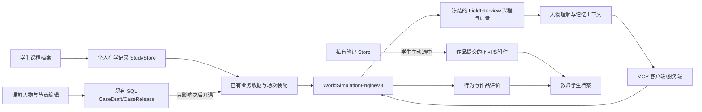

| 事实 | 唯一权威位置 | 实现入口 |
| --- | --- | --- |
| 哪一门课正在进行、完成或取消 | StudentStudyStore | [服务](../../apps/api/src/student-study.ts)、[合同](../../packages/contracts/src/student-study-v3.ts) |
| 学生／教师对某场的访问权 | 现有 SessionControl 与身份绑定 | [统一场次装配](../../apps/api/src/flagship-session-provision.ts) |
| 场景地点、实际行动、认识和好友 | 世界记录中的 FieldInterviewRecord | [内核](../../packages/world-core/src/field-interview-v1.ts)、[关系规则](../../packages/world-core/src/field-social-v3.ts) |
| 地图通路与探索范围 | 冻结课程的 nodes/exits 与 visitedNodeIds | [地图规则](../../packages/world-core/src/field-map-v3.ts) |
| 未提交的笔记 | 按学生与课程隔离的 StudentNotebookStore | [笔记服务](../../apps/api/src/student-notebook.ts) |
| 已提交作品及自愿附上的副本 | 现有 FlagshipStudentWorkStore | [作品服务](../../apps/api/src/flagship-student-work-v3.ts) |
| 教师新增人物及其发布版本 | 现有 ContentStore 的 CaseDraft/CaseRelease | [人物工作室](../../apps/api/src/character-studio.ts) |
| 人物上传立绘 | 既有 SQL Asset 记录＋不可变 PNG 原件 | [图片接口](../../apps/api/src/character-studio-routes.ts) |
| 课程与地区分配 | courseRegionAssignments | [定义](../../packages/course-content/src/course-regions.ts) |

不为每个人物另建数据库。人物知识通过课程现有 SQL 资料库的知识编号授权连接；教师编排的现场经历与公开方法资料分别标识。JSON/JSONL 运行 Store 与 SQL 内容库各自保留既有职责，本阶段不扩大为完整生产数据库迁移。

## 3. 场景、人物与关系

地图仅显示已发现的地点及已知通路，突出当前位置和已到访范围。未发现地点不展示内部画面，已知但尚未获准进入的地点只说明必要条件。场景出口有各自的位置与方向，地图和出口经过同一内核规则核验。

人物立绘使用透明图片或按图集单元定位，画面点击由人物 alpha 命中检测处理。站位、尺度与地点来自课程发布版；远程联络和实际在场分别投影。

认识和加好友是不同事实。有效介绍或有实质内容的交流可以形成认识；明确请求加好友后，还要检查人物是否支持联络、当前意愿和关系条件。不支持的角色可以拒绝，学生仍可选择其他调查路径。引荐只指向人物配置中真实存在的对象，产生介绍记录与地图线索，不替被介绍者答应见面或加好友。

关系开放程度用于模拟人物行为，不是学生分数。重复问同一话题不反复提高关系。同一学生后续进入同一地区时，从自己的既有场次承接人物关系与有来源的交流摘要；不同学生相互隔离。新场的时间、已探索地点、待办与作品不从旧场照搬。

## 4. 人物智能体与 MCP

[FieldInterviewService](../../apps/api/src/field-interview-service.ts) 负责准备人物所知材料、近期对话、相关长期摘要和当前约定；模型只提出结构化判断，世界内核核验并提交实际效果。

[FieldCharacterMcp](../../apps/api/src/field-character-mcp.ts) 使用官方 MCP TypeScript SDK 的客户端、服务端和进程内传输，实际注册采访、认识、加好友、引荐工具。写入所需的主体和场次由服务端绑定，模型或浏览器不能自行替换。调用收据保存工具名称和调用引用；工具返回成功才算动作成立。

默认六节点为理解、知识、记忆、决策、工具、表达。教师可以调整各节点说明，关闭可选的知识／记忆／社会行动能力，设置近期对话窗口；必要的理解、决策和表达节点须保留。人物知识、名字、立绘、目标、性格、联络意愿、引荐对象均在发布前校验。首版为受约束的节点配置器，并不声称支持任意代码执行或任意外部工具接入。

有模型配置时使用受约束的自然回应；离线演示使用明确标注的规则回应。上下文摘要和关系记忆已经有独立数据依据；它们不等于模型权重训练。强化学习、自动训练人格或经真实师生验证的长期能力模型，不能在缺少数据与验证时宣称完成。对用户呈现结论与行动依据，不展示模型内部逐步推理。

## 5. 笔记、作品与教师查阅

采访本是右下角可随时展开的私人笔记工具，支持标题、正文、多页、自动保存和冲突处理。资料查阅不再冒充学生自己的笔记，教师也没有读取未提交笔记的接口。

工作台在切换成果时保留未保存内容，返回现场前提示处理草稿；保留成果流程和编辑区，移除强制勾选证据的侧栏、证据条数门和凑修订次数门。后台已有资料来源与真实行动仍可供评价核对，系统不会把全部已看资料自动声明成作品使用的引用。

送审时学生可以选择笔记页，也可以选择纸质笔记照片。未点击确认送审的照片留在浏览器中；服务端只在明确提交时接收附件。当前 Demo 每次最多两张、每张不超过 2MB，支持 PNG/JPEG/WebP。已提交附件与对应作品版本一起保存，后续私人笔记修改或删除不会改写已交副本。教师档案按实际送审收据读取作品，即使学生又开始修改草稿，先前提交仍可查阅。

评价入口沿用既有作品与行为评价服务；档案首页只读取仍有效的已有评价，不因打开首页触发额外模型评分。证据未形成时显示待评。新课程的量规事实映射与内容深度将在 V2.9 内容阶段继续校准；工程体验记录不能替代真人试用或专业效度证明。

## 6. 发布、兼容与阶段边界

课程发布与人物发布各自不可变，场次冻结具体 lesson hash。旧运行数据保留原发布内容，新版配置不会热更新到在学课程。已有多场并行历史在首次读取个人课程记录时，保留最近一场为当前，其余保留历史状态，不伪造成完成，也不删除作品。

V2.8 交付目标是三地区、五门课程的可运行骨架和完整主要交互链路；其基础内容仍只是后续建设的起点。每课 40 分钟、十条有区别的调查路径、每地区二十场景与人物，作为 V2.9 的深度基线核对。不得把原型场景数、重复人物或固定台词当成已达到内容验收。

入口实现：[学生档案](../../apps/web/src/v2/pages/student-course-archive.tsx)、[教师档案](../../apps/web/src/v2/pages/teacher-student-archive.tsx)、[人物工作室](../../apps/web/src/v2/pages/character-studio.tsx)、[正式课程装配](../../apps/api/src/published-course-runtime.ts)。

## 7. V2.8 阶段验收记录

2026-09-12完成本轮骨架验证。正式入口在北京时间09:49恢复为V2.8.0，距03:14启动约6小时35分，满足八小时内可实际体验架构的约定。后续隐私校验与共享默认配置已同步到同一候选版本。V3成品目标仍在推进，本记录不代表V2.9内容基线已完成。

| 验证 | 实际结果 |
| --- | --- |
| 构建与类型 | 共享包、API与Web构建通过，API/Web类型通过；Three渲染块仍有531.89kB的构建体积提示 |
| 世界交互 | 开放采访与新社会关系2文件38项通过，含所有课程初始投影、未知区域、非好友远程拒绝、加好友、引荐与重复话题边界 |
| API阶段回归 | 九文件49项通过：在学/笔记、作品、人物理解、MCP、开放采访、教师任务及业务收据；既有测试按新单课和认识规则修正后通过 |
| 并发投影 | 新增五门个人课程的并发读取与行动后读取测试1项通过；提示同步按场次串行，异常日志保留定位信息 |
| Web回归 | 23文件179项通过；删除两份替换后的旧首页及对应旧界面断言，源码入口75模块全部可达 |
| 浏览器整链 | 新增V2.8用例通过：档案实际点击、三地区、手机关系、课前发布、在学版本不变、新场出现新增人物、教师档案与390px笔记 |
| 笔记与作品 | 实际保存笔记、选择副本与照片送审、再修改私人笔记，教师读取仍是原副本；新增选择版本校验和附件内容hash，避免确认期间的笔记变化被静默提交 |
| 正式运行 | 4173与3001均报告2.8.0，代理通过；学生、教师、人物工作室、管理员页面实际打开且无控制台错误，原示范委托仍可回读 |
| 数据保留 | 原正式目录停机快照已核验，1102个文件保留；正式数据仍在.local/data，用户赛事、视频文件和密钥未纳入本次提交 |

测试为工程模拟。新增功能回归主要使用deterministic/mock；正式环境沿用了原有Live配置，不能将管理员的Live标识当作本轮所有新增交互的Live验收。没有编造真实师生意见。

### 7.1 运行画面

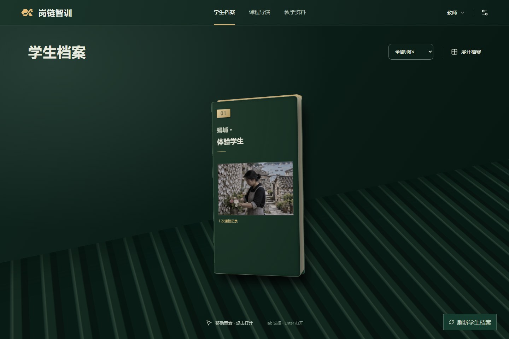

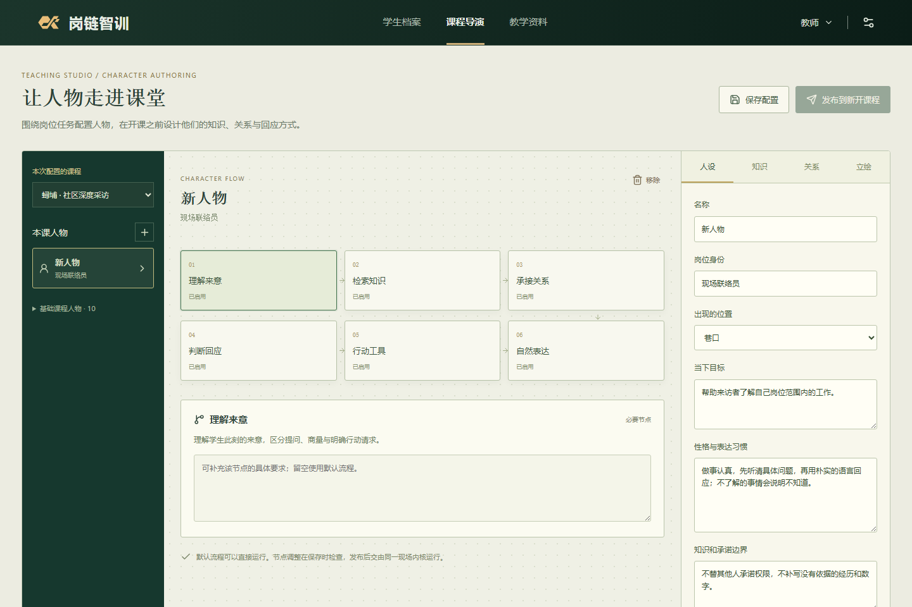

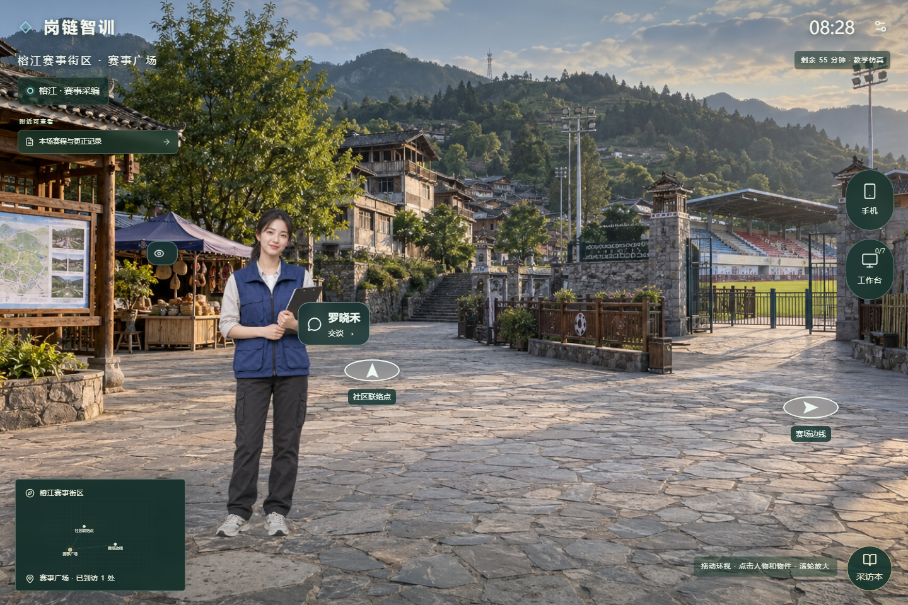

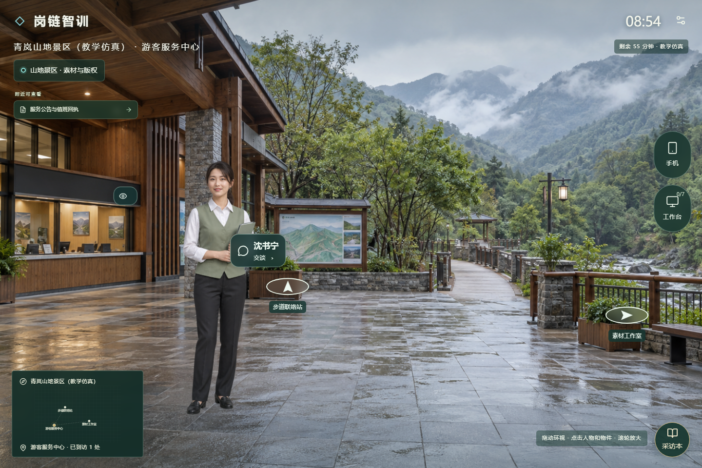

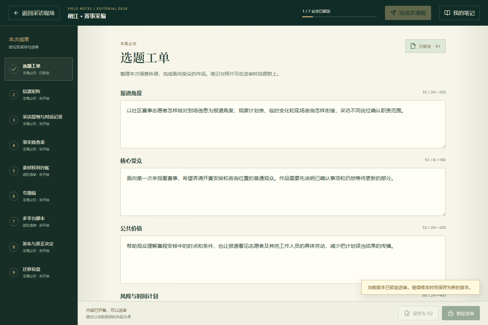

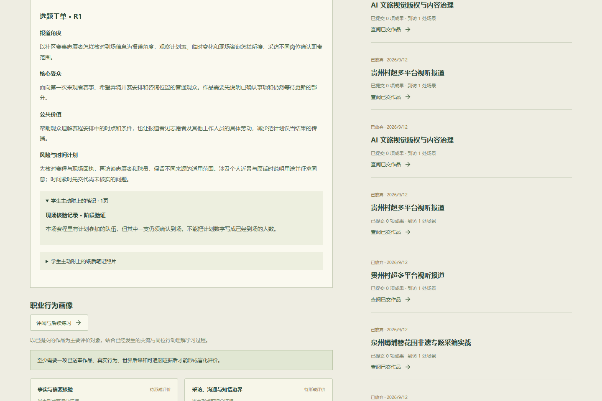

### 7.2 设计核对

已对照三张概念图核对：档案的厚度和分层、中文标题与封签、悬停/展开/抽出状态、教师深绿目录与纸面编辑区、无强制证据侧栏的工作台及独立笔记工具。实际交互将3D装饰与点击区域分开，避免动画改变命中；减少动态和窄屏模式保留功能。未把概念图冒充运行画面，也未为填满档案室伪造学生。

### 7.3 V2.8验收时的承接范围

三地区仍为骨架，榕江和青岚尚未达到深度分支、场景和人物基线。工作单与部分核验提示仍沿用蟳埔内容，须按课编排；新关系事件与最终作品的评价依据还要进一步对应，既有后续训练也须完整纳入单课规则。V2.9将补齐这些明确内容；V3.0再统一验证、打磨和交付。

## 8. 黑色档案首页复刻（工作区）

2026-09-13，FE-020已按用户确认稿完成工作区实现，以V3.0.0为发布基线，尚未建立新的版本标签。本节为当前首页的实现与验证，前面的V2.8阶段截图保持历史用途。

### 8.1 实际行为

学生课程档案和教师学生档案共用黑色档案室。立体薄档案按行沿画面右下→左上、左上→右下连续流动，相邻行反向、节奏一致。一端移出的档案从另一端接续，每行持续循环展示。鼠标附近减速至停止，后续档案保持间距并减速避让，其他行继续；移开后平滑恢复。标题和预览从真实课程、学生记录读取。

点击档案或预览只横向抽出阅读面，展示详细信息；详情中的实训按钮才调用原开课服务。收回档案不改变当前课程，课程切换仍需完成或明确放弃，放弃后开新课保留二次确认。教师从详情进入原学生资料、作品及评价页面。

搜索、地区和档案类型筛选、展开目录、键盘聚焦和触屏点选使用相同档案ID。筛选不重新编号，悬停封签、目录序号与详情序号一致。减少动态模式保留全部入口，窄屏详情不倾斜并支持内部滚动。

### 8.2 结构与性能

| 职责 | 实现 |
| --- | --- |
| 真实档案、筛选、预览与详情状态 | [ArchiveStage](../../apps/web/src/v2/pages/archive-stage.tsx) |
| 三维薄档案、鼠标射线、投影与资源释放 | [ArchiveFieldRenderer](../../apps/web/src/v2/pages/archive-field/renderer.ts) |
| 逐行连续循环、局部暂停与平滑恢复 | [motion](../../apps/web/src/v2/pages/archive-field/motion.ts) |
| 抽出和收回动画、可读详情与进入按钮 | [ArchiveReader](../../apps/web/src/v2/pages/archive-field/reader.tsx) |
| 学生与教师业务入口 | [学生档案](../../apps/web/src/v2/pages/student-course-archive.tsx)、[教师档案](../../apps/web/src/v2/pages/teacher-student-archive.tsx) |
| 颜色、排版、遮挡和响应式 | [archive.css](../../apps/web/src/v2/pages/archive.css) |

阵列使用实例化几何，优先绘制近处不透明表面，避免大量遮挡区域重复着色。档案只平移，固定灯光的哑光响应预先写入顶点颜色。GPU正常环境保留较高像素密度与轻微焦外处理；识别到软件渲染器时，背景缓冲按0.55倍采样，DOM文字、预览图和详情仍按原尺寸呈现。

按用户对中低端设备的要求，几何档案总数保持由882降至441，组成七行循环队列。单份档案的厚度、纸边、封签、纹理和真实档案映射保持完整；实例容量及运动计算对象减半。循环端点根据当前视口与完整模型边界设在画面之外，调整视口时保留循环进度；每帧更新可见实例及前后顺序，移入的档案会正常接续。流动距离按经过时间计算，不依赖帧数。动画在本地运行，不产生逐帧网络请求；减密不代表下载体积或整机帧耗时也减半。

减密前的一次软件渲染实测由约1秒的动画帧间隔改善到约117—133毫秒。该结果来自SwiftShader，不代表此次减密后的硬件GPU帧率。校内中低端机型和规模访问尚未实测。运行资源按实际可见性停止绘制；离开页面释放几何、材质和纹理，异步挂载取消不会继续创建图形上下文。

图形就绪与课程数据就绪共同决定可交互状态，避免初次加载时背景先出现而档案内容尚未到达。鼠标停在移动档案之间时，命中检测会继续跟随画面更新。

### 8.3 素材与边界

黑色纸板纹理和蟳埔首页插图由内置Image Gen生成，提示词及用途见[材质记录](../../前端设计/2026-09-13-黑色交互稿/材质记录.md)。专用插图用于贴近已确认档案稿，不替代课程里的真实资料，不进入作品证据目录。其余课程继续使用已有封面图集。

无名薄片提供档案簇的空间结构，不产生额外课程、学生或成绩。没有将整幅概念图当作网页背景；可交互对象来自实际几何，文字和按钮属于网页元素。

### 8.4 验证结果

- 首版黑色首页的Web检查共25文件184项通过。本次连续循环调整定向验证8项通过，覆盖右下／左上持续运动、逐行反向、完整循环与档案身份、视口变化保留进度、不同帧率一致节奏、441份均匀队列、长期悬停避免重叠、恢复、减少动态和异步挂载；类型检查与构建通过。
- 本次档案专项浏览器回归通过：实际页面441份模型、局部暂停与远处运动、查看详情不发出开课请求、收回、窄屏与Esc退出，未捕获页面运行异常。CUA两次连接策略加载失败，改用项目现有Playwright在4173／3001原数据演示栈验证。
- 三地区、课前人物发布和在学版本隔离回归通过；教师发布任务后两名学生独立开课、刷新与返回原场回归通过。相关入口用例已迁移到“先抽出详情，再进入”的新交互。
- 在Edge中实际验证学生详情进入独立实训、教师读取当前课程及评价摘要并进入完整档案；390×844窄屏详情横向溢出为0。
- 主程序继续使用4173网页及3001API，原在学记录保留。本轮没有重建或清空原运行数据。

专项用例见[archive-ui](../../e2e/archive-ui.spec.ts)，共享入口见[archive-flow](../../e2e/fixtures/archive-flow.ts)。软件渲染下持续录屏会影响动画测量，因此专项保留DOM操作轨迹和关键状态截图，关闭连续视频与轨迹截屏；其他整链仍按原配置验证。

### 8.5 设计对照与运行画面

学生三态按1672×941原稿尺寸比较构图、档案厚度、颜色、排版、预览和抽出状态，窄屏按390×844验证；下方学生与窄屏实拍已更新为此次逐行连续循环的页面。教师1280×800截图保留上轮业务交互验证，背景排列与运动以共享首页新实现为准。原图与实拍分别保存，设计图的运动箭头和阶段文字不作为产品控件。

| 对照项 | 实现与取舍 |
| --- | --- |
| 黑色空间与档案密度 | 保留减半后的模型数量与斜向阵列；逐行沿右下／左上反向连续循环，循环接缝位于画面之外 |
| 材质、封边与封签 | 哑光纹理、灰色纸边、少量黄铜封签；软件环境降低背景采样 |
| 顶部与边缘控件 | 保留正式品牌、课程/作品/资料导航、搜索及地区筛选；当前在学入口缩入底部 |
| 悬停信息 | 原位停住附近档案，左侧短预览和连线；远处继续运动 |
| 详情阅读面 | 向右抽出、转向阅读，保留封面、侧翼、纸边与归位动作 |
| 内容与标识 | 使用真实课程、学生信息与正式Logo；不同课程的文字和图片随实际档案变化 |
| 窄屏 | 两行导航和不倾斜的阅读面，保留可操作目录与进入按钮 |

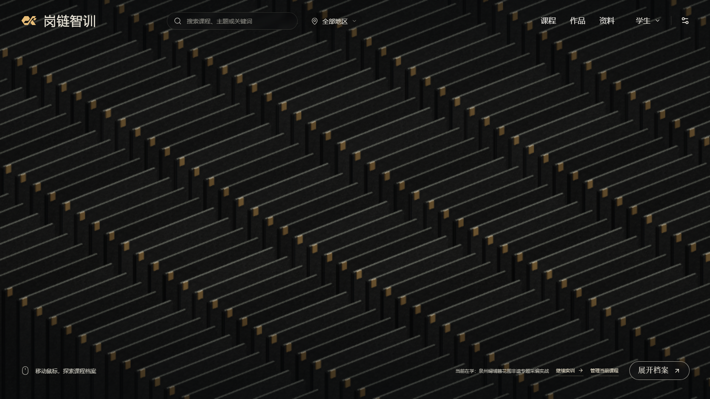

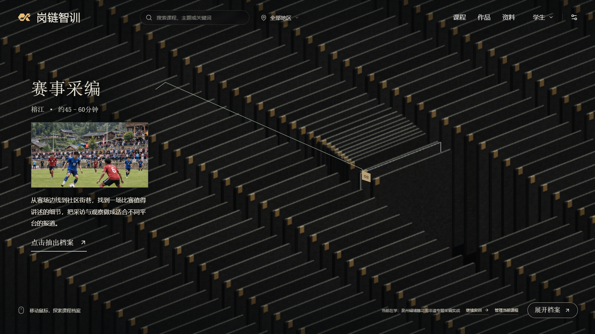

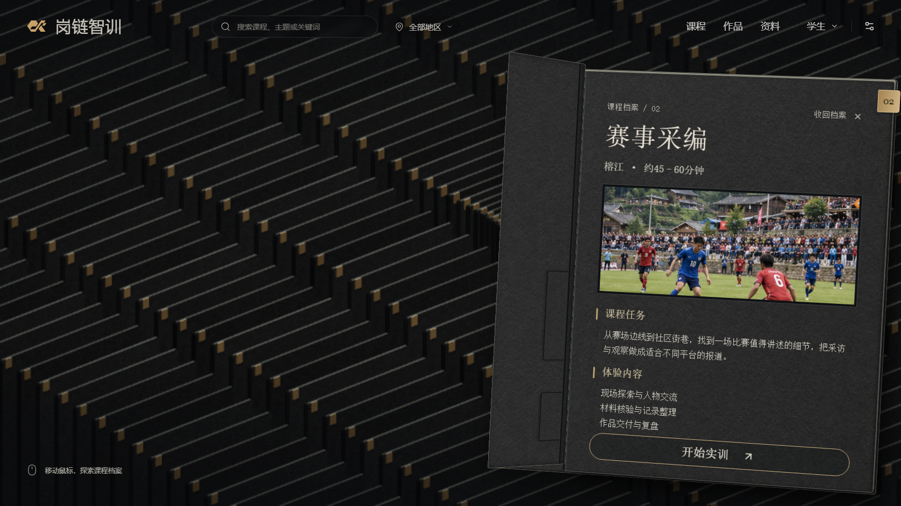

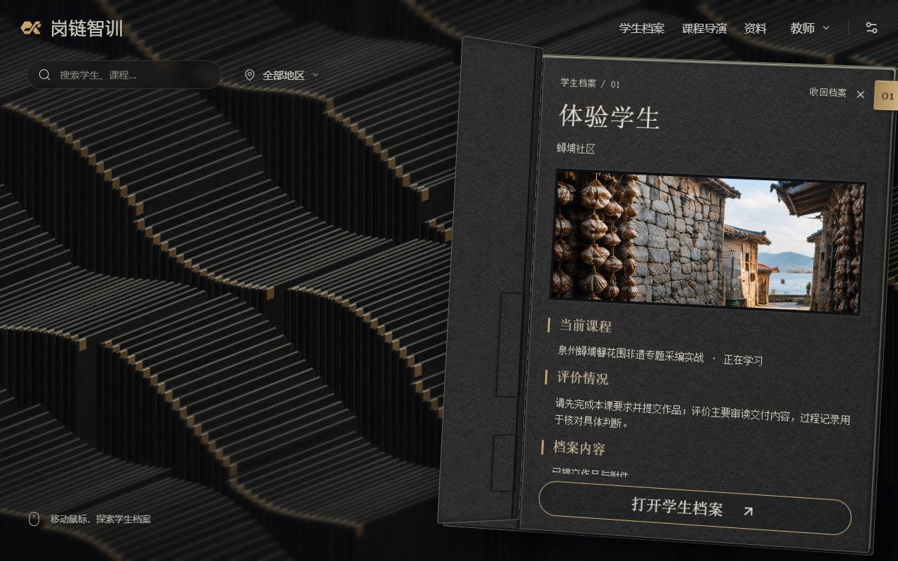

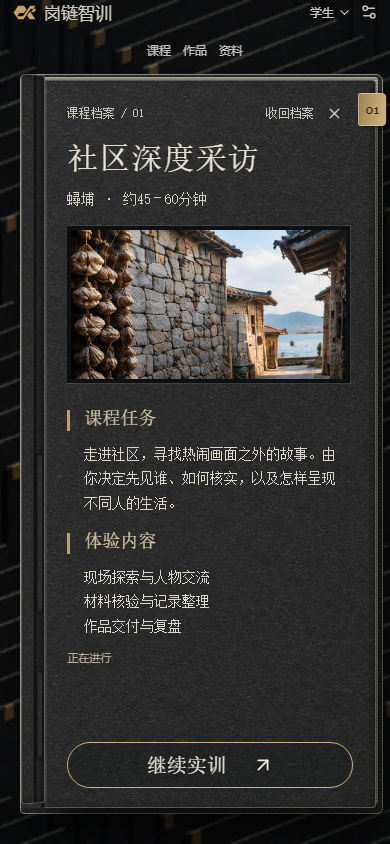

## 9. 公开学生导览

公开导览共用第8节的档案组件，通过[公开构建脚本](../../scripts/build-public-demo.mjs)从当前课程包生成三地区五课程资料；各地区20个场景，人物、资料、调查路径与成果字段均来自课程权威定义。[导览入口](../../apps/web/src/public-demo/main.tsx)使用hash导航与浏览器本机记录，在Pages仓库子路径和Sites站点根路径运行。导览允许查看全部场景，和正式课程中依照授权、关系及时间推进的实训语义不同。

笔记不上传，导出作品默认不包含私人笔记；学生可以主动勾选附带。人物面板显示已编写的教学片段，界面明确区别于实时回答。公开版不发出API请求，尚未接通实时智能体、教师评分与云端提交。完整系统源码保留，后端托管准备和实际发布地址统一在[部署说明](../../deploy/README.md)维护。

初次公开部署通过Web类型检查、9项定向测试及公开导览浏览器回归（仓库子路径、三地区、地图20节点、笔记刷新恢复、作品导出与默认笔记隔离、390×844窄屏）。容器配置通过入口语法检查，尚无Docker实测或云端Node托管验收。

公开访问优化在同一入口实现：构建生成WebP及内容指纹，首页只读取课程摘要，选课后按需获取全文；公共资源解析器让正式本机程序继续使用原图。共用档案渲染器采用30 FPS绘制上限，流动时钟与交互保持一致。指标与本轮12项定向检查、实际图像解码及功能回归结果统一见[访问性能](../../deploy/README.md#访问性能)，不将限速模拟值当作所有网络的保证。
