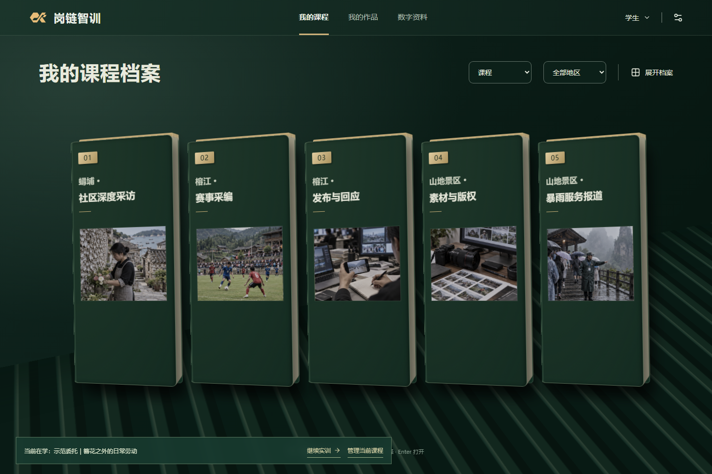
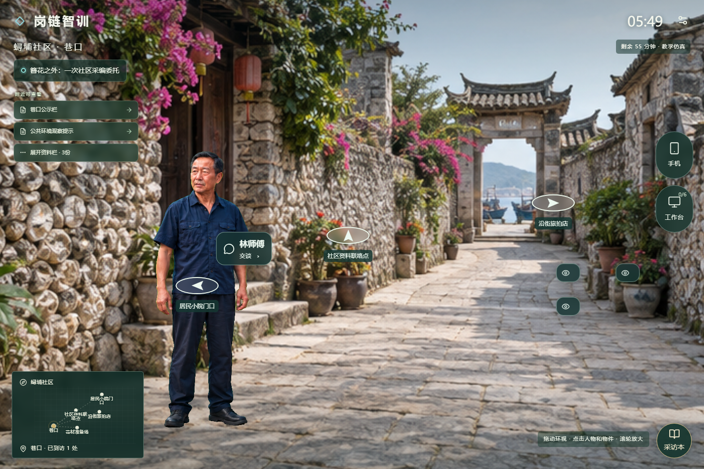
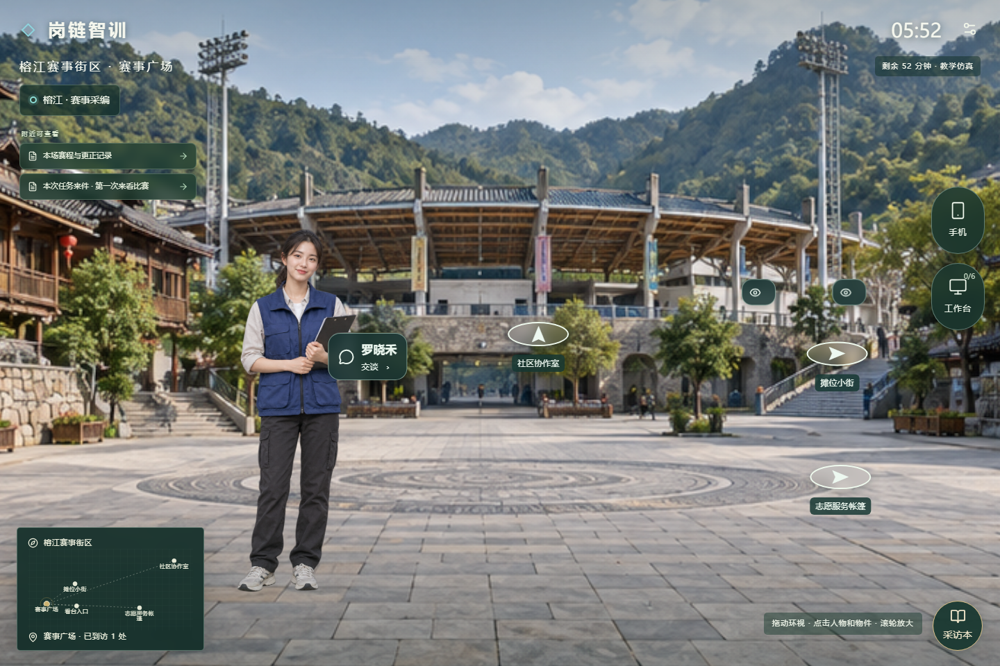
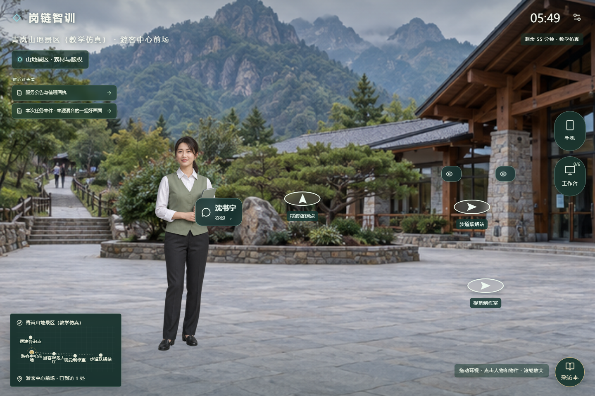
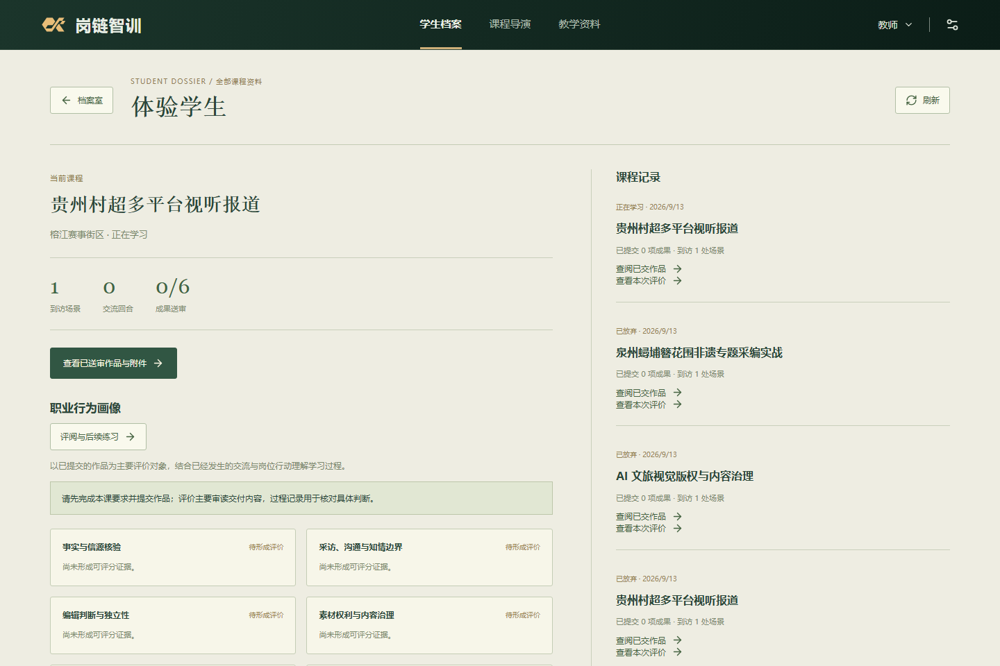
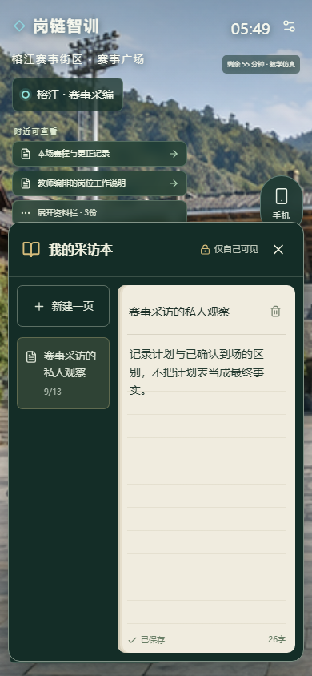
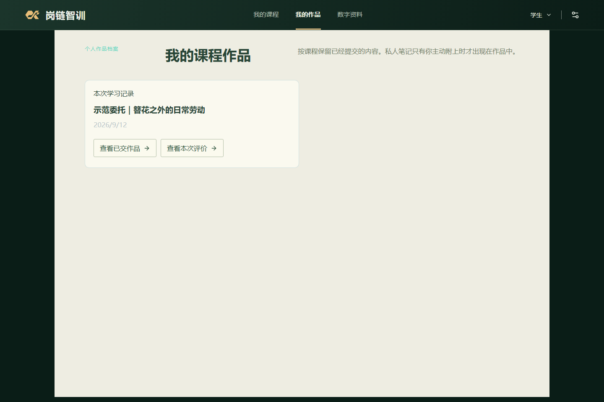

# 岗链智训 — V3成品交付与验收

> **文档梗概**：V3.0.0 Demo 的操作顺序、收尾修复、实际验证及交付边界。课程内容的唯一说明见[18](18-V3课程内容与作品评价.md)，交互与发布结构见[17](17-V3交互骨架与内容架构.md)。
>
> **最后更新**：2026-09-13。
>
> 该文档隶属于[开发者文档](../01-开发者文档.md)。

## 1. 本版交付范围

V2.7退役旧前端，V2.8形成档案首页与正式交互骨架，V2.9扩写三地区五课程，V3.0完成角色体验、当前与历史记录衔接、媒体标识、恢复与文档收尾。产品面向评委本机运行测试；正式代码沿main集成，源码历史由对应Git标签保留。

三地区各20个场景及20名主要人物，五门课程各12个调查方向和4种轮换委托。调查方向提供不同信源、问题和作品判断；学生无需遍历地图或首先接触林师傅。同地区的两门课程共享空间身份，通过岗位任务、来件和成果要求形成差异。

本版落实以下已确认规则：

- 学生档案代表课程，教师档案代表一名学生的全部课程资料。悬停、展开和抽取档案可进入真实记录。
- 同时只有一门在学课程，返回首页保留原场；放弃后换课需二次确认，取消前的记录保留。
- 地图逐步发现，场景有实际相邻出口；未知或未获准地点不泄露内部预览。人物在场景中出现。
- 先认识再协商好友。联络意愿、拒绝与引荐经过实际MCP和世界规则，手机只显示已建立关系的人物。
- 教师可以在开课前新增人物，配置身份、立绘、位置、知识及六节点流程；发布只影响之后开课，原在学场次保留冻结内容。
- 采访本是私人多页笔记；只有学生主动选择的副本或纸质笔记照片进入提交材料。教师无法直接读取未交笔记。
- 作品工作台按本课成果组织，取消手动勾选证据侧栏及数量门槛。评价以已提交内容为主，过程记录用于核验具体判断。
- 模型失败保留空分数。教师可对真实已交作品逐维评阅，原稿、各维理由和终裁一同保存；学生同意与教师授权后，后续课程才能进入同一在学名额。

## 2. 建议体验顺序

### 2.1 启动与原记录

在仓库根目录运行 `corepack pnpm start`，或双击“启动融岗智训.cmd”。默认网页为 `http://127.0.0.1:4173`，API为3001，数据为`.local/data`。首次需完成构建和场景登记，等待“体验入口”输出。

输入 `stop` 并回车可正常关闭子服务、释放目录租约；也支持Ctrl+C。系统异常退出后若出现旧租约，先按数据安全CLI核对旧进程确已结束，再显式恢复，不删除数据目录绕过检查。隔离空白体验使用 `corepack pnpm start:fresh`，不会清空原数据。

升级后原场次继续使用当时的内容。要看本版扩充场景，应从课程档案新开一场；已有课程未结束时按页面提示继续或主动放弃，不能把保留旧发布误当成升级失败。

### 2.2 学生：自由调查到交付

打开“我的课程”，选择社区、赛事或景区课程。读取本次委托后，沿地图或画面出口探索。可以从花材、商户、公共资料等线索开始，直接向住户协商进入，不要求走林师傅引荐路线。

与人物交流后提出联络请求，观察同意或拒绝；打开手机核对联系人变化。右下角采访本可随时记录，关闭再打开仍保留内容。返回课程档案尝试开另一门，可验证继续旧课与二次确认放弃。

工作台的六项必交成果围绕本课任务展开。填写、保存并送审后，可附上自己选择的笔记或照片，也可只交作品。媒体按实际表达需要选用，文字任务不强制交齐图、音、视频。完成课程后，“我的作品”可以回读各场已交版本，包括已放弃课程先前的提交记录。

### 2.3 教师：课前创作到下一场

切换教师身份，进入“课程导演”，新增人物并配置本课资料、行为边界和场景位置。默认六节点可直接运行；保存并发布后，用新开的学生课程验证该人物出现，旧场次保持原样。

“岗位委托转为教学任务”区域支持两类委托草案、修改和本班发布。学生档案中的“档案类型”可选择教师委托或全部档案。两名演示学生进入同一委托时各自获得独立场次。

回到“学生档案”，打开一名学生查看当前课程、历史、已交作品及评价。模型不可用时可以逐维审读作品，填写六维判断和依据，确认本班适用性后形成终裁；不会自动填入示范分数。学生同意并经教师授权后，下一场具有对应的调查变化和独立作品，原成绩保留。

## 3. 收尾修复与数据规则

| 问题 | 本版处理 |
| --- | --- |
| 已交个人作品未进入旧作品页 | 由本人在学记录读取真实场次，新增按课回读入口；学生只能查自己的提交，师生复用同一作品展示组件 |
| 无模型评分时教师无法完成评阅 | 六维可手动审阅；将本次实际作品修订登记到正式评价依据，避免旧引用门拦截或凭空补分 |
| 场景出口说明挡住资料按钮 | 场景标记计算包含文字占位并避让相邻控件，不用强制点击绕过 |
| 旧课程认领被新场次替换 | 保留历史课程的冻结启动与成员绑定，同时纳入单门在学检查；已经结束的旧课仍可复核成果 |
| 当前版本备份被兼容门拒绝 | 恢复版本窗口包含V2.7、V2.8、V2.9及当前版本，仍校验文件与目录、原件hash和单写者租约 |
| 图片派生丢失隐式生成标识 | PNG生成标识由共享工具写入，原像素和来源文件不变；音视频派生也保留元数据说明 |

不删除原在学数据、密钥、用户未提交的参赛文档和视频。四套旧演示数据、旧独立前端的既有可恢复归档继续保留；本版不按目录名称猜测其中数据无用。备份恢复和实际存储格式见[01第9节](../01-开发者文档.md#9-数据模型与恢复)。

## 4. 实际验证

### 4.1 检查口径

阶段集中检查，失败后修复根因并定向复验，不把反复执行相同用例计成新增覆盖。浏览器连接工具因请求头策略不可用，已采用仓库Playwright的独立浏览器上下文、隔离端口及临时数据，不在原用户数据中跑破坏性用例。

| 检查 | 本轮事实 |
| --- | --- |
| 共享包 | 12包全量749项通过，6项可选Live测试跳过；另行进行了实际Live链路验证 |
| API | 全量首次487项通过、14项失败、2项可选测试跳过；失败集中于旧认领兼容、升级恢复及已变更的单课用例。修复后对应7文件40项通过，另行通过18章课程、HTTP复核与重启链；五课并发与作品归属、单课笔记和评价3文件16项通过；新教师人工评阅连同评价服务10项通过 |
| Web | 23文件180项全部通过 |
| 浏览器 | 18项覆盖全部通过：统一运行15项通过，余下作品评阅用例更新维度名称后独立3项通过。覆盖三地区、课前人物发布及冻结隔离、地图、笔记、师生作品回读、两类委托、教师终裁、后续训练、三角色权限与390宽度页面 |
| 类型与构建 | 15个运行包类型检查及完整构建通过；最后移除重复列表后Web再构建通过 |
| 正式运行 | 4173网页与代理、3001API健康均为3.0.0；学生、教师、课程导演、个人作品和管理员页面回读无控制台错误，原课程记录保留 |
| 正常关闭 | 隔离启动后发送stop，API确认停机，进程退出码0且数据租约available；不以强制杀进程冒充正常关闭 |

首次失败日志与复验日志均保留于本机`.local/v3`，不将失败批次写成“一次全绿”。主要可复验源码入口：[浏览器目录](../../e2e)、[作品与后续链](../../e2e/v260-learning-loop.spec.ts)、[五课并发投影](../../apps/api/test/published-course-projection-v3.test.ts)、[评价服务](../../apps/api/test/flagship-assessment-v4.test.ts)、[数据恢复](../../apps/api/test/local-data-safety.test.ts)。

### 4.2 Live与工程模拟

隔离Live数据中实际执行4轮人物对话并保留`live_model`回执，完成六项文字作品、六维质量评阅和教师终裁，生成20场景后续课。模型曾返回无效JSON，保留失败记录并通过显式幂等重评恢复；重放同一重评请求不重复调用。纯文本审读和实际图片模型调用分别验证，媒体能力按实际输入判断。

下一场在另一门课进行时被拒绝，主动取消后进入成功；旧成绩没有被校准回填。青岚课程自己的两份素材及单图裁切送审通过；浏览器学习链另实际执行图像、音频、视频派生。原素材哈希、权利回执和生成标识保留。

这些是开发者用演示账号输入的工程试用，不是目标职教教师或学生的反馈。测试中的教师评分只为验证流程；Live评分也不是外部专家效度或获奖证据。

## 5. 仍需真实使用验证的部分

每课按55分钟工作量设计，目标正常首次完整学习不少于40分钟；尚未协调真人计时试用。自动化运行速度、字数、场景数量都不能证明学习时长或教学效果。

同地区人物关系与摘要可延续，但没有在线更新模型权重的强化学习，也未完成跨课程长期能力模型和全面反事实世界推演。教师编辑器是课前人物与受控六节点创作，不是任意代码执行、完整通用低代码平台或课中热发布。以上边界继续在[后续规划](../02-项目规划.md#5-后续保留任务)登记。

本轮是可独立运行的Demo交付。真人专业复核、实际教学效果、生产SSO与多租户部署，以及参赛材料中的真实签字和学校流程，分别依赖后续真实证据。

## 6. 本版运行画面

以下为2026-09-13实际运行截图：场景、笔记及教师资料来自隔离工程试用，首页与个人作品入口来自保留原数据的正式启动。人物和场景属于教学仿真，账号及作品输入为工程模拟。没有使用概念图替代网页实拍。

