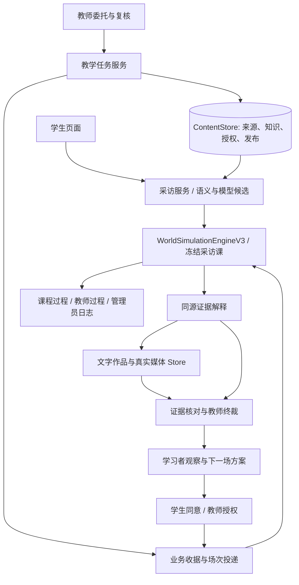

# 岗链智训 — 开发者文档

> **文档梗概**：记录当前 `V3.0.0` 阶段交付的实现、操作、数据与边界。产品目标只见[02](02-项目规划.md)，已发生提交只见[03](03-开发历史.md)，结构取舍见[04](04-智能体设计架构.md)。本文件合并旧版重复说明；历史时点的实现与截图不作为当前验收依据。
>
> **具体规划法则**：依据实际调用和持久记录说明功能；代码定义的细节链接到唯一实现。规则检查、真实模型调用、模拟师生操作和外部意见分别表述。
>
> **最后一次更新时间**：2026-09-13
>
> **更新者**：主控与系统架构组

## 目录

- [0. 先看结论](#0-先看结论)
- [1. 当前用户实际体验](#1-当前用户实际体验)
- [2. 当前系统分层与权威调用链](#2-当前系统分层与权威调用链)
- [3. 当前课程与运行时模型](#3-当前课程与运行时模型)
- [4. 当前岗位世界实现程度](#4-当前岗位世界实现程度)
- [5. 当前智能体群实现程度](#5-当前智能体群实现程度)
- [6. 当前评价实现程度](#6-当前评价实现程度)
- [7. 当前前端实现程度](#7-当前前端实现程度)
- [8. 公共契约、接口与授权](#8-公共契约接口与授权)
- [9. 数据、模型与恢复](#9-数据模型与恢复)
- [10. 程序目录与关键入口](#10-程序目录与关键入口)
- [11. 启动和体验当前版本](#11-启动和体验当前版本)
- [12. 测试基线及其证明边界](#12-测试基线及其证明边界)
- [13. 当前缺陷与技术债登记](#13-当前缺陷与技术债登记)
- [14. 修改当前代码时不可破坏的边界](#14-修改当前代码时不可破坏的边界)
- [15. 文档与规划入口](#15-文档与规划入口)

## 0. 先看结论

当前主线是高职融媒体岗位实训。V2.8在原权威世界与作品服务上接入档案式首页、单门在学规则、三地区场景、实际人物MCP、跨场关系摘要、私人笔记与自愿作品附件，以及课前人物节点配置。教师以学生为中心查看课程与作品；学生以课程为中心探索和提交。详细结构与操作见[17号架构说明](01-子文档/17-V3交互骨架与内容架构.md)。

V2.9已接入三地区各20场景与20名主要人物，每课12个调查方向、4种轮换委托、独立成果计划与作品评价。旧场次继续使用原发布内容；新课采用当前发布，教师保存的课前配置仍按其发布版使用。真实师生试用与专业效度尚未建立。默认无配置时使用规则回应，有配置时使用模型，执行方式以真实收据为准。详见[18号内容手册](01-子文档/18-V3课程内容与作品评价.md)。

V3.0完成个人作品归档入口、教师无模型时的逐维评阅、历史课程与新单课规则衔接、媒体文件隐式标识和升级恢复窗口，清理重复的旧委托作品列表。操作与实际验证集中见[19号交付手册](01-子文档/19-V3成品交付与验收.md)。

<a id="24-教师任务发布与独立场次"></a>
## 1. 当前用户实际体验

### 1.1 教师：学生档案与课前课程导演

“学生档案”按一名学生归集当前课程、历史练习、送审作品、可选附件与有效评价。已提交的作品与笔记副本可直接打开查阅；未提交的私人笔记不在教师权限内。没有有效评价时显示待评，不填充示范分数。

“课程导演”选择一门课程，新增人物并配置名称、岗位、目标、性格、知识、位置、立绘和联络意愿。默认六节点可以直接使用，也可调整节点说明和可选能力。保存时校验，发布后只供之后新开的场次使用。在学课程不会被热更新。人物资料复用SQL内容库，不按人物新增数据库。

原岗位委托设计入口保留在课程导演页：输入委托、受众、学生基础、来源和课时，按社区人物报道或公共服务信息模板生成草案，修改并确认发布。学生档案中的“教师委托”分类展示本班最新发布。实际课堂适用性、专业量规和结果由教师复核。

### 1.2 学生：课程档案、现场与作品

每份档案是一门课程或本班委托。悬停、键盘聚焦可预览，展开模式便于比较，点击后进入个人场次。始终只有一门在学课程：返回首页不结束，完成或手动放弃才结束；换课时选择放弃还须第二次确认。旧记录保留，不把放弃写成完成。

学生按地图和现场出口探索，与实际在场人物交流；认识和加好友分开，部分人物会拒绝添加。关系摘要在同一学生后续进入同一地区时延续；场次时间、作品和探索进度重新开始。右下角采访本支持多页自由笔记与自动保存。

工作台保留成果流程与编辑区，去掉强制选择引用的侧栏、证据条数门和凑修订次数门。学生可以只交作品，也可以主动附上笔记副本或纸质笔记照片。后台仍保留实际资料和行为来源，不能把所有已看材料自动声称为学生使用的引用。

### 1.3 管理员：可追溯运行

管理员查看实际代际的世界日志、人物/协作运行、评价来源与独立调用账本。业务收据和评价分别加载，评价异常不会遮蔽已提交作品的恢复状态。未形成消融实证时仍显示证据不足；程序不将空观察或固定演示结果包装成架构优势。

## 2. 当前系统分层与权威调用链



源码中的V3、V4是契约与运行代际，产品页面共同服务同一场次。当前采访作为同一WorldSimulationEngine记录中的fieldInterview分支提交，不另造学生状态。旧课程仍通过原WorldEngine与冻结体验描述读取；不能因为名字相近而把两种事件格式合并或拿旧世界覆盖新场。

主要组合根在[server.ts](../apps/api/src/server.ts)，代际选择在[session-experience-descriptor.ts](../apps/api/src/session-experience-descriptor.ts)。跨Store仅在真实权威提交后投递，从而保留失败位置和可恢复的原请求。

<a id="31-当前内容数量"></a>
<a id="314-content-012-独立专业训练包"></a>
<a id="315-v2528-content-012-真实课程成果映射返修"></a>
<a id="317-v2531-be-007-教学资料工作区"></a>
<a id="318-v2538-content-013-案例资料与岗位任务阅读"></a>
<a id="23-岗位教学任务与专业对照内容"></a>
<a id="21-授权资料召回排序"></a>
## 3. 当前课程与运行时模型

课程目录仍含5门课程、30章、106个知识ID：70条基础、12条旗舰扩展、24条职业训练知识。课程为蟳埔、村超跨平台、村超发布后语境、AI旅游版权治理、景区暴雨信息服务；每门课程的章节与运行资格由[course-content](../packages/course-content/src/index.ts)导出，不在前端复制课程名称表。

三地区现场定义见[field-lessons-v3](../packages/course-content/src/field-lessons-v3.ts)，地区归属与封面简介见[course-regions](../packages/course-content/src/course-regions.ts)。五门课程经[正式开课装配](../apps/api/src/published-course-runtime.ts)绑定本课的场景、人物、轮换委托、成果计划和评价依据，复用既有融媒体世界内核。各课12个调查方向及内容组织见[18号内容手册](01-子文档/18-V3课程内容与作品评价.md)。

新场次使用[按课成果计划](../packages/course-content/src/field-work-plans-v3.ts)，每课六项必交及各自选做内容。历史旗舰的十项岗位任务、九类文字成果与挑战等级门保留在原[作品清单](../packages/course-content/src/xunpu-flagship-content-v3.ts)，不套用到新课程。两类教师模板和七组专业对照片段的原件是[media-teaching-tasks.ts](../packages/course-content/src/media-teaching-tasks.ts)。对照是教学编写，不是学生答案或预设成绩。

内容SQL保存来源文档、原件/解析修订、片段、知识、向量、用途授权、案例和处理作业。公开PDF可摄入为实际字节与可定位片段；只有教学摘编的条目保持sourceByteHash为空，不冒充原文解析。专业复核状态独立维护。资料工作区支持PDF、OCR、ASR与视频音轨处理；资料转写能力不能外推为作品模型已理解连续音视频。

检索在同一个SQL查询内先限定课程、用途、主体、有效授权与片段范围，再对完整候选计算向量/词法分并排序，最后limit。原按ID预截断的召回错误已修复。词法回退、空授权、撤回与历史授权保持原边界。算法和SQL原件见[SqlContentStore.search](../packages/content-store/src/store.ts)，授权装配见[content-library-runtime.ts](../apps/api/src/content-library-runtime.ts)。

<a id="16-节点探索与正式实训接入"></a>
<a id="164-场景过渡与前导准入"></a>
<a id="18-开放采访样板课实现"></a>
<a id="36-v4-公共语义行动运行时"></a>
## 4. 当前岗位世界实现程度

新课程采用逐步发现的地点图、各自出口坐标与透明人物立绘；未发现或未获准地点不展示内部预览。认识、好友和引荐由实际行动写入世界记录，地图与手机读取同一结果。三地区现各20场景、20名主要人物；数据原件与按课路径见[18号内容手册](01-子文档/18-V3课程内容与作品评价.md)。

旧采访课1.2.0与已有1.1.0场次保留原hash。蟳埔原课的具体安排如下；它们不自动代表其它地区已经具备同等内容深度。

| 实际交互 | 权威后果与边界 |
| --- | --- |
| 移动、观察与问题 | 行动消费本场虚拟分钟，公开路线可独立展开；实质问答与问候分开 |
| 引荐与本人记录方式 | 阿环本人确认后才产生文字/环境记录约定，不能推定录音、面部或任意传播 |
| 约见与离场续访 | 约定时间、到场、错过和继续交谈分别保留；没有见面不计已发生采访 |
| 邮件与工作消息 | 承诺、逾期、催办、送达、阅读与实际取得附件分开；未到达材料不进入作品来源 |
| 商业素材 | 提供样片、水印或缺口核对单均不自动授予许可；可自行采集或只采访观点 |
| 发布后反馈 | 补语境、维持判断、暂缓与学生实际作品修订分开；案例示例不替代本场行动 |

原件：[采访课](../packages/course-content/src/xunpu-exploration-lesson.ts)、[确定性执行](../packages/world-core/src/field-interview-v1.ts)、[共享来源解释](../apps/api/src/field-evidence.ts)。确认安排必须进入世界提交，模型的建议或口头承诺不是已经完成的后果。

<a id="game-007-dialogue"></a>
<a id="38-v4-公共知识接地协作纵切"></a>
<a id="381-v2523-ai-026-来源授权与补证恢复返修"></a>
<a id="382-v2526-ai-026-来源授权与时效恢复幂等返修"></a>
<a id="383-v2530-ai-026-历史授权隔离返修"></a>
<a id="385-v2543-ai-026-引用立场与模型证据边界返修"></a>
<a id="22-人物理解与采访调用账本"></a>
## 5. 当前智能体群实现程度

岗位智能体拓扑保留14种职责，不代表每句话都会运行14个模型。当前采访人物按局部课内材料、本人历史和可用安排回应；原岗位协作按事件选择参与者、形成贡献、保留立场和学生决定。程序问候、地点移动与定时通知不能包装成Live AgentRun。

自然语言先识别当前请求、否定、转述和边界，再生成受限候选。说“需要资料”可提出安排，只有明确确认才写世界。可解释范围外会澄清。实际被拒绝的越界请求保留为反证，讨论或否定这种行为不算实施。

新增[人物MCP工具](../apps/api/src/field-character-mcp.ts)通过真实客户端/服务端进程内协议执行采访、认识、好友与引荐；只接受服务端绑定的调用上下文，模型不能更换学生或绕过内核条件。默认流程中的知识、记忆与行动开关实际影响运行，人物可拒绝不适当请求。

采访同场串行，相同请求合并；调用前先持久预留预算，再检索和请求模型。超时、取消、世界提交失败及重启中断都在独立尝试账本中保留。未知费用占用预留，不写成零账单；模型关闭后不会继续消耗未受控的重试。已结算候选仅在原输入与世界来源一致时复用。

默认不发付费请求。DeepSeek、讯飞及兼容网关以实际配置和调用收据为准；质量模型只能在证据门内提出候选，不能伪造引用、覆盖教师或直接改变世界。实现：[field-interview-service](../apps/api/src/field-interview-service.ts)、[模型账本](../apps/api/src/field-model-attempt-store.ts)、[编排包](../packages/agent-orchestrator/src/index.ts)、[网关](../packages/model-gateway/src/index.ts)。

<a id="20-v26采访证据与角色反馈"></a>
<a id="25-作品反馈与后续采访训练"></a>
## 6. 当前评价实现程度

### 6.1 作品与专业反馈

文字保存/送审有独立修订、父版本、字段、实际引用与内容hash。图像裁切、音视频裁切、遮挡、替换产生可回读派生文件，保留原件、处理操作、权利回执和生成标识。作品、课程过程、教师反馈和管理员日志复用同一来源解释。

六维为事实核验、采访同意、编辑判断、素材权利、媒体适配和纠错迁移。新的课程在必交作品全部送审后，按当前课程目标审读实际内容；实际取得的材料与对话提供核验上下文，不要求手动勾选引用卡。已有蟳埔历史场次继续保留原来的结构化事实规则与冻结量规。

新课程没有有效模型结果时保留空分数，并支持本人显式重评；同一请求不重复调用，教师终裁后的同一作品不被模型覆盖。教师可依据已经提交的本课作品逐维审阅。篇幅、点击、好友、建议采纳率与修订次数不加分。媒体按实际需要选择，原件与派生文件仍接受哈希和使用范围检查；没有观察到的视听内容不得被模型声称已经评阅。

无模型成绩时，教师填写六维判断、分数和具体理由后形成终裁；正式评价的来源指向实际已提交作品修订，不能由浏览器补造来源。PNG派生通过[共享生成标识工具](../packages/media-processing/src/png-disclosure.ts)保留隐式元数据，音视频派生同步写入标识说明，原素材及像素内容不会被这一登记修改。

输入、判定、教师修订和调用记录均保留版本。问候或阅读标记不会使既有评价失效，实际新来源、安排、作品或后果会重新核对。实现：[作品Store](../apps/api/src/flagship-student-work-v3.ts)、[媒体处理](../apps/api/src/flagship-media-v4.ts)、[来源核对](../apps/api/src/field-learning-evidence.ts)、[正式评价](../apps/api/src/flagship-assessment-v4.ts)。

### 6.2 下一场与结果校准

教师终裁后，学习者模型保留支持、反证、不确定性和当前成长重点；学生同意、申诉与教师授权沿原流程执行。一次挑战最多变化一级，下一场具有独立世界、成员和作品。

| 变式 | 学生实际遇到的采访变化 |
| --- | --- |
| 来源三角核验 | 陈老师资料承诺延后到9分钟，需要并行对照已有来源 |
| 同意与协商 | 阿环记录方式确认之前需先说明身份、教学用途和拟公开范围 |
| 公共服务时限 | 蔡主任现场咨询截止改为第12分钟，回执同步修改，之后仍可发工作消息 |
| 编辑独立性 | 有限使用商户素材前需明确片源关系和记者选题权，仍须核对实际许可 |

原件：[采访变式](../apps/api/src/adaptive-field-lesson.ts)、[适配服务](../apps/api/src/learner-adaptation-v4.ts)。新场没有继承上一场学生已经完成的对话、材料或作品。

上表为历史蟳埔安排。当前三地区按实际冻结课程的人物和材料生成对应变化，具体代码同样在采访变式模块；不将陈老师或蔡主任复制到榕江、青岚。准备好的下一场须通过个人在学入口接纳，另一门课未结束时拒绝直接进入；原终裁记录仍可回读。

新采访场采用field-work-v1冻结窗口，核对本人的实际问题、安排、取得资料、送审内容与变式条件。窗口未结束保持观察，缺证或未达成记录失败；旧V3窗口保持原策略。校准只更新预测可信度与不确定性，不回填能力分。实现：[校准](../apps/api/src/learner-calibration-v4.ts)。

<a id="16-独立前端空间交互前测"></a>
## 7. 当前前端实现程度

FE-020已在当前工作区将学生、教师起始页改为黑色三维档案室，包含交错波浪、局部暂停、悬停预览和横向抽出详情；详情按钮才调用原业务入口。实现、适配、实际检查及新截图见[黑色首页说明](01-子文档/17-V3交互骨架与内容架构.md#black-archive-implementation)。这是V3.0.0之后的工作区改动，尚未建立新的发布标签；下方V2.8设计资料保留其阶段口径。

档案首页、人物课程导演和纸面工作台使用统一的深绿、纸白与封签层次。动画只作用于装饰层，按钮保持稳定命中；支持减少动态、窄屏与键盘访问。地图、人物、笔记与设置的实现和设计图见[17号说明](01-子文档/17-V3交互骨架与内容架构.md)。

正式前端唯一入口为[apps/web](../apps/web/package.json)。React按角色和页面懒加载；旧独立前测包已退出workspace。当前节点场景使用Three呈现，手机、采访本、工作台和对话层使用React交互，不在画布内复制业务状态。

教师任务页支持桌面与窄屏，未保存修改不能发布。师生反馈页优先呈现冲突和缺口，保留具体原文、来源与追溯。管理员业务收据独立显示失败状态，无法读取时不冒称零条。

网页黄金链位于[e2e](../playwright.config.ts)。本轮浏览器连接工具的请求头策略加载失败，使用仓库Playwright验证；不能把它写成外部Edge连接成功。旧演示手册与概念图按原版本保留，不代表当前UI快照。

## 8. 公共契约、接口与授权

公共请求/响应采用[contracts](../packages/contracts/src/index.ts)中的Zod Schema。产品版本、Schema版本、课程发布和内容hash独立演进。产品包3.0.0不要求所有契约或内容版本同时改成3.0.0。

| 业务 | 实现入口 |
| --- | --- |
| 个人在学、开始/完成/放弃 | [student-study-routes](../apps/api/src/student-study-routes.ts) |
| 私人笔记与并发修订 | [student-notebook-routes](../apps/api/src/student-notebook-routes.ts) |
| 课前人物、知识与发布 | [character-studio-routes](../apps/api/src/character-studio-routes.ts) |
| 教师学生档案与已交作品 | [teacher-archive-routes](../apps/api/src/teacher-archive-routes.ts) |
| 教师任务草案/修改/发布、学生开训 | [teaching-task-routes](../apps/api/src/teaching-task-routes.ts) |
| 采访、语义行动和原V4协作 | [flagship-experience-v4-routes](../apps/api/src/flagship-experience-v4-routes.ts) |
| 文字工作台、引用、修订与送审 | [flagship-workspace-v3-routes](../apps/api/src/flagship-workspace-v3-routes.ts) |
| 真实媒体派生与回读 | [flagship-media-v4-routes](../apps/api/src/flagship-media-v4-routes.ts) |
| 评价、教师复核及管理员依据 | [flagship-assessment-v4-routes](../apps/api/src/flagship-assessment-v4-routes.ts) |
| 同意、申诉、教师授权、下一场 | [learner-adaptation-v4-routes](../apps/api/src/learner-adaptation-v4-routes.ts) |

身份来自服务端会话，变更校验Origin、Cookie、CSRF与角色绑定，浏览器不能声明另一学生或教师身份。新独立场要求显式学生成员；教师按班级范围查看。演示身份切换用于单机体验，不是生产SSO、实名身份或完整租户隔离。

## 9. 数据、模型与恢复

| 权威数据 | 当前存储/行为 |
| --- | --- |
| 当前课程与历史状态 | 按学生隔离的StudentStudyStore，不复制世界事实 |
| 私人笔记 | 按学生与课程隔离的StudentNotebookStore；已交副本属于原作品提交 |
| 来源、知识、授权、案例与教学任务发布 | 一套PGlite内容SQL库；按需初始化，已有发布在启动时恢复 |
| 世界与采访 | 冻结发布对应的JSON/JSONL世界Store，包含事件与版本 |
| 文字、媒体与正式评价 | 各自版本Store，保存内容hash、父版本和原始依据 |
| 人物、协作、学习者与尝试账本 | 分职责Store，引用世界和评价，不作为另一份学生事实源 |
| 跨Store业务 | BusinessOperationCoordinator先提交权威，再幂等投递；失败位置与原提交引用保留 |
| 本机写入与备份 | DATA_DIR租约、原子替换、校验hash、恢复检查点与版本门 |

目前统一收据覆盖作品送审、教师终裁、后续训练与教师任务开训。教师任务和后续训练共用[场次投递](../apps/api/src/flagship-session-provision.ts)。启动恢复已有操作不生成替代学生行为，不用新请求吞掉原失败。

来源文件、备份与恢复见[local-data-backup](../apps/api/src/local-data-backup.ts)。备份必须核验manifest、文件hash与产品兼容版本；已有目录不被恢复操作静默覆盖。新备份formatVersion=2同时校验文件和完整目录集合，保留PGlite必需的空目录；旧v1纯JSON备份继续支持，旧v1 SQL备份缺少目录清单时明确拒绝恢复，需从原DATA_DIR重新备份，不静默补造数据库结构。跨进程生产数据库、生产身份和完整事务迁移留后续。

V3.0恢复窗口接纳V2.7、V2.8、V2.9和当前版本，并保留原先明确支持的历史版本；不能从此推断任意旧版或未来版本都可恢复。精确列表以代码为准。历史课程认领保留原发布与绑定，纳入同一单课记录；本人已结束课程可继续查阅和复核作品。

<a id="19-v26工作区整理"></a>
## 10. 程序目录与关键入口

```text
apps/api/                 服务组合、身份、路由、业务Store及恢复
apps/web/                 唯一正式三角色前端
packages/contracts/       公共Schema及产品版本
packages/course-content/  课程、知识、采访课、任务与对照原件
packages/content-store/   内容SQL、检索与授权
packages/world-core/      权威世界、采访执行和角色投影
packages/agent-orchestrator/  协作、证据门和质量候选
packages/model-gateway/   模型协议、调用控制与取消
packages/media-processing/   资料与媒体处理工具
scripts/                  启动、检查、备份与交付
e2e/                      真实API与浏览器回归
doc/                      当前实现、规划、历史和必要设计
资料/                     赛事、专业、技术与职业教育依据
.local/data/              正式启动入口默认数据
.local/                   本机依赖、测试产物与可恢复旧目录
.local-secrets/           本机密钥，Git忽略
```

四套旧演示数据（.data-demo、.data-demo-pdf-v249、.data-live-guided-20260904、.data-video-v4-20260904）和两套独立前端（临时前端设计、前端交互前测）已退出根目录与发布源码。批量删除曾被自动审批阻止，采用可恢复迁移，现位于.local/retired-v260；未宣称永久删除或释放磁盘。

当前前端已采用的素材保留在正式资源目录，唯一视觉基准与来源说明整合到[视觉资料](../资料/91-视觉与演示资产/节点探索视觉基准/README.md)。用户未提交的视频、参赛材料和本机密钥保留。旧源码由Git承接，不增加源码备份副本。

V2.7.0按`main.tsx → App.tsx → v2`的静态、重导出和动态导入链复核前端：107个源码模块中69个由正式入口到达，另外38个仅服务已退出的旧前端；其外部导入仅来自17个旧界面测试。已删除这38个模块、5份旧样式、17个配套测试和2份专用fixture，共62个文件。仍被当前页面调用的V3/V4模块与后台历史场次契约保留。退役源码可通过Git的V2.6.0标签回看。

V2.7清理的实际检查见[190号历史](03-开发历史.md#v270-retirement)。V2.8替换首页后另移除两个不再可达的旧页面及对应旧界面断言，保留仍在使用的课程详情、作品、评价和历史世界组件。当前验证与截图集中写入[17号说明](01-子文档/17-V3交互骨架与内容架构.md)，不以历史全量检查代替当前结果。

## 11. 启动和体验当前版本

Windows可使用根目录“启动融岗智训.cmd”或“启动融岗智训.ps1”。开发环境建议使用已验证的Node 24.20.0及仓库固定的包管理器配置；不要覆盖共享依赖仓库的全局配置。

```powershell
corepack pnpm install --frozen-lockfile
corepack pnpm start
```

默认Web为http://127.0.0.1:4173，API为http://127.0.0.1:3001，数据为.local/data。输入stop回车可关闭子服务并释放租约，也支持Ctrl+C。直接API入口也把相对DATA_DIR解析到仓库根目录，默认使用同一.local/data。冒烟与新空白演示优先使用各自隔离目录，不被本机旧数据配置覆盖。首次启动需要构建、登记课程和创建演示场，请等待脚本输出可用入口。模型、端口和数据目录由[启动脚本](../scripts/run-demo-stack.mjs)读取实际配置。

```powershell
# 明确复用某个既有数据目录
$env:DEMO_DATA_DIR = Join-Path (Get-Location).Path '.local/data'
corepack pnpm start
# 创建独立空白演示，保留已有数据
corepack pnpm start:fresh
# 临时数据启动与关闭冒烟
corepack pnpm start:smoke
```

演示次序：教师“课程导演”配置并发布人物或岗位委托 → 学生从档案开课 → 地图探索、认识人物、协商联络与记私人笔记 → 工作台保存及送审 → 教师“学生档案”查阅作品、附件和评价。已有蟳埔终裁、学生同意与教师授权下一场仍沿原入口保留。

教师与管理员入口可从角色切换选择。调试时可使用profileId=teacher-class-a、student-unassigned、student-team-a或operator-demo；场次引用必须来自实际创建结果，不手写或共用另一学生的bindingId。

## 12. 测试基线及其证明边界

```powershell
corepack pnpm preflight
corepack pnpm check:versions
corepack pnpm check:docs
corepack pnpm check:secrets
corepack pnpm typecheck
corepack pnpm test
corepack pnpm build:apps
corepack pnpm test:e2e:built
```

定向回归覆盖来源归属、未到达材料、否定表达、反证、调用预算、幂等恢复、两类教师委托、不同学生隔离、作品对照和窗口校准。V2.8新增[档案与三地区浏览器回归](../e2e/v280-experience.spec.ts)、[并发场景投影](../apps/api/test/published-course-projection-v3.test.ts)、[单课与笔记](../apps/api/test/student-study-notebook-v3.test.ts)及[MCP传输](../apps/api/test/field-character-mcp.test.ts)。既有整链原件为[教师任务](../e2e/v260-teaching-task.spec.ts)及[作品到下一场](../e2e/v260-learning-loop.spec.ts)，其中师生输入明确标注为工程模拟。

本轮回归、版本、启动/重启、桌面/窄屏和发布结果在[V3验收记录](01-子文档/19-V3成品交付与验收.md)集中登记，V2.6记录按历史保留。不能用测试数量代替功能证明，不能将历史V2.4.9的77页手册和48张截图写成本版本验收，也不能把deterministic或mock当Live证据。

<a id="04-2026-09-07-复审与目标设计入口"></a>
<a id="17-蟳埔课程复审与后续设计入口"></a>
## 13. 当前缺陷与技术债登记

| 剩余边界 | 当前处理与后续方向 |
| --- | --- |
| 内容体验尚需持续校准 | 三地区内容、按课成果与评价已经接通；40分钟首次学习时长和教学效果仍需真实学习者验证，当前只有工程体验 |
| 教师任务生成范围有限 | 两类知识/规则模板可编译；任意课程自动创作与自由地图不在本阶段承诺内 |
| 专业评价仍需真实复核 | 有限来源检查、具体原文与教师复核已接通；完整开放域语义、多模态效度仍未建立 |
| 真实教学效果与用户意见 | 提供试用及复核材料，等待真实参与者；不得以工程模拟代填意见 |
| 生产身份与存储 | 单机租约和Store恢复可用；SSO、多租户、生产事务库仍属DATA-006/BE-008 |
| 跨课程长期模型与全面反事实推演 | 同地区人物关系摘要已跨场承接；长期能力模型、实际强化学习和全面反事实推演没有整体完成 |
| 代码体积与模块规模 | server.ts、WorldEngine、聚合Schema和Three包仍偏大；沿实际职责改动，不作无需求的搬移重构 |
| 后续回归维护 | 新增功能继续维护角色隔离、来源、真实媒体及窗口回归，检查范围与实际结果见V3验收记录 |

原采访送审source_drift、课程遗漏、管理员读旧世界、召回预截断、预算漏记、固定课程标题和新任务开训缺口已经关闭，其具体变更与证据见[本轮历史](03-开发历史.md#v260-baseline)。上述后置事项继续保留原任务编号，不能借V2.6.0宣称完整D包已交付。

## 14. 修改当前代码时不可破坏的边界

- 事实属于实际场次、学生与冻结发布；不按页面状态反写世界，不共享学生作品。
- 来源取得、模型候选、教师确认与学生行动分别留痕，未发生的事实保持未知。
- 新发布不覆盖旧场；版本迁移保留旧ID、hash、原收据和可审计决定。
- 评价、模型调用和预测分域；未知成本保留预留，校准不回填成绩。
- 文本、模型与业务错误不得用兜底成功掩盖；控制台或接口失败必须给出实际状态。
- 外部师生反馈、专业认证与签字材料由实际参与者提供，工程模拟不能替代。

## 15. 文档与规划入口

- [00总纲](00-项目总纲.md)：作品定位、阶段范围与用户入口。
- [02规划](02-项目规划.md)：新一轮内容讨论、待确认问题、任务和版本安排。
- [03历史](03-开发历史.md)：真实提交与验收边界。
- [04架构](04-智能体设计架构.md)：权威分层及模型、规则、人类之间的结构取舍。
- [15阶段设计](01-子文档/15-V2.6阶段闭环设计.md)：V2.6阶段目标与边界，验收结果见16号记录。
- [16验收记录](01-子文档/16-V2.6验收记录.md)：V2.6历史检查与外部条件。
- [17交互骨架](01-子文档/17-V3交互骨架与内容架构.md)：V2.8的架构、操作和阶段验收。
- [18课程内容](01-子文档/18-V3课程内容与作品评价.md)：当前三地区、五课程及作品评价依据。
- [19成品交付](01-子文档/19-V3成品交付与验收.md)：V3操作步骤、收尾修复、实际验证和截图。
- [黑色首页复刻](01-子文档/17-V3交互骨架与内容架构.md#black-archive-implementation)：已确认交互稿的工作区复刻、适配和验证。
- [专业复核包](../资料/04-职业教育依据/06-V2.6岗位任务与专业复核包.md)、[目标用户试用提纲](../资料/04-职业教育依据/02-目标用户访谈提纲.md)。

旧版文内锚点保留到相关当前章节；需要复现旧时点的代码和文档，可依据03的提交索引从Git读取，不将历史设计当作当前承诺。
