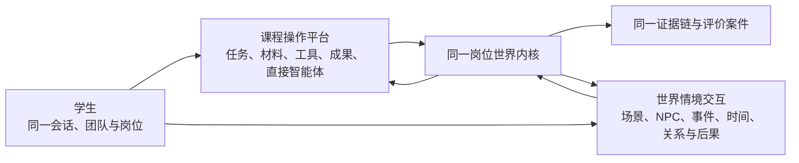

# 融岗智训 — 产品设计定型稿

> **适用范围更新（2026-09-07）**：本文保留对应旧阶段的设计和验收事实。新一轮本体开发以[02 当前计划](../02-项目规划.md)及[12 技术目标设计](../01-子文档/12-技术实现审查与冲刺架构.md)为准；旧阶段的固定节点、数量、版本和内部国金准入不自动延续为新周期要求。

> 该文档隶属于[02-项目规划.md](../02-项目规划.md)，用于固化技术实现讨论前已经确认的最终产品设计。后续技术架构、功能拆分、课程开发与原型验收必须以本文为产品基线。

| 项目 | 定型内容 |
| --- | --- |
| 项目全称 | 融岗智训——面向职业教育高水平专业群建设的融媒体内容生产与治理岗位群教学实训智能体平台 |
| 设计总纲 | 一核双端，课境共生 |
| 产品理念 | 看得全面、演得真实、评得可信、改得有效 |
| 文档状态 | 产品设计定型基线 |
| 定型日期 | 2026-07-22 |
| 最近收束 | 2026-07-29：将双维度、智能体群和可信评价收束为国金三项创新与六类成果证明 |

---

## 1. 项目定位

“融岗智训”面向职业院校融媒体相关专业群，将融媒体内容生产与治理岗位中的真实工作流程、岗位关系、职业冲突和评价标准，转化为可教学、可运行、可观察、可评价的智能实训环境。

平台不是帮助学生一键生成稿件或视频，而是搭建一间由多智能体持续驱动的“虚拟融媒体编辑部”。学生以记者、编辑、视听制作、事实核查、内容审核、平台运营等岗位身份进入情境，通过文字、语音、图片、视频和文件完成任务，并在信源变化、版权争议、平台规则和舆情演化中作出职业判断。教师则负责组织课程、配置情境、观察过程、复核评价并改进教学。

从产品体验上，它可以被理解为一个面向融媒体职业教育的“岗位世界”；从技术上，它是由结构化状态、事件规则、角色智能体、RAG和证据评价共同组成的可推演职业情境仿真系统，不等同于机器学习意义上的世界模型。

项目最终要实现的不是“AI替学生做得更快”，而是：

> **让学生在AI参与、信息冲突和规则约束下，完成可信、合规、可解释的融媒体工作任务，并使其真实职业能力被看见、被评价、被改进。**

## 2. 对赛题的回应

项目参加2026年度中国青年科技创新“揭榜挂帅”擂台赛新一代信息技术领域，响应科大讯飞榜题 `XA-202603`“面向职业教育高水平专业群建设的教学实训与岗位技能智能体开发”。

| 赛题关键词 | 产品回应 |
| --- | --- |
| 职业教育 | 服务中职、高职和职业本科的技术技能人才培养，不做普通本科通识教学或就业咨询 |
| 高水平专业群建设 | 以融媒体技术与运营为主要切口，联动新闻采编与制作、网络新闻与传播、广播影视节目制作等相关专业，沉淀共享课程、情境、任务和评价资源 |
| 教学实训 | 把真实工作过程转化为岗位工单、动态情境、阶段成果和教师可复核的课堂实训 |
| 岗位技能 | 围绕策划、采集、编辑、制作、核查、审核、发布、运营与复盘等典型任务评价学生 |
| 智能体开发 | 由多个具有不同身份、目标、权限和信息的智能体共同构成岗位生态，而不是设置一个通用问答机器人 |

项目的扣题闭环为：

> **专业群 → 岗位群 → 典型工作任务 → 课程与情境 → 学生行动证据 → 岗位能力评价 → 课程和专业群改进**

“高水平智能体群”不能只由架构图或角色数量证明。最终必须用同模型、同知识、同工具和同情境下的三组消融，证明职责分离、私有视野、事件调度和权威世界门能够减少越权或事实漂移、提高证据覆盖或任务质量、降低教师修订负担；不能证明独立价值的智能体应合并或删除。

## 3. 总体设计：一核双端，课境共生

### 3.1 一核：高仿真岗位实训与评价中枢

“一核”是整个平台的运行中枢，统一承载：

- 课程目标与岗位任务编排；
- 多智能体角色调度与协作关系；
- 情境状态、动态事件和因果分支；
- 多模态材料输入、作品提交与分析；
- 学生操作、判断依据和修改行为留痕；
- 原创评价规则、智能初评与教师复核；
- 学生、班级、课程和专业群四级反馈。

这个中枢的重点不是生成更多内容，而是让课程真正“运行起来”：角色会互动，信息会变化，规则会约束，选择会产生后果，表现会留下证据。

### 3.2 双端：教师教学端与学生实训端

**教师教学端**承担课程与情境组织。教师可以选择或组合课程，设定能力目标、学生岗位、素材、智能体角色、事件难度和评价量表；实训过程中查看进度、关键决策和风险节点，必要时人工投放事件；实训结束后复核系统评价，查看班级能力短板与课程改进建议。

**学生实训端**承担岗位任务执行，并提供两种可以随时切换的工作方式：一是面向明确任务、材料、工具、成果和直接智能体辅助的“课程操作平台”，二是面向场景、NPC、动态事件、关系和后果的“世界情境交互”。学生以同一岗位身份在两个维度中开展策划、采访、制作、核查、审核、发布和复盘；在与智能体和同组成员的互动中识别信息差异、处理职业冲突、提交工作成果，并为关键判断提供依据。

双端并非两个彼此孤立的界面，而是围绕同一课程、同一情境和同一证据链协同运行。

### 3.3 学生端双维度：操作平台与世界交互

“双维度”不是再增加一个与课程平台无关的小游戏，而是让同一项岗位工作可以用两种互补方式完成：

| 维度 | 主要价值 | 典型行为 | 不能退化成 |
| --- | --- | --- | --- |
| 课程操作平台 | 高效理解要求、处理材料、协作生产和提交成果 | 制订选题、检索信源、上传材料、编辑版本、提交审核、查看反馈 | 传统课件目录、作业提交页或万能聊天框 |
| 世界情境交互 | 在信息差、时间压力、人物立场和事件后果中训练职业判断 | 采访NPC、现场调研、处理改口、应对突发事件、观察传播反馈 | 纯剧情阅读、无后果选项或依靠悬念推进的文游 |

两种模式共享同一 `sessionId`、岗位身份、世界状态、材料版本、NPC承诺、虚拟时间、权限、证据和评价标准。界面切换只是呈现方式变化；任何会影响任务、人物、材料、成果或评价的动作都必须进入统一世界事件链。

世界情境交互正式称为“结构化可演算职业情境世界”。首版不引入图像生成模型，不追求三维开放世界，而使用固定2D/2.5D场景、头像或立绘、事件卡、状态层和轻量动效表达职业现场，把资源集中投入事件逻辑、智能体协作、课程内容与可信评价。

### 3.4 课境共生：课程定义能力，情境承载训练

“课程”解决教什么、练什么和按什么标准评价；“情境”解决任务如何发生、岗位如何互动、变量如何演化以及学生如何表现。二者通过统一的可执行课程节点连接：

> **教学目标 + 岗位任务 + 输入材料 + 智能体角色 + 动态事件 + 学生操作 + 阶段成果 + 过程证据 + 评价标准**

当前设计的四门课程只是首批样板内容，不是固定产品架构：

1. 融媒体选题策划与新闻采集；
2. 多模态内容制作与平台适配；
3. 事实核查、版权与内容治理；
4. 融媒体综合项目实战。

未来教师可以新增课程、拆分课程、组合课程，也可以让同一课程运行在不同地区、题材、岗位难度和事件分支中。情境为课程提供真实性，课程为情境提供教学目的，二者共同构成可持续扩展的实训内容体系。

## 4. 最终内容布局

### 4.1 可执行课程体系

每一门课程都应由可运行的课程包构成，而不是只保存教案或课件。课程包至少包括：

- 对应专业、课程和岗位能力目标；
- 典型工作任务及岗位分工；
- 分节点任务与通过条件；
- 学生所需的素材、工具和规则；
- 智能体介入位置及行为边界；
- 可触发的基础、进阶和挑战事件；
- 阶段成果、最终成果与评价量表；
- 过程证据采集要求及教师复核点。

课程既可独立用于日常课堂，也可按教学目标自由组合，最终还可围绕同一持续演化事件形成综合实战。

### 4.2 岗位情境体系

岗位情境不是静态案例背景，而是具有状态、角色、时间和后果的任务环境。每套情境应包含：

- 事件背景、受众、传播目标和时限；
- 学生岗位、智能体岗位及其权限关系；
- 初始信源、素材包和隐藏信息；
- 可由时间、进度或学生行为触发的动态事件；
- 正常发布、补充核验、返工、延期、下架或风险升级等结果分支；
- 与课程目标和评价指标之间的明确映射。

同一情境可以承载多门课程，同一课程也可以适配多套情境，从而避免课程内容与案例题材绑定。

### 4.3 多智能体岗位集群与全流程使用

| 智能体类别 | 典型角色 | 在实训中的职责 |
| --- | --- | --- |
| 情境调度类 | 总控、事件调度、总编 | 管理任务状态、发布指令、控制节奏并触发事件 |
| 内容生产类 | 策划、记者、编辑、视听制作、平台运营 | 从时效、创意、表达和传播效果角度推动生产 |
| 信息交互类 | 采访对象、当事人、专家、机构联系人、普通用户 | 提供局部、变化、模糊甚至相互冲突的信息 |
| 内容治理类 | 事实核查、版权审核、平台审核、舆情研判 | 从真实性、版权、伦理、合规和公共风险角度提出质疑 |
| 教学评价类 | 过程观察、岗位评价、复盘引导 | 汇总证据、执行初评、指出能力缺口并引导反思 |

各智能体必须拥有清晰的身份、目标、信息范围和行为边界。部分智能体帮助学生，部分智能体提出约束，部分智能体制造真实工作中的信息差与冲突。

智能体不能只出现在结构化世界的NPC层。目标产品应在七个使用平面中形成规模化协作：

- 学生操作辅助：课程导航、任务规划、证据教练；
- 教学与情境导演：教学导演、情境导演；
- 世界岗位角色：总编、采访对象、机构联系人、版权方、平台运营等可实例化NPC；
- 材料与内容生产：材料理解、采访结构化、内容适配；
- 专业治理：事实、版权、内容安全、平台规则；
- 评价与教师辅助：三类语义评价、课程设计、实时干预和复核助理；
- 监督学习：只生成待审核候选的学习策展。

规模化使用按三层管理：

| 层 | 解决的问题 | 产品含义 |
| --- | --- | --- |
| `AgentTemplate` | 这类智能体能做什么、不能做什么 | 固定职责、图、提示词、工具、权限、输出和版本 |
| `AgentInstance` | 它在本课程、本班、本组和本次情境中是谁 | 绑定角色卡、NPC身份、岗位视野、私有记忆和会话 |
| `AgentTask` | 它为什么在此刻被唤醒 | 绑定触发事件、输入版本、预算、租约、重试和追踪 |

一个模板可以产生多个隔离实例，一个实例可以处理多次持久任务。系统只唤醒受当前行动影响的实例，不让所有智能体围绕每条消息同时运行。

### 4.4 资源与规则体系

平台需要持续沉淀五类核心内容资产：

- **岗位与能力库：**职业标准、岗位职责、典型任务、能力指标；
- **课程与工单库：**课程包、任务节点、成果模板、教学说明；
- **案例与素材库：**文本、采访音频、图片、视频、数据、证照和历史案例；
- **情境与事件库：**人物设定、事件脚本、触发条件、结果分支；
- **治理与评价库：**事实核查方法、版权规则、平台规范、评价Rubric和标注样例。

真正难以复制的竞争力，将来自这些内容资产与仿真、评价机制之间的结构化连接，而不是单纯来自界面或模型调用数量。

## 5. 核心功能

| 功能模块 | 最终成品应具备的能力 |
| --- | --- |
| 课程与情境编排 | 教师选择、组合或新建课程，配置岗位、材料、节点、事件与评价标准 |
| 学生端双维度 | 在课程操作平台和世界情境交互之间无损切换，两端共享岗位、世界、材料、证据与评价 |
| 岗位与团队组织 | 分配学生岗位和权限，支持个人实训与多人协作 |
| 多模态任务交互 | 支持文字、语音、图片、视频、文档和结构化表单的输入、处理与提交 |
| 多智能体协同 | 依据角色、阶段和情境状态调用不同智能体，而非所有问题交给同一助手 |
| 动态事件推演 | 根据信息变化、时间进度和学生行为实时触发突发情况与后续分支 |
| 决策后果反馈 | 学生选择可导致通过、驳回、返工、延期、下架或风险升级等不同结果 |
| 过程责任证据链 | 记录智能体建议、学生接受或拒绝、判断依据、修改行为和最终后果 |
| 原创综合评价 | 综合任务成果、工作过程、内容治理、职业判断与反思迁移进行评价 |
| 教师复核 | 对关键结论、红线问题和综合评分保留教师确认、修订与解释权 |
| 能力画像 | 输出学生个人能力结构、团队协作表现与改进建议 |
| 教学诊断 | 汇总班级共性短板，定位课程节点、素材和评价标准中的问题 |
| 专业群反馈 | 将跨课程、跨情境能力数据映射为课程体系和实训资源建设建议 |

## 6. 四项产品理念

### 6.1 看得全面

平台不仅看最终作品，还观察学生如何获取信息、选择信源、使用AI、回应质疑、修改成果和承担岗位责任；不仅分析文本，还接收语音、图片、视频、文档及操作记录；不仅给出学生分数，还呈现个人、团队、课程和专业群多个层级的结果。

“看得全面”由多模态数据和全过程证据共同保证。

### 6.2 演得真实

平台还原真实融媒体岗位关系、业务流程、信息差异、规则约束和时间压力。智能体并不统一迎合学生，而是拥有不同目标和立场；事件也不会始终沿固定脚本发展，而会根据学生行为实时变化。

“演得真实”不是追求数字人或三维场景的表面逼真，而是确保岗位关系真实、职业冲突真实、事件因果真实、决策后果真实。

### 6.3 评得可信

平台不以模型的一次主观判断直接决定学生成绩，而是依据事先明确的岗位Rubric、结构化过程证据、关键节点表现和成果质量进行综合评价，并对红线风险和高权重结论保留教师复核。

“评得可信”要求每个主要评价结论都能追溯到具体行为、材料或成果，做到分数有证据、判断有依据、教师可校正。

### 6.4 改得有效

评价结果不能停留在一张成绩单。系统需要把能力缺口定位到具体岗位任务和课程节点，向学生提供针对性训练建议，向教师呈现班级共性问题，并进一步为课程内容、实训资源与专业群培养方案调整提供参考。

“改得有效”意味着平台既完成学生评价，也推动教学和专业群持续改进。

## 7. 三项核心壁垒

### 7.1 多模态证据交互

融媒体岗位本身涉及文字、声音、影像、数据和文件。项目将多模态能力用于真实工作材料的理解与评价，而非仅作为功能展示。学生可以模拟采访、上传图片和视频、核对海报与证照、提交多平台作品；平台则把这些材料与学生操作共同纳入证据链。

这一壁垒回答的是：**怎样更完整地看见学生的实际岗位表现。**

### 7.2 动态高仿真情境

平台通过多智能体角色关系、事件状态、触发规则和结果分支，模拟采访对象改口、数据更新、版权投诉、舆情反转、平台规则变化、紧急改稿等真实变量。不同选择影响后续任务，使学生面对的不是固定题目，而是会变化的职业现场。

这一壁垒回答的是：**怎样更真实地训练学生解决复杂工作问题。**

### 7.3 过程证据驱动的可信评价

项目建立“智能体建议—学生选择—判断依据—修改行为—情境后果—教师复核”的责任证据链，并以原创综合评价机制分析任务成果、过程规范、内容治理、职业判断和反思迁移。

这一壁垒回答的是：**怎样证明学生不仅完成了作品，而且真正形成了可解释、可迁移的岗位能力。**

三项壁垒共同构成闭环：

> **多模态使平台看得更全面，动态仿真使平台演得更真实，证据评价使平台评得更可信；评价结果再返回课程和专业群，使教学改得更有效。**

## 8. 与科大讯飞体系的结合

科大讯飞不应只出现在项目名称、PPT标识或技术架构图中，而应成为产品真实运行的能力底座。当前产品设计预留以下结合方向：

| 讯飞能力方向 | 在本项目中的作用 |
| --- | --- |
| 智能体与工作流 | 构建不同岗位智能体，编排角色协作、任务节点和条件分支 |
| 大模型与知识库 | 接入专业教学标准、岗位标准、课程材料、案例和治理规则 |
| 语音识别与语音交互 | 支持模拟采访、口述素材、语音任务和沟通过程分析 |
| OCR与图像理解 | 处理海报、截图、证照、现场图片和图文材料 |
| 文本、图片与视频内容安全 | 支撑事实、合规和治理环节的机器辅助检查 |
| 多模态理解能力 | 将不同媒介材料与学生行为统一纳入情境和评价 |

具体采用哪些产品、接口和部署方式，将在下一阶段技术设计中核实。产品设计层面的原则是：讯飞能力解决模型、多模态和智能体运行问题；项目自身必须形成课程体系、岗位情境、角色关系、因果推演、责任证据链和评价机制，避免沦为接口堆叠。

## 9. 教育与社会价值

职业教育的价值不应只用学历层次衡量。技术技能人才的能力来自真实任务中的操作、判断、协作和责任承担，但传统课堂和结果性考试往往难以完整呈现这些能力。

本项目希望解决以下问题：

- **实训机会不均：**通过可复用的虚拟岗位环境，让资源不同的职业院校也能获得较完整的融媒体实训；
- **课堂与岗位脱节：**用真实流程、岗位冲突和行业规则连接课程与职业现场；
- **重操作、轻判断：**把事实、版权、伦理、平台治理和AI责任纳入训练；
- **只看成品、忽视过程：**以过程证据呈现学生如何完成任务、解决问题和承担责任；
- **评价结果难被信任：**通过可追溯证据、岗位标准和教师复核增强评价可信度；
- **教学反馈难沉淀：**把学生共性短板转化为课程与专业群改进依据。

项目希望传递的价值观点是：

> **职业教育不是低一层级的教育，而是另一种以真实工作能力为核心的教育类型。学生的价值不应只由学历标签判断，而应让其在真实任务中的技能、判断与责任被看见、被证明、被信任。**

## 10. 产品边界

为确保项目聚焦，最终产品明确不做以下事情：

- 不做覆盖所有职业专业的通用职教平台；
- 不做就业推荐、简历优化或职业规划工具；
- 不做单一问答助手或传统AI助教；
- 不以一键生成融媒体作品为主要卖点；
- 不让智能体替代学生完成关键职业判断；
- 不在 `V1.1.0` 同时开发四套完整课程，先把一套旗舰课程做深，再用第二微型情境证明迁移；
- 不用智能体数量、数字人形象或炫目界面代替实训机制；
- 不把二十三类候选模板当作必须保留的数量指标；
- 不把结构化职业情境包装成机器学习意义上的通用世界模型；
- 不把模型自动评分包装成绝对客观结论；
- 不在缺少专家一致性和真实试点时宣称已经提升教学效果；
- 不在缺少检索与验证时宣称“国内首创”。

## 11. 最终成品形态

最终产品应呈现为一套可实际运行和演示的融媒体岗位实训平台，至少能让评委完整看到：

1. 教师在教学端选择课程、配置情境、岗位、材料、事件和评价标准；
2. 平台生成一场可运行的融媒体岗位实训；
3. 学生在课程操作平台提出选题、处理材料、编辑成果，也能切入世界情境与NPC、同组岗位和动态事件交互；
4. 两种模式始终使用同一世界状态，学生从情境取得的线索可进入操作平台，操作平台形成的成果也会改变情境后果；
5. 多智能体在学生辅助、岗位角色、材料生产、治理、评价和教师辅助等平面按事件协作，而不是全部挤在一个对话框；
6. 学生作出选择，平台实时反馈不同后果并记录完整证据；
7. 系统依据原创规则与多个语义评价器形成初评，教师完成逐维复核；
8. 平台输出学生能力画像、班级诊断、课程建议和专业群反馈；
9. 地方文旅活动融媒体报道旗舰课程能够稳定跑通，第二微型情境通过配置复用相同内核，不为题材编写专用代码；
10. 黄金演示、多智能体消融、评价效度、真实试点、迁移证明和参赛证据包均能绑定版本、情境、模型、口径和限制。

用一句话概括最终成品：

> **融岗智训以“一核双端，课境共生”为总体结构，通过多模态交互、多智能体动态仿真和过程证据评价，构建看得全面、演得真实、评得可信、改得有效的职业教育融媒体岗位实训平台。**

## 12. 技术讨论基线

后续技术实现讨论应围绕以下问题展开，并保持与本文产品设计一致：

- 一核应拆分为哪些服务和数据模块；
- 教师端、学生端及管理端的功能边界如何划分；
- 学生端课程操作平台与世界情境交互如何共享同一状态、任务和证据；
- 多智能体如何编排、共享状态并控制信息权限；
- 智能体模板、实例和任务如何规模化管理，并证明各自对教学结果的必要贡献；
- 课程包、情境、事件和分支如何建立统一数据模型；
- 多模态材料如何采集、存储、解析并进入证据链；
- 学生操作和人机交互如何形成可查询的过程证据；
- 原创评分机制如何计算、解释、校准并接受教师复核；
- 如何通过教师间一致性、模型—专家偏差、高风险漏判和真实试点界定评价可信范围；
- 如何用同条件三组消融而不是智能体数量证明高水平智能体群；
- 如何记录教师配置、干预与终评时间，避免系统把智能成本转移给教师；
- 如何在不修改业务内核的情况下建立第二微型情境；
- 哪些科大讯飞产品与接口能够真实接入，哪些能力需要自研；
- 如何形成一套既能完整演示、又能扩展到更多课程和情境的技术架构。

`V1.0.0` 首个原型的连接网络、消息处理、RAG、自学习与事件驱动职业工作台基线见[24-智能体群原型与开发规划.md](24-智能体群原型与开发规划.md)；学生端双维度、规模化智能体使用、黄金交互链和 `V1.1.0` 开发验收以[25-V1.1双维度交互与智能体群开发交接.md](25-V1.1双维度交互与智能体群开发交接.md)为准；国金成果、试点、消融、失败门和参赛收口以[26-国金成果证明与开发准入标准.md](26-国金成果证明与开发准入标准.md)为准。

## 13. 国金导向的成果定义

项目面向揭榜挂帅赛事的唯一优化目标是形成最高等级国家级成果竞争力；“国金”仅作项目内部冲刺简称，正式材料必须使用当届官方奖项名称。不得把目标写成已经获奖或保证获奖，也不得在未取得完整官方评分表时把内部指标冒充官方标准。最终答辩只保留三项创新：

1. 同一结构化职业世界中的课程操作平台与世界情境交互双维度；
2. 私有视野、事件调度和权威世界门下的岗位智能体群；
3. 行为—证据—后果—教师复核驱动的可信岗位能力评价。

三项创新必须由六类成果共同支撑：

| 成果 | 回答的问题 |
| --- | --- |
| 八至十二分钟黄金演示 | 学生实际体验是否明显区别于传统课程平台 |
| 三组多智能体消融 | 为什么需要智能体群，而不是一个强模型或多套人设 |
| 评价效度报告 | 模型初评与专业教师判断是否保持可接受一致 |
| 真实教学试点 | 学生是否真正产生更有价值的岗位行为，教师是否可接受 |
| 第二微型迁移 | 系统是否是平台，而不是地方文旅单一脚本 |
| 参赛证据包 | 每个答辩主张是否有运行、实验、教师决定或试点数据，是否逐项回应官方要求并说明科大讯飞承接价值 |

任何不能支持上述三项创新和六类成果的功能，不进入当前周期。具体指标、失败处置和停止条件统一见[26号文档](26-国金成果证明与开发准入标准.md)。
