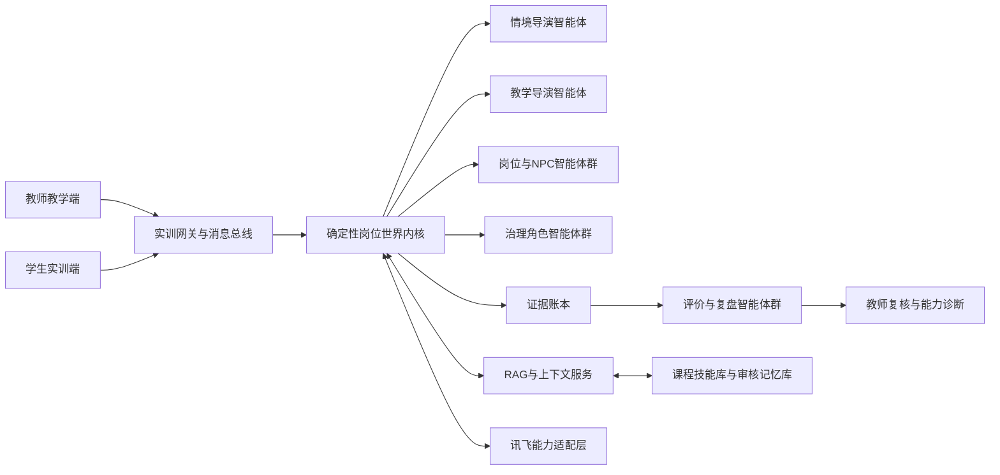

# 融岗智训 — 智能体群原型与开发规划

> **适用范围更新（2026-09-07）**：本文保留对应旧阶段的设计和验收事实。新一轮本体开发以[02 当前计划](../02-项目规划.md)及[12 技术目标设计](../01-子文档/12-技术实现审查与冲刺架构.md)为准；旧阶段的固定节点、数量、版本和内部国金准入不自动延续为新周期要求。

> 该文档隶属于[02-项目规划.md](../02-项目规划.md)，保存 `V1.0.0` 首个可运行原型的范围、智能体连接网络、消息处理逻辑、RAG与上下文管理、自学习闭环及开发模块衔接。产品定位和最终成品边界以[23-融岗智训产品设计定型稿.md](23-融岗智训产品设计定型稿.md)为准；`V1.1.0` 双维度学生端与规模化智能体开发交接以[25-V1.1双维度交互与智能体群开发交接.md](25-V1.1双维度交互与智能体群开发交接.md)保留，当前任务以[02-项目规划.md](../02-项目规划.md)为准，成果证明、内部阈值与失败关闭门以[26-国金成果证明与开发准入标准.md](26-国金成果证明与开发准入标准.md)为准。
>
> **文档性质：**`V1.0.0` 原型规划基线；不再承担下一周期任务状态
>
> **规划阶段：**首个可运行原型已经形成代码候选，实际完成度见[01-开发者文档.md](../01-开发者文档.md)
>
> **更新时间：**2026-07-29
> **更新者：**文档专项组

---

## 目录

- [1. 原型开发目标](#1-原型开发目标)
- [2. 原型范围与完成边界](#2-原型范围与完成边界)
- [3. 总体技术架构](#3-总体技术架构)
- [4. 智能体连接网络](#4-智能体连接网络)
- [5. 消息分层与处理逻辑](#5-消息分层与处理逻辑)
- [6. 智能体交互方案](#6-智能体交互方案)
- [7. RAG与上下文节流](#7-rag与上下文节流)
- [8. 监督式自学习与自我进化](#8-监督式自学习与自我进化)
- [9. 证据与评分体系](#9-证据与评分体系)
- [10. 科大讯飞能力接入](#10-科大讯飞能力接入)
- [11. 开发模块与衔接关系](#11-开发模块与衔接关系)
- [12. 原型开发顺序](#12-原型开发顺序)
- [13. 原型验收场景](#13-原型验收场景)
- [14. 原型启动确认项的当前处理](#14-原型启动确认项的当前处理)
- [15. 参考资料](#15-参考资料)
- [16. 开发组启动目标](#16-开发组启动目标)

---

## 1. 原型开发目标

本节记录 `V1.0.0` 启动时确定的纵向闭环目标。该目标已经形成代码与课程内容候选，但正式发布标签仍未完成；下一轮不得重复从零搭建这些底座，应在现有世界内核、Outbox、权限、评价和回放之上实施[25号开发交接](25-V1.1双维度交互与智能体群开发交接.md)。

原型阶段不追求一次实现全部课程、全部角色和全部讯飞能力，而要先跑通一条能够证明项目核心价值的纵向闭环：

> **教师配置课程与情境 → 学生进入岗位 → 多智能体推动事件演化 → 学生完成多模态行动与职业决策 → 世界状态产生后果 → 系统形成过程证据 → 多维初评与教师复核 → 输出能力诊断。**

原型必须证明四件事：

1. 智能体不是并列聊天机器人，而是拥有不同身份、目标、视野、权限和记忆的岗位角色；
2. 情境会根据学生行动改变，后续事件具有可解释的因果关系；
3. 多模态材料和学生操作能进入统一证据链；
4. 评分能够回溯到具体事件、行为和成果，并接受教师复核。

原型的技术核心不是模型数量，而是**统一状态、受控通信、角色隔离、按需检索和可追溯评价**。

## 2. 原型范围与完成边界

### 2.1 建议纳入原型

| 范围 | 原型要求 |
| --- | --- |
| 旗舰内容 | 选择一门样板课程或一套综合情境作为纵向切片，具体题材由项目组确认 |
| 师生双端 | 教师端完成情境启动、过程观察、事件干预和评分复核；学生端完成岗位交互、材料处理、成果提交与复盘 |
| 界面形态 | 采用事件驱动的游戏化职业工作台；聊天仅作为采访、协作或通知组件之一 |
| 情境节点 | 建议包含6—10个主要任务节点和不少于3类动态事件 |
| 智能体 | 先实现5类逻辑智能体：情境导演、教学导演、岗位角色、治理角色、评价与复盘 |
| 多模态 | 首版至少支持文本、语音、图片或文档；视频分析作为可插拔异步能力 |
| RAG | 建立课程、岗位、规则和案例四类知识域，支持带元数据过滤的检索 |
| 证据评价 | 对关键行动生成证据编号，完成规则分、模型评价和教师复核 |
| 回放 | 按时间线查看世界事件、角色响应、学生判断、状态变化和评分依据 |

“逻辑智能体”不等于一个常驻模型进程。多个岗位角色可以由同一模型服务根据角色卡和独立上下文按需实例化，以控制并发、成本和Token消耗。

### 2.2 暂不作为原型硬目标

- 三维开放世界、复杂人物动画和完整数字人集群；
- 四门课程全部达到正式交付质量；`V1.1.0` 只实现一套旗舰情境和一套第二微型迁移证明，其余课程保留为内容规划资产；
- 智能体不经审核自动修改正式课程和评分标准；
- 全量视频生成、实时视频理解和大规模并发班级；
- 与职业院校现有教务系统进行深度生产级集成；
- 追求智能体数量或API数量，而没有可演示的教学闭环。

## 3. 总体技术架构

原型采用“**确定性仿真内核 + 双导演 + 岗位角色群 + 证据法庭 + 能力插件层**”架构。

项目可以被通俗理解为“用智能体搭建一个面向职业教育、聚焦融媒体岗位的可推演世界”，但这只是产品比喻。本文所称“岗位世界”或“职业情境世界”，指由课程规则、结构化状态、事件因果、角色智能体和多模态证据共同构成的仿真环境；它不等同于机器学习领域用于学习现实规律、预测环境状态的世界模型。正式申报和技术说明应优先使用“**可推演职业情境仿真系统**”或“**岗位世界仿真内核**”，避免将产品直接宣称为通用世界模型。



### 3.1 确定性岗位世界内核

世界内核是唯一可以确认和修改正式情境状态的组件，负责：

- 场景实例、课程节点、虚拟时间和任务进度；
- 人物关系、素材版本、信源状态和平台规则；
- 事件触发条件、结果分支和难度参数；
- 学生与智能体的可见范围和操作权限；
- 所有已确认事件的顺序、版本与持久化。

智能体只能提交“行动意图”，不得直接改写正式世界状态。内核完成规则验证后，才产生权威世界事件。这一边界用于避免多智能体互相矛盾、重复触发或凭空改变事实。

### 3.2 双导演

- **情境导演智能体：**根据课程节点、世界状态和学生行为，从事件库选择或生成候选突发事件，控制情境节奏、信息差和职业冲突。
- **教学导演智能体：**根据能力目标和学生当前表现判断是否需要追问、提示、降阶、加压或补充练习，保证情境变化始终服务教学目标。

双导演都只输出候选事件或教学意图，最终是否生效由世界内核和教师配置共同决定。

### 3.3 岗位角色与治理角色

岗位角色负责模拟总编、策划、记者、采访对象、专家、平台运营等角色；治理角色负责事实核查、版权审核、内容安全、平台规则和舆情研判。角色之间允许存在目标冲突和信息差，但不得绕过消息总线直接共享全部上下文。

### 3.4 证据法庭

证据法庭独立于教学与扮演角色，接收已持久化的证据事件而非角色智能体的主观总结。它由确定性规则评分、模型评价和教师复核三部分构成，确保“教练”和“裁判”不由同一智能体兼任。

## 4. 智能体连接网络

### 4.1 角色契约

每类智能体都必须通过结构化角色契约注册，不允许只依赖一段自由提示词。角色契约至少包含：

```yaml
agent_id: role_editor_in_chief
agent_type: role
purpose: 推动编辑部在时限内完成可信发布
visible_scopes:
  - current_scene
  - assigned_materials
  - public_world_facts
private_scopes:
  - editorial_deadline
  - hidden_business_pressure
allowed_intents:
  - request_revision
  - ask_for_evidence
  - approve_submission
  - escalate_deadline
denied_actions:
  - mutate_world_state
  - write_score
  - read_other_private_memory
tool_policy:
  - rag_search
  - material_preview
token_budget: pending
```

### 4.2 连接矩阵

| 节点 | 接收内容 | 可读取数据 | 允许输出 | 禁止行为 |
| --- | --- | --- | --- | --- |
| 实训网关 | 师生操作、智能体结果、工具回调 | 身份、会话和路由信息 | 标准化消息、流式反馈 | 生成课程结论或评分 |
| 世界内核 | 标准化命令、智能体行动意图 | 权威世界状态、课程节点和规则 | 世界事件、状态快照、触发任务 | 自由生成未经验证的事实 |
| 情境导演 | 脱敏状态快照、教学约束 | 当前情境、事件库、节奏参数 | 候选事件、角色激活建议 | 直接给学生答案、直接落库事件 |
| 教学导演 | 能力目标、阶段证据摘要 | 课程包、能力图谱、教学策略 | 提示策略、难度调整建议 | 修改正式评分、读取无关隐私 |
| 岗位角色 | 角色视图、面向自身的事件 | 角色卡、角色私有记忆、授权知识 | 对话、请求、质疑、行动意图 | 获取上帝视角、直接通知所有角色 |
| 治理角色 | 待审材料、规则检索结果 | 对应治理规则和证据 | 风险标注、核查请求、驳回意图 | 直接决定最终学生成绩 |
| 评价角色 | 证据包、Rubric和成果 | 只读证据账本、评分规则 | 分项评价、理由和置信度 | 修改证据、参与情境剧情 |
| 学习策展智能体 | 教师修正、低分案例、运行统计 | 脱敏轨迹、既有技能版本 | 新规则、技能、事件候选稿 | 自动发布候选内容 |
| 讯飞能力适配层 | 标准化工具请求 | 对应材料和凭证 | 转写、OCR、理解、审核等结果 | 持有业务世界状态、直接面向前端 |

### 4.3 数据共享原则

多个智能体不共享一份无限增长的公共对话。数据分为三层：

- **权威共享层：**已确认的世界事实、课程节点、公开材料和规则版本；
- **角色私有层：**角色目标、隐藏信息、局部记忆和未公开立场；
- **审核学习层：**经教师确认后可复用的技能、案例、事件和评分样例。

学生能力画像单独存放，只有教学导演、评价系统和授权教师可访问必要字段。岗位角色不得读取完整学生画像，避免“针对分数演戏”。

## 5. 消息分层与处理逻辑

### 5.1 统一消息类型

| 消息类型 | 产生者 | 用途 |
| --- | --- | --- |
| `Command` | 教师端、学生端 | 表达操作请求，例如提交材料、询问角色、启动节点 |
| `Observation` | 多模态解析服务 | 将语音、图片、文档和视频转化为可检索的结构化观察 |
| `AgentIntent` | 各智能体 | 表达候选行动，不直接代表世界已发生变化 |
| `WorldEvent` | 世界内核 | 记录已经验证并生效的权威事件 |
| `StateProjection` | 世界内核 | 面向不同角色生成经过权限过滤的状态视图 |
| `Evidence` | 证据采集器 | 记录行为、依据、成果、修改和结果之间的关联 |
| `Assessment` | 规则引擎、评价智能体、教师 | 保存分项评价、理由、置信度和复核结果 |
| `LearningCandidate` | 学习策展智能体 | 提交待审核的新技能、规则、事件或评价样例 |

所有消息至少携带 `session_id`、`scene_id`、`actor_id`、`message_id`、`correlation_id`、`timestamp` 和 `schema_version`。涉及状态变化的消息还应携带 `expected_state_version`，用于避免并发覆盖。

### 5.2 单次消息处理链

```text
学生或教师操作
→ 网关完成身份校验、限流与消息标准化
→ 多模态服务生成Observation并保存原始材料引用
→ 世界内核读取当前状态和角色权限
→ 上下文服务按角色、课程节点和任务检索必要知识
→ 目标智能体生成AgentIntent
→ 规则引擎检查权限、事实一致性和触发条件
→ 世界内核提交状态变化并产生WorldEvent
→ 消息总线按角色视野分发StateProjection
→ 前端更新界面，相关智能体按需继续响应
→ 证据采集器关联操作、意图、事件和成果
→ 达到评价节点时生成Assessment并等待教师复核
```

### 5.3 三种交互时序

- **同步交互：**学生正在采访、询问或提交时，目标角色即时响应，适合对话与操作反馈。
- **异步事件：**转写、视频审核、舆情演化和延时事件通过任务队列处理，完成后再产生世界事件。
- **内部联动：**角色智能体之间不直接私聊，而是通过 `AgentIntent → WorldEvent → StateProjection` 交流，保证过程可追踪并可按权限过滤。

## 6. 智能体交互方案

### 6.1 学生与角色智能体

学生应在具体业务界面与角色互动，例如内部通讯、采访窗口、审核退回单和平台通知，而不是始终面对一个通用聊天框。前端负责呈现“谁在什么岗位、因何发来什么信息”，后端统一转换为结构化命令。

### 6.2 教师与导演智能体

教师可以设置能力目标、难度、允许事件类型、是否自动触发和人工确认点。导演智能体提出事件建议时，应显示触发原因、对应能力点和预计影响，教师可选择自动执行、单次批准或驳回。

### 6.3 智能体之间

智能体之间共享数据而不共享完整思维过程。共享内容限定为：

- 已确认的事实与世界事件；
- 结构化任务状态；
- 被允许公开的材料与工具结果；
- 必要的压缩摘要；
- 明确的交接对象、目的和下一步行动。

禁止传递模型隐藏推理、完整原始会话和其他角色私有信息。跨角色协作必须保留消息来源和关联事件编号。

### 6.4 游戏化职业工作台

学生端不得以单一聊天框承载全部实训。原型应模拟真实融媒体编辑部的工具环境，由不同页面和组件共同构成可操作的职业现场。

| 学生工作区 | 主要功能 | 对应事件 |
| --- | --- | --- |
| 任务简报与岗位台 | 查看岗位、目标、时限、协作者和阶段成果 | 任务发布、岗位变更、截止时间变化 |
| 内部通讯与采访台 | 与总编、同事、采访对象和专家沟通 | 新消息、对象改口、追问、拒访 |
| 线索与素材台 | 管理文本、录音、图片、视频、证照和来源 | 新线索、素材失效、来源更新 |
| 内容生产台 | 编辑图文、脚本、标题、封面和发布版本 | 修改要求、版本冲突、紧急改稿 |
| 核查与治理台 | 查看事实、版权、AI标识和平台风险 | 核查请求、版权申诉、审核驳回 |
| 发布与舆情台 | 配置平台版本并观察模拟传播反馈 | 发布成功、评论增长、舆情反转、下架 |
| 时间线与复盘台 | 回放行动、角色响应、世界变化和评分证据 | 节点结束、课程结束、教师复核 |

教师端对应提供课程与情境编辑器、实时导演台、班级监控、事件投放、证据回放和评分复核页面。界面不追求复杂三维画面，优先保证“任务可操作、状态会变化、后果能看见、过程可回放”。

页面状态必须由 `WorldEvent` 驱动，而不是由前端自行编写另一套剧情逻辑：

```text
WorldEvent
→ 世界内核生成面向当前用户的StateProjection
→ 前端状态仓更新任务、人物、材料、时间和风险
→ 对应页面出现新消息、警报、素材或可执行操作
→ 学生操作被转换为Command返回实训网关
```

为形成游戏体验，原型至少呈现任务目标、虚拟时间、资源约束、角色关系、选择分支、即时后果和结算复盘。积分、徽章和排行榜只能作为辅助反馈，不能取代岗位能力评价。

## 7. RAG与上下文节流

### 7.1 知识域

原型至少建立四个独立知识域：

| 知识域 | 主要内容 | 典型调用者 |
| --- | --- | --- |
| 课程域 | 教学目标、课程节点、任务说明、教师材料 | 教学导演、课程配置 |
| 岗位域 | 岗位标准、工作流程、术语、成果模板 | 岗位角色、评价角色 |
| 治理域 | 事实核查、版权、平台规则、AI标识和风险案例 | 治理角色、评价角色 |
| 情境域 | 人物、地点、背景、事件素材、隐藏事实和分支条件 | 情境导演、岗位角色 |

知识片段必须带有 `course_id`、`node_id`、`role_id`、`competency_id`、`rule_domain`、`media_type`、`source`、`version` 和 `visibility` 等元数据。检索时先按权限和元数据过滤，再执行关键词与向量混合召回、重排和引用返回。

### 7.2 分层上下文

每次智能体调用只组装当前任务必要内容：

1. **固定层：**精简角色契约、不可违反的规则和输出结构；
2. **状态层：**当前节点、角色视图、最近事件和待处理任务；
3. **检索层：**RAG返回的少量高相关课程、岗位或治理片段；
4. **证据层：**与本次决策直接相关的材料引用和历史摘要；
5. **临时层：**本轮用户输入和工具结果。

不得把整门课程、全量知识库、全部历史对话或所有角色状态放进每次提示词。

### 7.3 Token与效率控制

- 为不同智能体设置独立Token预算、最大轮次和超时；
- 岗位角色按事件激活，不长期维持全部智能体并发；
- 长对话转换为结构化状态和阶段摘要，原始记录留在证据库；
- 工具返回大文件时只传引用、摘要和必要片段；
- 对稳定角色提示、课程片段和检索结果建立缓存；
- 简单分类、路由和规则校验优先使用程序逻辑或轻量模型；
- 视频、长音频和批量材料走异步队列，前端展示处理状态；
- 每次模型输出使用固定JSON Schema，减少二次解析和重试。

## 8. 监督式自学习与自我进化

项目可以借鉴Hermes“记忆 + 技能”的思想，但不能让智能体在正式教学中无约束自我修改。原型采用“**采集—提炼—验证—审核—发布—回滚**”闭环。

### 8.1 可学习内容

- 教师对智能体回答、评分和事件设计的修正；
- 学生经常出现的错误路径和有效纠正方式；
- 新增岗位术语、工具用法、规则和案例；
- 被多次验证有效的提示策略、追问方式和事件组合；
- 评价智能体与教师评分差异较大的样例。

### 8.2 学习流程

```text
运行轨迹与教师修正
→ 脱敏和证据筛选
→ 学习策展智能体生成候选技能、规则、事件或评分样例
→ 离线回放与对照测试
→ 检查事实、权限、评分漂移和冲突
→ 教师或项目组审核
→ 以新版本发布到技能库、事件库或评价库
→ 监控效果，必要时回滚
```

### 8.3 多智能体数据联动

多个智能体通过经审核的共享技能库和世界事实库学习，不通过直接复制彼此全部会话学习。建议将记忆分为：

- **会话记忆：**仅用于当前场景，结束后压缩归档；
- **角色记忆：**保存该角色在当前场景内的互动和立场变化；
- **学生能力记忆：**保存能力特征和已验证薄弱项，受权限保护；
- **项目技能记忆：**保存经审核的课程流程、事件策略、工具使用和评分样例；
- **候选学习区：**保存尚未批准的模型提议，不进入正式运行。

评分标准、红线规则和正式课程必须人工审核后才能升级。每次升级必须保留版本、来源证据和回滚目标。

## 9. 证据与评分体系

### 9.1 证据链

每个关键评价结论必须指向至少一个证据对象。证据对象记录：

- 学生在何时、何岗位、何节点执行了什么行动；
- 使用了哪些材料和讯飞工具结果；
- 智能体提出了什么要求或风险；
- 学生接受、拒绝或修改了什么；
- 学生给出的依据；
- 世界状态因此发生了什么变化；
- 最终成果和教师复核意见。

### 9.2 三层评分

| 层级 | 负责内容 | 输出 |
| --- | --- | --- |
| 确定性规则 | 时限、必交成果、信源数量、流程完整度、红线行为 | 客观分、通过状态、违规项 |
| 评价智能体群 | 内容质量、职业判断、协作沟通、风险权衡和反思迁移 | 分项建议、理由、证据引用、置信度 |
| 教师复核 | 争议项、高权重结论、评分偏差和最终成绩 | 确认分、修改原因、教学备注 |

评价智能体之间出现明显分歧时，不做简单平均，应标记争议并交给教师复核。系统必须保存模型版本、Rubric版本和证据版本，以支持同一轨迹离线重放。

## 10. 科大讯飞能力接入

讯飞能力通过统一适配层接入，不允许业务代码直接分散调用不同API。适配层负责鉴权、请求转换、异步任务、重试、限流、缓存、成本统计和结果标准化。

| 讯飞能力 | 原型用途 | 接入位置 |
| --- | --- | --- |
| 星辰Agent工作流 | 承载岗位角色、治理角色或可复用子工作流 | 智能体运行适配器 |
| 工作流API与MCP | 将已发布智能体和工具接入自研世界内核 | 实训网关与工具注册中心 |
| 星火知识库或RAG能力 | 提供课程、岗位、规则和案例检索 | 上下文服务 |
| 录音文件转写、实时语音 | 模拟采访、会议和口述材料 | 多模态解析服务 |
| OCR与图片理解 | 解析海报、截图、证照和新闻图片 | 多模态解析服务 |
| 文本、图片、视频合规 | 提供内容治理的机器证据 | 治理工具服务 |
| 语音合成或数字人 | 增强特定角色的沉浸交互 | 可选呈现插件 |

星辰平台支持工作流嵌套和API发布，可用于组合角色能力；但课程状态、世界事件、证据账本和最终评分必须由自研平台掌握。无法确认开放API或授权方式的既有讯飞教育软件，只作为产品对标或后续商务联调项，不写入原型必达范围。

## 11. 开发模块与衔接关系

当前只划分模块职责，不代替项目组进行最终人员认领。

| 模块 | 主要交付 | 上游依赖 | 下游接口 |
| --- | --- | --- | --- |
| 架构与协议 | 消息Schema、角色契约、状态机边界、错误与版本策略 | 产品定型稿、课程结构 | 全部开发模块 |
| 内容与课程 | 旗舰课程包、角色卡、事件库、Rubric和样本材料 | 职教与岗位资料 | AI、后端、评价、前端 |
| 后端与仿真内核 | 网关、状态机、事件总线、权限投影、证据账本、任务队列 | 架构协议 | 前端、智能体、评价 |
| AI与智能体 | 双导演、岗位角色、治理角色、评价角色和提示模板 | 角色契约、课程包、后端接口 | 仿真内核、教师复核 |
| RAG与数据 | 文档处理、元数据、混合检索、缓存、记忆版本和学习候选区 | 内容材料、数据Schema | 全部智能体 |
| 讯飞能力适配 | 星辰工作流、语音、OCR、图片理解和合规服务适配器 | 账号、额度、官方接口 | AI、后端、多模态前端 |
| 前端与交互 | 教师导演台、学生游戏化职业工作台、通讯采访、素材生产、治理发布和时间线回放 | 产品流程、StateProjection协议、后端接口 | 用户验收 |
| 评价与质量 | 规则评分、模型评价、教师复核、回放测试和安全边界 | Rubric、证据Schema | 能力画像、原型验收 |

推荐依赖顺序为：

```text
产品与课程结构
→ 架构协议和数据Schema
→ 世界内核、RAG与讯飞适配Mock并行
→ 智能体和前端基于Mock开发
→ 单场景纵向联调
→ 证据评分与教师复核
→ 全流程演示和回放验收
```

## 12. 原型开发顺序

### 12.1 协议骨架

先确定课程包、角色契约、统一消息、世界状态、证据对象和评分对象的Schema，并提供Mock数据。前后端与智能体组必须围绕同一协议开发，禁止各自定义一套消息格式。

### 12.2 无模型可运行闭环

用固定脚本和Mock响应先跑通教师启动、学生操作、状态变化、事件分发、证据记录和结果展示。此阶段用于验证平台逻辑，不等待大模型接入。

### 12.3 智能体与RAG接入

将双导演和岗位角色逐步替换为真实模型调用，接入分层RAG、角色视野过滤和Token预算；先保证单角色稳定，再增加多角色联动。

### 12.4 讯飞多模态与评价联调

接入最能证明岗位价值的讯飞能力，建议优先语音转写、OCR或图片理解、内容合规，再补充视频和数字人。同步完成规则评分、模型评价和教师复核。

### 12.5 旗舰场景收口

用一套课程情境完整演示师生双端、突发事件、角色冲突、过程证据、评分解释和时间线回放。原型完成的判断以闭环是否成立为准，不以接入API数量为准。

## 13. 原型验收场景

开发组交付时应能连续演示：

1. 教师选择课程包，设置岗位、能力目标、事件难度和评价Rubric；
2. 平台创建场景实例并向学生分配岗位工单；
3. 学生在任务台、通讯采访台、素材台和治理发布台之间完成岗位流程，而非只在聊天框中作答；
4. 学生通过文字、语音和图片或文档完成至少一次多模态岗位任务；
5. 岗位角色智能体基于局部信息进行回应；
6. 情境导演依据学生行为提出突发事件，世界内核验证后生效；
7. 新事件通过页面消息、素材变化、警报或审核单呈现，学生在传播效率、事实核查、版权或平台规则之间作出选择；
8. 不同选择改变后续状态和结果；
9. 平台生成完整事件时间线和责任证据链；
10. 规则引擎与评价智能体输出分项评价、理由和证据编号；
11. 教师修改或确认评价，平台输出能力诊断。

原型验收还应检查：

- 任意权威状态变化都能找到对应 `WorldEvent`；
- 角色无法读取未授权的私有信息；
- 智能体失败或超时时，场景可以降级或重试而不丢失状态；
- RAG回答携带来源和版本；
- 评分能够定位到证据，不出现只有结论没有依据；
- 完整流程的Token、调用次数、延迟和错误均可统计；
- 同一事件轨迹可以被回放，关键评价可以重新计算。

## 14. 原型启动确认项的当前处理

| 原确认项 | 当前处理 |
| --- | --- |
| 首个旗舰课程与情境 | 已确认为“地方文旅活动融媒体报道” |
| 前后端技术栈 | 已确认为 TypeScript、React/Vite、Fastify |
| 人员与岗位模型 | 已采用多人多岗数据模型和单会话连续演示 |
| 世界、队列与存储 | 已建立单机事件溯源、Outbox、持久任务和本地JSONL；生产数据库与分布式队列另立升级任务 |
| 科大讯飞能力 | 统一适配端口已建立；真实账号、额度和Live验收继续暂缓 |
| 多模态与Rubric | 当前旗舰情境已接入可恢复材料任务、四域治理、规则/模型初评和教师逐维终评 |
| 部署 | 当前承诺本地可复现实训原型，不宣称生产云部署 |
| Git与版本 | 已启用Git并形成 `V1.0.0` 内容完成候选；正式标签与归档尚未完成 |

仍未确认或仍被暂缓的事项不再阻断主体交互开发，统一进入[25号文档第10节](25-V1.1双维度交互与智能体群开发交接.md#10-明确暂缓项)。

## 15. 参考资料

- [讯飞星辰Agent开发平台介绍](https://www.xfyun.cn/doc/spark/Agent01-%E5%B9%B3%E5%8F%B0%E4%BB%8B%E7%BB%8D.html)
- [讯飞星辰Agent工作流开发指南](https://www.xfyun.cn/doc/spark/Agent03-%E5%BC%80%E5%8F%91%E6%8C%87%E5%8D%97.html)
- [讯飞星辰Agent API接入](https://www.xfyun.cn/doc/spark/Agent04-API%E6%8E%A5%E5%85%A5.html)
- [讯飞录音文件转写大模型](https://www.xfyun.cn/doc/spark/asr_llm/Ifasr_llm.html)
- [讯飞通用文档识别OCR大模型](https://www.xfyun.cn/doc/words/OCRforLLM/API.html)
- [讯飞视频合规API](https://www.xfyun.cn/doc/nlp/VideoModeration/API.html)
- [Hermes Agent架构](https://hermes-agent.nousresearch.com/docs/developer-guide/architecture/)
- [Hermes Agent技能系统](https://hermes-agent.nousresearch.com/docs/user-guide/features/skills/)
- [OpenClaw多智能体路由](https://docs.openclaw.ai/concepts/multi-agent)
- [Claude Code子智能体配置](https://code.claude.com/docs/en/sub-agents)

## 16. 开发组启动目标

本节是 `V1.0.0` 原型启动时的目标原文：以一套旗舰课程与情境为载体，建立统一的岗位世界状态、消息总线和角色权限，跑通教师配置、学生岗位操作、多智能体事件推演、多模态材料处理、分层RAG检索、过程证据采集、规则与模型初评、教师复核及时间线回放的完整闭环。学生端由世界事件驱动而非依赖单一聊天框；岗位角色共享经审核的世界事实和技能数据，同时保持角色私有视野与记忆；自学习只生成待审核候选。

该基线已经形成可运行候选。重新交付开发组后的当前目标不是复做本节，而是按[25-V1.1双维度交互与智能体群开发交接.md](25-V1.1双维度交互与智能体群开发交接.md)完成课程操作平台与世界情境交互双维度、规模化智能体模板/实例/任务、黄金路径内容和可对照的可信评价。
