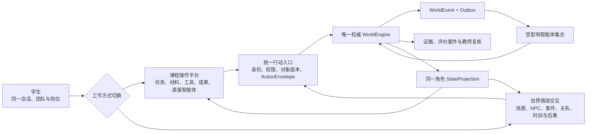
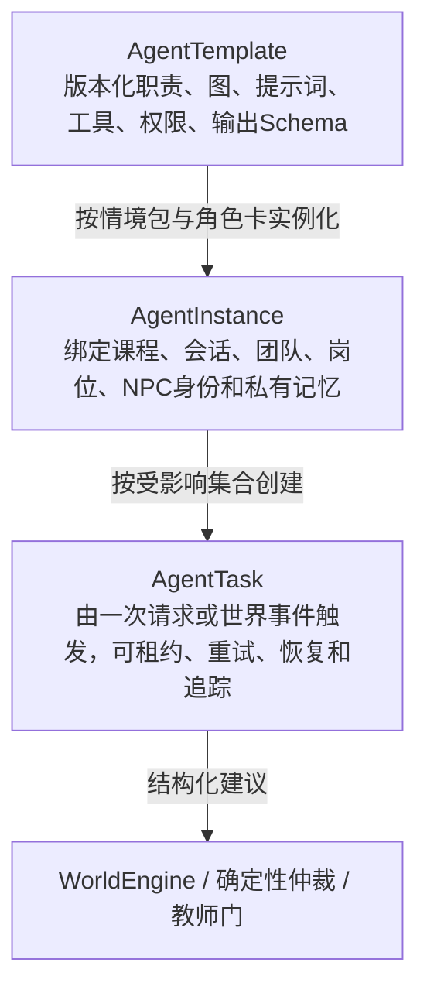

# 融岗智训 — V1.1双维度交互与智能体群开发交接

> **适用范围更新（2026-09-07）**：本文保留对应旧阶段的设计和验收事实。新一轮本体开发以[02 当前计划](../02-项目规划.md)及[12 技术目标设计](../01-子文档/12-技术实现审查与冲刺架构.md)为准；旧阶段的固定节点、数量、版本和内部国金准入不自动延续为新周期要求。

> 该文档隶属于[02-项目规划.md](../02-项目规划.md)，用于保留已经确认的 `V1.1` 产品构思和开发交接。产品定位以[23-融岗智训产品设计定型稿.md](23-融岗智训产品设计定型稿.md)为准，国金成果证明与开发准入以[26-国金成果证明与开发准入标准.md](26-国金成果证明与开发准入标准.md)为准，当前真实实现以[01-开发者文档.md](../01-开发者文档.md)为准，智能体节点、权限与事件外壳以[04-智能体设计架构.md](../04-智能体设计架构.md)为准，正式任务状态只在[02-项目规划.md](../02-项目规划.md)维护。
>
> **文档性质**：`V1.1.0` 规划目标，不代表当前已经实现
>
> **当前代码基线**：`V1.0.0` 内容完成候选
>
> **目标版本**：`V1.1.0` 比赛交互与智能体群深化版
>
> **更新时间**：2026-07-29
>
> **更新者**：文档专项组、项目统筹与产品规划组

---

## 目录

- [0. 交接结论与硬边界](#0-交接结论与硬边界)
- [1. 当前基线与必须补齐的差距](#1-当前基线与必须补齐的差距)
- [2. 学生端双维度产品架构](#2-学生端双维度产品架构)
  - [2.1 一个学生端，两种工作方式](#21-一个学生端两种工作方式)
  - [2.2 课程操作平台](#22-课程操作平台)
  - [2.3 世界情境交互](#23-世界情境交互)
  - [2.4 两种模式的连续性契约](#24-两种模式的连续性契约)
  - [2.5 不使用图像模型的视觉策略](#25-不使用图像模型的视觉策略)
- [3. 规模化智能体群目标](#3-规模化智能体群目标)
  - [3.1 三层规模模型](#31-三层规模模型)
  - [3.2 七个使用平面与最多二十三类候选模板](#32-七个使用平面与最多二十三类候选模板)
  - [3.3 按受影响集合调度](#33-按受影响集合调度)
- [4. 四条代表性交互链](#4-四条代表性交互链)
- [5. 岗位能力与证据评价](#5-岗位能力与证据评价)
- [6. 开发模块与接线要求](#6-开发模块与接线要求)
- [7. 开发顺序与阶段出口](#7-开发顺序与阶段出口)
- [8. V1.1.0验收门](#8-v110验收门)
- [9. 比赛演示与对照证明](#9-比赛演示与对照证明)
- [10. 明确暂缓项](#10-明确暂缓项)
- [11. 开发组启动清单](#11-开发组启动清单)
- [12. 国金结果约束与交接终点](#12-国金结果约束与交接终点)

---

## 0. 交接结论与硬边界

下一轮开发不是重新搭建一套课程平台，也不是继续横向增加按钮和智能体名称，而是在现有 `V1.0.0` 纵向闭环上完成两项决定性的产品深化：

1. 把学生端正式拆成可以随时切换、状态连续的“**课程操作平台**”与“**世界情境交互**”两个维度；
2. 把智能体从情境角色和后台评价扩展到学生操作、材料生产、教师助理等完整教学工作流，并建立 `AgentTemplate → AgentInstance → AgentTask` 的规模化运行模型。

上述两项只是开发载体，不是获奖证据。最终必须通过黄金演示、多智能体消融、评价效度、真实试点、第二微型迁移和参赛证据包证明价值；详细门槛见[26号文档](26-国金成果证明与开发准入标准.md)。

必须长期保持以下边界：

- 两个学生界面只对应两种呈现与操作方式，背后只有一个会话、一个岗位身份、一个权威世界、一个证据账本和一套评价标准；
- “世界情境交互”正式称为“结构化可演算职业情境世界”，不宣称为机器学习意义上的通用世界模型；
- 不引入图像生成模型，不以三维开放世界、逐帧动画或大量定制插画作为完成条件；
- 智能体只能给出角色回复、分析、建议、候选或待审核学习内容，不能直接改写权威世界事实、权限、最终成绩或正式课程；
- 高水平智能体群的证明标准是职责分工、私有视野、事件协作、证据贡献和对照结果，不是常驻进程数或 API 数；
- 科大讯飞真实联网、外部知识库和广泛浏览器矩阵继续作为独立验收线暂缓，不阻塞本轮主体内容与交互开发。

## 1. 当前基线与必须补齐的差距

| 领域 | `V1.0.0` 当前事实 | `V1.1.0` 必须补齐 |
| --- | --- | --- |
| 学生端 | 一个事件驱动的七区职业工作台，包含岗位台、通讯、素材、生产、治理、发布和复盘 | 增加顶层双维度入口；操作平台与世界交互可无损切换，并从同一投影读取连续状态 |
| 世界呈现 | 世界事件以任务卡、消息、材料状态、告警和时间线呈现 | 增加固定场景、人物位置、NPC状态、事件卡、虚拟时间和可见后果组成的情境舞台 |
| 学生直接用智能体 | 主要通过受控岗位通讯与NPC交互 | 增加课程导航、任务规划和证据教练三类直连智能体，但禁止提供标准答案或绕过岗位任务 |
| 智能体规模 | 六组十四个具名智能体，已有图、任务、权限、RAG、记忆、门禁和追踪 | 在不破坏十四个基线模板的前提下评估九类候选模板；显式区分模板、运行实例和持久任务，按准入与消融决定保留数量 |
| 事件外壳 | 已有结构化命令、`WorldEngine`、`WorldEvent + Outbox`、订阅、持久任务和角色投影 | 统一 `ActionEnvelope`、受影响集合策略、去抖、因果深度和单波预算 |
| 课程内容 | 有五项目标、两张岗位卡、七节点指引、九份材料、十六条知识和九条路线 | 让每个关键课程节点同时提供操作任务、世界交互机会、智能体贡献点和能力证据要求 |
| 评价 | 有规则、三路语义初评、确定性仲裁、教师逐维终评和回放 | 建立“能力—行为—证据—评分—复核”矩阵，增加多智能体必要性和评分一致性的对照证据 |
| 教师端 | 有课程情境、导演、审批、评价、追踪和恢复控制面 | 增加课程设计、实时干预和评价复核三类教师助理；建议必须可解释且由教师确认 |
| 教学与比赛证据 | 当前只有技术回归和既有浏览器闭环，没有V1.1消融、评价一致性、真实试点或迁移报告 | 建立同条件三组消融、专家/教师评价效度、真实试点、第二微型情境和带版本哈希的国金证据包 |
| 赛题与发榜方对应 | 已确认题号、题名、发榜单位，代码有统一科大讯飞适配层 | `PM-002` 固化当届官方条款映射、科大讯飞能力/产品承接图、自研边界、关键Live证据、可移交资产与部署路径 |

上述差距是本轮开发范围。不得把当前“七区工作台已经由事件驱动”直接等同于“双维度学生端已经完成”，也不得把角色配置数量直接等同于规模化智能体运行已经完成。

## 2. 学生端双维度产品架构

### 2.1 一个学生端，两种工作方式



工作方式切换本身只是客户端呈现偏好，不得生成第二份世界状态。真正影响任务、人物、材料、成果或评价的动作，都必须通过统一行动入口和世界内核。

### 2.2 课程操作平台

课程操作平台面向“明确任务、高效完成和过程留痕”，保留并重组当前七区工作台：

| 区域 | 学生可以做什么 | 智能体怎样参与 | 形成什么证据 |
| --- | --- | --- | --- |
| 任务与课程 | 查看目标、岗位职责、节点要求和交付标准 | 课程导航解释要求；任务规划帮助拆解步骤 | 阅读、计划、优先级与完成记录 |
| 调研与素材 | 提交选题、搜索线索、上传材料、标记信源 | 证据教练追问信源与依据；材料理解提取结构 | 查询、引用、核验和修订记录 |
| 岗位通讯 | 与同组岗位、NPC和机构角色交流 | 岗位角色保持立场和私有记忆 | 问题质量、协商、承诺和响应 |
| 内容生产 | 编辑稿件、采访纪要、平台版本和修订 | 采访结构化、内容适配智能体给受限建议 | 版本差异、引用和采纳/拒绝理由 |
| 治理发布 | 处理事实、版权、内容安全和平台规则 | 四域治理并行分析，确定性仲裁后进入教师门 | 风险发现、修正和发布判断 |
| 评价复盘 | 查看公开反馈、能力画像和因果时间线 | 评价智能体与复盘引导只读固定证据 | 反思、迁移计划与教师终评 |

学生可以直接向课程导航、任务规划和证据教练提问，但三者只能依据当前课程、岗位和授权材料提供引导。任何会改变世界的结论必须转成结构化行动并重新通过世界内核。

### 2.3 世界情境交互

世界情境交互面向“在职业现场中调查、判断和承担后果”，由以下可复用组件组成：

- 固定的2D或2.5D场景背景，例如编辑部、活动现场、采访区和发布中心；
- 角色头像、状态、关系和可交互热点；
- NPC对话、采访、拒绝、改口、承诺和信息差；
- 虚拟时间、任务压力、材料变化、平台通知和突发事件卡；
- 由世界事件决定的场景状态、人物反应、后果提示和下一步操作；
- 可以一键跳回操作平台处理材料、编辑成果或提交正式决定的任务入口。

世界情境交互不得成为纯剧情阅读器。每次重要互动至少应产生一种可验证结果：新线索、待核事实、角色承诺、关系变化、任务约束、材料版本、风险提示、世界后果或能力证据。

### 2.4 两种模式的连续性契约

| 连续对象 | 必须保持的规则 |
| --- | --- |
| 身份 | 切换前后使用同一 `sessionId / teamId / bindingId / actorId / roleId` |
| 世界 | 只读取同一状态版本和同一不可变情境发布版 |
| 材料与成果 | 操作平台保存的材料、引用和修订立即成为世界交互可引用对象，反之亦然 |
| NPC与承诺 | 世界交互形成的承诺、拒绝和私有线索必须在岗位通讯中连续存在 |
| 任务 | 两种模式显示同一当前节点、完成门、虚拟时间和待处理项 |
| 证据 | 每个行动记录来源界面、岗位、对象、依据、事件和后果，但不得重复计分 |
| 权限 | 模式切换不能扩大角色视野，也不能短暂显示上一岗位的投影 |
| 失败 | 模型或工具失败时保留世界状态并显示可恢复状态，不跳过门禁自动推进 |

### 2.5 不使用图像模型的视觉策略

本轮采用“固定资产 + 状态组合 + 轻量动效”的方案：

- 每个地点只制作少量可复用背景和昼夜、天气、警报等状态层；
- 角色使用头像、半身立绘或符号化卡片，不制作连续生成式画面；
- 使用 CSS、SVG、Lottie 或简单序列帧表达消息到达、风险升级、时间流逝和人物状态；
- 场景内容由数据配置人物、热点、事件卡和动作，不把剧情写死在前端；
- 视觉资源服务于信息差、时间压力和职业关系，不与课程操作抢占注意力。

该方案把主要投入放在课程内容、事件逻辑、智能体协作和评价证据上，避免图形资产成为迭代瓶颈。

## 3. 规模化智能体群目标

### 3.1 三层规模模型



- `AgentTemplate` 解决“这类智能体能做什么、不能做什么”；
- `AgentInstance` 解决“它在本班、本组、本岗位和本次情境中是谁、知道什么”；
- `AgentTask` 解决“它为什么在此刻被唤醒、输入和预算是什么、结果如何恢复”。

当前代码已有 `AgentDefinition`、角色配置和持久 `AgentTask`，但尚未形成独立、统一的模板目录与实例注册对象。本轮必须在兼容现有任务恢复和定义版本的前提下补齐，而不是另建一套不可追踪的自由智能体框架。

### 3.2 七个使用平面与最多二十三类候选模板

`V1.1.0` 目标不是让二十三个模型同时运行，而是形成最多二十三类可版本化、可按需实例化的候选模板能力。二十三类是当前设计上限，不是数量KPI；不能通过独立职责、权限、输出和消融证明必要性的模板必须合并或删除。

| 使用平面 | 模板类别 | 状态 | 主要输出 |
| --- | --- | --- | --- |
| 教学与情境导演 | 教学导演、情境导演 | 当前2类 | `TeachingDirective`、`CandidateEvent` |
| 世界岗位角色 | 总编、采访对象、版权方、平台运营 | 当前4类，可实例化更多NPC | `RoleResponseIntent`、可选受控行动意图 |
| 专业治理 | 事实核查、版权分析、内容安全、平台规则 | 当前4类 | 独立 `GovernanceFinding` |
| 可信评价 | 证据充分性、作品质量、职业协作 | 当前3类 | 带固定证据引用的 `EvaluationProposal` |
| 监督学习 | 学习策展 | 当前1类 | `LearningCandidate(pending_review)` |
| 学生操作辅助 | 课程导航、任务规划、证据教练 | 新增3类 | 解释、计划、追问和受限建议 |
| 材料与内容生产 | 材料理解、采访结构化、内容适配 | 新增3类 | `Observation`、结构提取、版本建议 |
| 教师辅助 | 课程设计助理、实时干预助理、评价复核助理 | 新增3类 | 配置草稿、干预建议、分歧摘要 |

若九类候选全部通过准入和消融，模板目录最多由当前十四类扩展至二十三类；最终数量可以更少。一个模板可以在不同班级、团队、NPC和材料上产生多个隔离实例；实例数量和任务数量由会话与事件决定，不写死为全局常驻数量。

### 3.3 按受影响集合调度

一次行动只创建必要任务：

```text
ActionEnvelope / WorldEvent
→ 确定性计算受影响对象、岗位与能力域
→ 订阅版本、冷却、去抖、因果深度和单波预算过滤
→ 为保留的 AgentInstance 建立 AgentTask
→ 并行执行互不依赖的专业分支
→ 结构化建议经过世界二验、仲裁或教师门
→ 新 WorldEvent 再开启下一事件波
```

例如，学生向采访对象追问时只需要目标NPC、必要的证据教练和可能的教学导演；版权分析、最终评价和学习策展不应同时被唤醒。只有材料进入正式审核时才并行运行四域治理，只有固定成果进入评价案件后才运行三个语义评价器。

## 4. 四条代表性交互链

| 场景 | 课程操作平台 | 世界情境交互 | 智能体协作 | 评价依据 |
| --- | --- | --- | --- | --- |
| 学生A完成选题调研 | 提交选题、受众、价值、信源计划和风险假设；任务规划与证据教练给形成性建议 | 在活动现场与传承人、游客和主办方互动，验证需求、争议与可获得材料 | 课程导航、任务规划、证据教练、NPC、教学/情境导演 | 调研覆盖、问题质量、信源区分、证据修订和选题论证 |
| 学生B完成采访核验 | 上传录音，形成转写、采访纪要、声明与证据引用 | 采访对象改口或拒绝确认，学生决定追问、换源或暂缓使用 | 材料理解、采访结构化、采访对象、事实核查、证据教练 | 追问质量、声明—证据匹配、来源等级和纠错行为 |
| 双岗位应对暴雨突发 | 记者更新现场材料，编辑调整选题与多平台稿件 | 暴雨改变活动安排，主办方、游客和平台产生不同反馈 | 情境导演、相关NPC、内容适配、平台规则、教学导演 | 分工协作、时效与准确性权衡、版本控制、发布判断 |
| 教师组织与复核 | 配置目标、岗位、材料、Rubric，查看班级诊断和评价分歧 | 选择不干预、提示卡、NPC追问、追加材料或人工接管 | 课程设计助理、实时干预助理、评价复核助理、评价法庭 | 教师干预记录、学生独立贡献、模型分歧和最终复核理由 |

四条链必须可以在同一旗舰课程中连续出现，且操作平台与世界交互产生的证据进入同一时间线和评价案件。

## 5. 岗位能力与证据评价

| 能力域 | 关键行为证据 | 规则可判断内容 | 语义评价内容 | 教师复核重点 |
| --- | --- | --- | --- | --- |
| 选题与调研 | 选题版本、信源计划、NPC问题、材料引用和修改理由 | 必填项、信源数量、时限、引用有效性 | 选题价值、受众洞察、论证质量 | 是否真正因新证据改变判断 |
| 采访与核验 | 问题序列、追问、承诺、转写、声明—证据链接 | 来源状态、核验步骤、冲突是否处理 | 问题质量、证据充分性、信息判断 | 是否把未核陈述误当事实 |
| 内容生产 | R1/R2差异、引用、渠道版本、采纳或拒绝建议 | 版本、格式、引用完整性 | 表达质量、平台适配和编辑判断 | AI建议是否被有依据地使用 |
| 治理与发布 | 四域Finding、修改记录、暂缓/发布决定 | 红线、必审项、对象版本和门禁 | 风险权衡、职业责任和合规意识 | 高风险决定与学生解释 |
| 协作与应变 | 岗位交接、请求、反馈、突发事件后的计划变化 | 交接是否发生、时序、任务完成 | 沟通、分工、冲突处理和应变 | 个体贡献与团队结果的区分 |
| 复盘与迁移 | 时间线标注、反事实解释、后续训练计划 | 是否完成复盘和引用证据 | 自我诊断、因果理解和迁移能力 | 是否存在模板化、无证据反思 |

最终能力分不得由单一模型或角色智能体直接生成。固定证据包、确定性规则、三个语义评价器、分歧检测和教师逐维复核继续沿用现有评价法庭；新增智能体只能补充过程建议和诊断摘要，不能获得最终成绩写入权。

## 6. 开发模块与接线要求

| 模块 | 主要改动 | 必须复用 | 禁止做法 |
| --- | --- | --- | --- |
| `contracts` | `ActionEnvelope`、界面来源元数据、双维度安全投影、模板/实例引用和能力证据映射 | 现有会话、角色、事件、任务、评价和版本契约 | 用无类型JSON把两种模式揉在一起 |
| `world-core` | 统一行动准入、受影响集合、去抖、因果深度、单波预算和同证据去重 | 唯一权威写入、对象版本、教师门、受众投影 | 让前端或智能体直接改世界 |
| `agent-runtime` | 接入九类候选模板、模板目录、共享节点与输出守卫 | 现有版本化图、上下文、模型端口、RAG与私有记忆 | 为每个NPC复制一套近似代码 |
| `agent-orchestrator` | 实例解析、按受影响集合建任务、预算与任务追踪 | Outbox、租约、有限重试、死信、恢复和幂等对账 | 每次行动广播给全部智能体 |
| `apps/web` | 顶层双维度切换、课程操作平台重组、情境舞台、连续任务抽屉 | `bindingId`、SSE投影、现有七区组件、响应式和清空旧岗位状态 | 在前端写第二套剧情状态机 |
| `scenario-catalog` | 场景、NPC实例、热点、交互机会和节点双维度映射 | 不可变发布、引用校验、内容哈希和逐会话固定版本 | 原地修改已发布 `1.0.0` 情境 |
| 内容与课程 | 每节点补齐操作任务、世界互动、智能体介入和证据要求 | 当前旗舰课程目标、岗位卡、材料、知识和导演路线 | 用悬念或对话数量代替岗位训练 |
| 评价与追踪 | 能力证据矩阵、界面来源、智能体贡献和对照运行摘要 | 固定案件、四路意见、确定性仲裁、教师终评和双时间线 | 用模型自报“贡献”作为证据 |

详细代码路径和当前扩展点见[01-开发者文档.md](../01-开发者文档.md)。

## 7. 开发顺序与阶段出口

| 阶段 | 先完成什么 | 阶段出口 |
| --- | --- | --- |
| A：统一协议 | `ActionEnvelope`、模式来源、模板/实例引用、受影响集合策略和双投影边界 | 同一行动可从两种界面进入同一世界命令；旧 `V1.0.0` 会话仍可恢复 |
| B：三线并行 | 双维度交互壳与操作平台重组；九类候选模板、实例注册与按需任务；七节点内容映射 | `FE-003 / AI-005 / CONTENT-003` 分别达到可联调状态，当前回归不退化 |
| C：世界联调 | 固定场景舞台、事件卡、NPC状态、突发事件与两种界面连续性 | `GAME-002` 把界面、智能体和课程内容接入同一投影，切换不丢岗位、材料、NPC承诺、成果版本、时间或待办 |
| D：评价证明 | 能力证据矩阵、智能体贡献归因、教师复核和三组架构对照 | 一条黄金路径从选题到终评完整运行，每分可回到行为证据，多智能体必要性有对照结果 |
| E：技术证据 | 故障、权限、回放、三组消融、性能成本、第二微型迁移和黄金演示 | 完整闭环稳定复验，技术主张绑定版本、情境、模型、口径和哈希 |
| F：教学证据 | 专家量规、教师独立评分、学生试点和教师负担 | 一致性、偏差、漏判、学生行为、教师时间、失败和限制如实形成报告 |
| G：参赛收口 | 三项创新、主张—证据矩阵、反方问题集和Live/确定性备用 | 十二分钟内让非技术评委理解价值，任何无证据主张从答辩删除 |

正式任务编号、主责、前置关系和状态以[02-项目规划.md](../02-项目规划.md)为准。

## 8. V1.1.0验收门

- **双维度门**：学生能在同一会话与岗位下切换两种模式；任务、材料、成果、NPC承诺、世界时间和风险连续。
- **同一世界门**：两种模式的所有世界动作都进入同一 `WorldEngine → WorldEvent → StateProjection` 链；前端没有第二套权威剧情状态。
- **规模化智能体门**：模板、实例、任务可分别追踪；至少覆盖学生辅助、世界角色、内容/治理、评价或教师辅助中的三个以上平面。
- **按需调度门**：每次事件可解释哪些智能体被唤醒、哪些被过滤以及使用了多少任务预算；不存在默认全广播。
- **私有视野门**：两名学生与NPC保持独立记忆和授权材料；切换模式、岗位或会话均不泄漏旧投影。
- **岗位训练门**：世界互动必须改变线索、约束、关系、材料、任务或后果，不能只增加无评价价值的聊天轮次。
- **证据评价门**：每项主要能力评价都能定位到学生行为、引用、世界后果、规则/模型意见和教师复核。
- **失败恢复门**：任一新增模型、工具或实例失败时均显式降级，世界状态可继续查看、重试或由教师介入。
- **兼容门**：现有 `1.0.0` 情境发布版不可变；新增内容发布新版本，旧会话和既有检查点不能被静默升级。
- **资源门**：无图像生成模型也能完成全部交互；缺少新美术资产时仍可用结构化卡片和基础场景运行。
- **消融门**：单一通用智能体、无私有视野多角色和完整架构使用同模型、知识、工具、情境与动作序列重复运行；完整架构不能形成安全、证据、质量或教师负担优势时必须简化。
- **评价效度门**：量规经专家审查，教师间一致性、模型—专家偏差和高风险漏判有去标识报告；未达门时页面和答辩降级为“评价辅助”。
- **真实试点门**：教师和学生完成真实试用并记录行为、任务、负担、失败和限制；样本不足时只能称探索性验证。
- **迁移门**：第二微型情境通过配置建立，不在前端、世界内核或智能体运行时写题材专用分支。

## 9. 比赛演示与对照证明

比赛演示使用一条连续黄金路径：

```text
教师配置并开班
→ 学生在操作平台提出选题与信源计划
→ 切到世界交互向NPC调研和采访
→ 材料理解与事实核验形成冲突证据
→ 暴雨事件改变活动与发布计划
→ 双岗位协作修订多平台成果
→ 四域治理与教师门决定是否发布
→ 固定证据案件、四路初评和教师终评
→ 学生查看能力画像与因果回放
```

同时保留三组可复验对照：

1. 单一通用智能体基线；
2. 多角色但没有私有视野与权威世界门的简化基线；
3. 完整多智能体、私有视野、事件外壳和证据评价版本。

对照至少比较：越权或事实漂移、证据覆盖、角色职责清晰度、无关调用数量、任务质量、教师修订量、P50/P95、Token和估算成本。三组使用同一模型档位、知识、工具、情境和学生动作，每组目标至少重复十次，失败与降级不得删除。项目由此证明“为什么需要智能体群”，而不是只展示“有多少智能体”。

## 10. 明确暂缓项

以下事项不进入本轮主体开发完成判据：

- 科大讯飞真实凭证下的星辰、知识库、OCR、ASR、图片理解和全媒体内容审核验收；
- 外部向量知识库、生产数据库、分布式队列和远端对象存储；
- 多浏览器、真实设备矩阵和大规模班级并发；
- 三维开放世界、图像生成、复杂数字人和全量角色动画；
- 生产SSO/IAM、在线灾备、容量SLO和正式运维监控。

这些能力继续保留适配端口和独立任务入口，但不得挤占双维度学生端、智能体群协作、课程内容和可信评价的开发优先级。

科大讯飞Live不作为主体开发启动条件，但最终参赛封装前必须选择与三项创新直接相关的关键能力形成真实接入证据；未完成的能力必须继续明确标注为Mock、适配端口或未验证。

当届官方完整榜题书、评分表、提交物、奖项称谓和现场规则同样不阻塞主体开发，但属于 `PM-002` 关闭前置。正式材料必须建立“官方条款—实现—测试—证据—材料页码”矩阵；“国金”仅为内部目标简称，不代替当届官方奖项名称。

## 11. 开发组启动清单

1. 先阅读本文第0—3节，确认“双维度但同一世界”和“模板—实例—任务”两条核心边界。
2. 阅读[26号文档第0—6、12节](26-国金成果证明与开发准入标准.md#0-当前判定)，确认官方口径缺口、三项创新、六类成果、实验口径和停止条件。
3. 阅读[01-开发者文档.md](../01-开发者文档.md)，从现有文件和契约扩展，不另起第二套运行时。
4. 从[02-项目规划.md](../02-项目规划.md)领取唯一任务，按前置顺序开发。
5. 任何新界面动作先定义世界语义、权限、证据和跨界面可见后果，再实现视觉交互。
6. 任何新智能体先回答独立职责、权限、上下文、Schema、触发和消融六项问题；无法回答则不开发。
7. 每完成一段纵向链，同时补齐单元测试、权限测试、时间线、性能成本和证据清单。
8. 优先跑通“选题调研 → NPC核验 → 暴雨应变 → 治理发布 → 评价复核”黄金路径，再做第二微型迁移；不扩展第二套完整课程。

## 12. 国金结果约束与交接终点

从本次交接起，开发组只优化三项可被评委看见和验证的创新：

1. 同一结构化职业世界中的学生端双维度；
2. 私有视野、事件调度和世界门下的岗位智能体群；
3. 行为—证据—后果—教师复核驱动的可信评价。

技术完成、教学有效和参赛收口分别由 `QA-002`、`QA-003`、`PM-002` 负责。`QA-002` 通过不等于教学价值已经证明，`QA-003` 试点形成不等于参赛表达已经完成；三者全部形成带版本和限制说明的证据，且 `PM-002` 已完成当届官方条款映射与科大讯飞承接图后，`V1.1.0` 才具备最高等级国家级成果参赛收口资格。

以后不得使用“通用世界模型”“全自动客观评分”“二十三个智能体同时协作”或未验证的“教学效果提升”作为宣传。完整成果口径、内部阈值、反方问题和失败处置统一见[26-国金成果证明与开发准入标准.md](26-国金成果证明与开发准入标准.md)。
