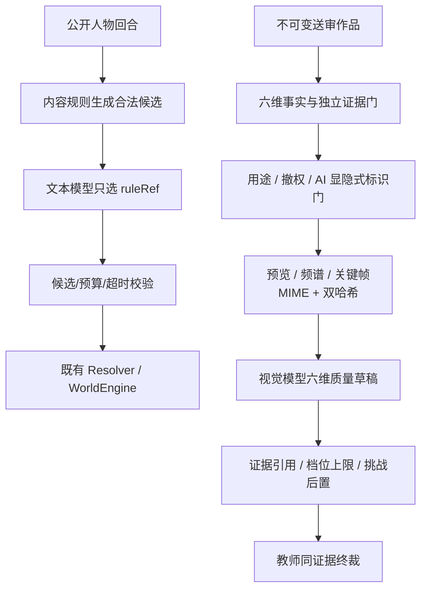

# 融岗智训 — 智能体群产品化与消融

> **适用范围更新（2026-09-07）**：本文保留对应旧阶段的设计和验收事实。新一轮本体开发以[02 当前计划](../02-项目规划.md)及[12 技术目标设计](../01-子文档/12-技术实现审查与冲刺架构.md)为准；旧阶段的固定节点、数量、版本和内部国金准入不自动延续为新周期要求。

> 该文档隶属于[02-项目规划.md](../02-项目规划.md)，定义 V2 智能体群面向学生、教师和管理员的产品投影，以及同底座消融口径；当前实现事实以[01-开发者文档.md](../01-开发者文档.md)为准。

## 1. 保留的权威架构

```text
已认证角色与课程发布
  → WorldEngine 接收统一行动/动态事件
  → 事件波计算受影响集合
  → 调度必要 AgentTemplate/AgentInstance
  → 模型或确定性执行层生成结构化候选
  → 学生采纳、补证或拒绝
  → 教师门复核高风险候选
  → WorldEngine 唯一正式写回
  → 证据、回放、评价与管理员 Trace
```

模型、讯飞星辰工作流、知识库和工具只提供候选执行能力，不拥有世界正式写入权、教师放行权或成绩权。

## 2. 六组十四智能体的产品化清单

V2 服务端输出 `AgentTopologyManifest`，至少包含稳定 ID、分组、职责、订阅事件、输入、结构化输出、允许动作、禁止动作、教师门、运行模式和当前状态。现有十四类名称与代码 ID 以仓库目录为准，任务实现时不得仅为界面另造第二套 ID。

| 分组 | 面向业务的职责 | 典型唤醒条件 |
| --- | --- | --- |
| 教学导演 | 控制节奏、生成教学候选、组织教师门 | 节点进入、风险升级、进度停滞 |
| 采编生产 | 选题、材料理解、采访、写作与视听生产建议 | 新任务、新材料、修订请求 |
| 事实核查 | 信源分级、事实冲突、证据补强 | 来源矛盾、关键事实缺证 |
| 内容治理 | 版权、AI 标识、伦理、平台与发布风险 | 高风险素材、发布前检查 |
| 运营传播 | 平台适配、时效、受众与数据复盘 | 多平台发布、传播数据返回 |
| 评价学习 | 过程证据、量规、反馈、策略与迁移 | 成果提交、教师终评、复盘 |

## 3. 三类角色投影

### 3.1 学生

每次只返回一个最相关 `AgentSuggestion`：建议摘要、岗位视角、依据、适用原因、风险、允许动作。学生可执行 `accept / request_evidence / reject`；不得返回候选池、Prompt、私有记忆、供应方、Trace 或其他角色私有信息。

### 3.2 教师

教师看到一个业务 Episode：触发事件、受影响集合、选中智能体、跳过智能体及理由、贡献依据、学生决定、教师门、正式写回和后果。无事件时只显示一个紧凑等待态，不渲染固定八张空卡。

### 3.3 管理员

管理员可查看拓扑、候选/过滤、失败、降级、供应方模式、预算与安全 Trace，并切换到学生/教师体验。管理员视图不得绕过世界写入、教师门或真实身份授权。

## 4. `AgentCollaborationEpisode/2.0.0` 边界

Episode 是角色安全业务因果投影，不是原始运行日志。它必须由服务端从已授权事件、调度、建议、学生选择、教师决定和正式写回做引用交集；不存在的引用、仅技术 Trace 出现的噪声、stage summary 和浏览器伪造参数不得进入。

学生版本只包含当前建议和自身决定；教师版本包含完整业务链；管理员版本可附安全技术引用但仍不返回密钥、Token、Cookie、完整 Prompt 或私有记忆正文。

## 5. 讯飞星辰接线

- 公共启动链读取现有星辰配置并实例化工作流 Handler。
- 凭证、工作流 ID 与必需配置完整且健康检查成功时标记 `live`。
- 缺配置、超时、协议错误或响应不合格时进入确定性演示/失败关闭，界面明确显示 `deterministic_demo` 或 `degraded`。
- 回退输出必须通过与 Live 相同的结构化 Schema、权限门和世界写入门。
- 浏览器不得提交供应方、模型或预期策略引用来改变服务端路由。

## 6. 三组消融

| 组 | 架构 | 必须相同 |
| --- | --- | --- |
| A | 单一通用智能体 + 原有权威门 | 案例、材料、模型/工具预算、量规、世界门 |
| B | 固定多角色、共享视图、固定广播 | 同上 |
| C | 事件驱动智能体群、私有视图、受影响集合 | 同上 |

条件标签不得进入模型输入。每组记录任务结果、协作必要性、里程碑、无关调用、越权、证据覆盖、教师修订、延迟、Token 与成本。C 组没有达到预登记门时，结果必须保持失败或证据不足，并触发合并模板、简化调度或收缩主张的讨论。

## 7. 安全与验收

- 世界、任务、证据的正式 writer 只能由既有权威链调用。
- 角色投影零私有引用泄漏；学生/教师 API 不返回供应方密钥或原始模型上下文。
- 跳过理由稳定且可测试，禁止用自由文本复制技术日志。
- Live 与确定性演示可由机器判定，不以营销文案区分。
- 同底座控制哈希、策略哈希和失败结果进入管理员证据面。

## 8. AI-009 真实落地

`AI-009 / V2.0.5` 将本规格从契约推进到公共服务链。`agent-runtime` 只从生产目录中选择 `lifecycle=baseline` 的十四个既有智能体，并确定性归入教学导演、采编生产、事实核查、内容治理、运营传播和评价学习六组；九个 assistance 候选不会被误算为“十四智能体”。拓扑接口为 `GET /api/admin/agent-topology`，只接受 operator 管理员主体，师生不会因 World `ActorKind` 扩展而获得后台权限。

`GET /api/sessions/:sessionId/collaboration-episode?bindingId=...` 由服务端根据 Cookie、绑定和会话推断 `student / teacher / admin` audience，拒绝浏览器提交 audience、供应方、回放或 Trace。聚合器只连接同一触发事件、行动根、教师候选与审核决定；无关候选、无关审核、stage summary、原始 payload 和仅技术轨存在的引用全部失败关闭。学生只获得一条建议及采纳、补证、拒绝决定；教师获得十四项业务选择与跳过原因；管理员才获得安全执行模式和 Trace 引用。GET 前后世界时间线保持完全一致，Episode 服务没有注入世界、任务或证据 writer。

新增 `scenario-xunpu-media@2.0.0` 的七节点记者单岗情境，普通学生只有 `student-reporter / reporter`，责任编辑、采访对象、版权和平台职责由受控智能体/NPC承担。该包通过真实目录校验，规范哈希固定为 `faf6a5a00ec6824341a1dac8d2d2058703375cd72871351fb469ad6e1a70e0ee`。课程内容阶段的版本 1 保持不可变；运行发布另增版本 2 `release-course-xunpu-intangible-media-2.0.0-runtime.1` 并绑定上述真实情境哈希，不借用旧“水乡非遗市集/暴雨闭园”世界，也不复制未授权媒体。

公共启动链注册通用星辰结构化模型 Handler。配置完整时模型网关如实标记 `iflytek_xingchen / live`；缺凭证时继续使用显式 `deterministic_demo`，协议错误或不合格响应失败关闭。Handler 不能绕过结构化 Schema、智能体权限、教师门或 `WorldEngine` 唯一写回权；健康响应不返回基础地址、授权头或密钥。真实讯飞凭证联网仍是未完成外部验收。

## 9. FE-008 角色产品化接线

`FE-008 / V2.0.7` 把同一协作 Episode 投影成两种新的真实产品面：教师只消费业务因果链，管理员才消费拓扑运行态和技术观测。教师导演按实际存在的数据段显示触发事件、受影响集合、选中/跳过理由、学生决定、教师门和权威写回；无事件时只保留一个等待态，不显示供应方、Trace、原始引用或技术阶段占位。

教师决定端点不接受浏览器候选 ID。服务端用教师投影的待审候选与冻结章节 action/event 引用做交集，在会话锁内复核 audience、gate 与状态版本；批准可以推进，补证与退回只写教师审计和候选拒绝，不产生被退回候选的权威后果。页面丢弃最小 mutation receipt，等待事件波并重读 Episode 后才确认结果。

批准后如果权威 Episode 已切到下一章，教师页会把提交前 pending Episode 与提交后权威 Episode 组合成一次“教师门 → 世界后果”确认卡，显示刚批准的业务对象和已经激活的新事件。确认卡不读取技术 Timeline/Trace、不携带候选 ID，也不改变当前 Episode；刷新后仍以服务端当前事件为准。

管理员全景由 `AgentTopologyManifest` 的六组十四 baseline 节点与管理员 Episode 的本轮运行事实合并；Manifest 不伪造最新 Run，Episode 不可用时显示真实 idle/不可用。管理员仍通过 operator principal/capability 授权，角色切换会重新建立学生或教师身份，不能把后台能力带入师生体验。旧地址显式携带的 `profileId` 若与目标角色不一致，前端会在认证和业务读取前失败关闭；只有未指定身份时才使用该角色的演示默认身份。该接线关闭“架构只在附件和文档中存在”的可见层缺口，但没有生成 A/B/C 消融结果，也不把确定性演示写成架构优越证据。教师 `request_evidence` 当前只完成安全退回和零权威推进；学生补证行动尚未恢复，因此不计为完整补证闭环。

## 10. AI-010 跨课程规则与诚实消融证据

`AI-010 / V2.0.12` 新增 `CrossCourseAgentRuleManifest/2.0.0`，从四门服务端课程内容编译 25 个章节的单一动态事件、受影响集合、候选集合、选择上限、教师门与 `selectWhen / skipWhen`。清单同时绑定不可变课程/情境引用、十四 baseline 节点拓扑哈希、内容快照哈希、逐章规则哈希和稳定清单哈希；生成时间不参与规则身份，因此同一内容重启不会制造漂移。课程引用、完整内容哈希、章节顺序及 action/event/candidate/gate 任一超集、漏项或替换均失败关闭。

泉州内容使用的 `agent-task-planning`、`agent-evidence-coach`、`agent-material-understanding`、`agent-interview-structuring` 和 `agent-content-adaptation` 保持 supporting capability，不进入六组十四 baseline。显式解析关系被写入规则哈希；未知或未解析引用不能标记 `runtime_ready`。Episode 的实际选择只取受影响 baseline 与当前事件真实订阅者的并集，最大数量只是上限，跳过项保持稳定原因；学生单建议取相同排序的最高相关节点。

管理员读取面为 `GET /api/admin/agent-rule-manifest` 和 `GET /api/admin/agent-ablation-evidence`，查询必须为空且只允许 operator。学生和教师路由不会创建这两个 reader；清单/报告漂移返回安全 `409`。管理员就绪页显示四课程规则、十四 baseline、五项 supporting capability、三组过程门和当前结论，不把规则声明冒充真实 Run。

当前 `AgentAblationEvidence/2.0.0` 只形成零样本诚实骨架。聚合前必须验证实验、控制变量、策略、课程规则和观察元组；观察 ID 与“课程—章节—事件—条件—重复”必须唯一，A/B/C 必须齐套且每案例每组至少十次，content-only/unresolved 课程不得带观察，失败或不可用结果不得补分。旧 V1 Gold 中世界门不一致、按配置推导越权和重复三条观察冒充三十条的做法没有被复用为 V2 证据。

本版本 `observationCount=0`，所以结论固定为 `insufficient_evidence`。A/B/C 是公开预登记组而不是盲组：`conditionLabelsHidden=false`、`blindReviewStatus=not_configured`；私有随机盲分配与 commit/reveal 尚未建立，契约和页面机械禁止 `hypothesis_supported` 与“架构优越”措辞。后续若要形成非零比较，必须另发协议版本、冻结私有随机分配并保留失败样本，不能在当前 DTO 上补写伪盲评结果。

## 11. QA-006 / PM-006 产品化与消融最终状态

四课程 25 章均通过不可变课程/情境引用、逐章事件、受影响集合、候选、选择上限、教师门及选择/跳过条件校验。产品拓扑始终只计六组十四 baseline；五项 assistance 以 supporting capability 单列，既不扩成第十五至十九个节点，也不进入消融 agent 数。三门迁移课 18/18 章的真实 HTTP 链证明受影响调度、单建议排序、完成候选和教师批准可达；管理员显示的选择/跳过只来自权威 Episode，不把规则声明冒充 Run。

最终非 Live 门为 868 项测试和 built Chromium E2E `13/13`。师生路由不会实例化管理员规则/消融 reader，operator 端点严格空查询；普通响应不含实验条件、Prompt、私有记忆、供应方请求或原始 Trace。过程评估 finalize 对 World 与时间线零写入，继续保持智能体候选、课程学习状态和权威世界三层边界。

当前消融证据仍是零样本：A/B/C 公开、盲评未配置、结论 `insufficient_evidence`。这证明系统能够拒绝重复观察、控制漂移、不齐套批次、失败补分和占位课程观察，但没有证明事件驱动群优于单智能体或固定多智能体。后续只有在同底座、每案例每组至少十次、私有随机盲分配、失败保留和独立解盲全部冻结后，才允许形成新的比较版本。

## 12. AI-012 评价智能体与业务证据边界

`V2.1.8 / AI-012` 把“评价学习”组接到泉州 V3 真实记录，但没有赋予任何智能体成绩权。`FlagshipCompetencyAssessmentServiceV3` 只从不可变作品修订、已接受学生动作、学生对真实建议的决定、教师门和已提交世界后果中提取 `CompetencyEvidenceEpisode`；不存在的引用、页面点击、代理预测、NPC 私有印象和建议 Agent 自报均不能成为证据。

语义评价端口接收去身份化材料，不读取学生身份、binding、挑战等级、实验条件、Agent 建议、供应方或 Trace。挑战调整在盲化语义结果之后应用，并受 3—7 级 80/85/90/95/100 上限约束。管理员证据页可查看来源哈希、盲评输入哈希、结构化语义收据和逐维复算；学生/教师 DTO 不含这些技术字段。该隔离也保证未来 A/B/C 组标签不能泄漏给评分端。

六个量规维度必须分别达到独立证据门；任一维度不足时整场不出分。教师只能确认当前结果，或基于已有证据逐维修订，不能从浏览器提交总分或伪造证据引用。默认语义实现明确标为 `deterministic_demo`，量规明确标为 `pending_expert_review`；因此本版只证明评价因果、权限和复算边界成立，仍不构成多智能体优势、专业评价效度或真实教学效果证据。

## 13. AI-014 学习者代理与智能体群边界

`V2.1.9 / AI-014` 新增的 `LearnerProxyAgentV3` 是学习分析沙箱，不是第十五个世界智能体，也不进入六组十四 baseline 拓扑。它只在六维评价最终、证据充分且教师复核后读取去身份安全摘要，对当前 3—7 级及相邻候选世界作预测；`evidenceEligible / canActForStudent / canScoreStudent` 永远为 `false`。代理不能进入 WorldEngine、不能创建学生动作、不能生成作品、不能影响本场成绩，也不能读取 NPC 私有记忆、学生身份、binding、教师身份或消融条件。

挑战策略把代理预测、画像置信度、历史校准误差和真实能力证据组合成下一轮建议。自动策略单次最多升降一级，低置信度或高误差保持当前等级；教师可以有理由跨级覆盖。学生申诉会冻结画像更新、方案确认和挑战覆盖，结案后才恢复。预测只在对应下一场出现真实学生动作后校准，没有真实行动不制造命中率。

学习者画像和代理预测不得进入 A/B/C 任务结果评分，否则会把自适应差异混入智能体群协作差异。后续消融若同时研究自适应，必须另建正交因素或固定相同 ChallengeAssignment；当前零观察结论继续为 `insufficient_evidence`。本版只证明隔离与审计边界，不证明代理预测准确、多智能体优越或个性化教学有效。

## 14. QA-007 自写行动、安全信号与四终局

`V2.1.10 / QA-007` 关闭了“学生输入只是留痕，NPC 仍说固定台词”的关键缺口。学生原始行动只保存在学生工作域；`xunpu-action-policy-v3.ts` 依据冻结事件规则提取 `professional / incomplete / risky / not_applicable`、命中/缺失标准、风险标志、证据计数、公开世界指标和剩余时间。Agent Observation 只携带这组最小安全信号，不复制原始话语、反思或身份。

R2 十四执行器根据安全信号和累计世界状态形成不同 proposal：门卫可放行、要求说明或拒访；传承人可深入回应、要求重问或结束采访；核查、版权、编辑和平台治理会增减事实可信、社区信任、编辑独立、版权/平台风险与更正债；审慎等待会消耗虚拟时间。所有 proposal 仍由 Resolver、世界规则与教师门结算，智能体的正式写入权保持为零。

发布执行器不再返回统一成功文案，而是从同一 Snapshot 确定性选择可信合作、审慎延误、流量反噬或治理失败。四个独立会话测试证明每个结局均可机械到达；浏览器黄金链证明不完整行动可补证重做、主动 NPC 冲突可拒绝后继续、七项必交和专题稿 R1→R2 可进入发布门。该结果证明受控因果差异存在，不替代 A/B/C 非零消融，也不把冻结规则执行器宣称为真实模型 Live 或涌现智能。

## 15. AI-022 统一候选模型与多模态评价边界

`V2.4.4 / AI-022` 不增加第十五个世界智能体，也不让大模型成为新的世界或评分权威。它把同一结构化网关接到人物 Episode 的合法候选选择，并为作品评价增加独立视觉 Provider：



学生原话、公开历史、文字作品与媒体像素都按不可信数据处理；其中的 Prompt 注入不能改变系统规则。未授权、已撤权、证据不足、媒体缺失、处理不完整、模型异常、超时、零预算或伪引用均形成明确的零调用/降级/拒绝收据，不得伪装成已观察。音频当前只转换为真实频谱和电平摘要，没有 ASR，因此禁止生成或猜测语义转写；视频只取三帧，禁止把静帧结果包装成连续运动或伴音判断。

普通学生与教师不接收 Base64、Prompt、Trace、供应方、成本或媒体准备内部信息；管理员只得到去身份哈希、表示类型、预期/实际数量、是否随请求发送、局限和安全运行引用。受控 DeepSeek Live 已覆盖文本 JSON、真实图像输入与人物候选协议，但这只是可达性证据，不进入 A/B/C 架构优越结论，也不构成专业评价效度。
