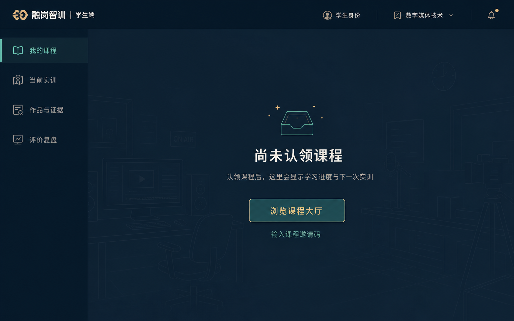
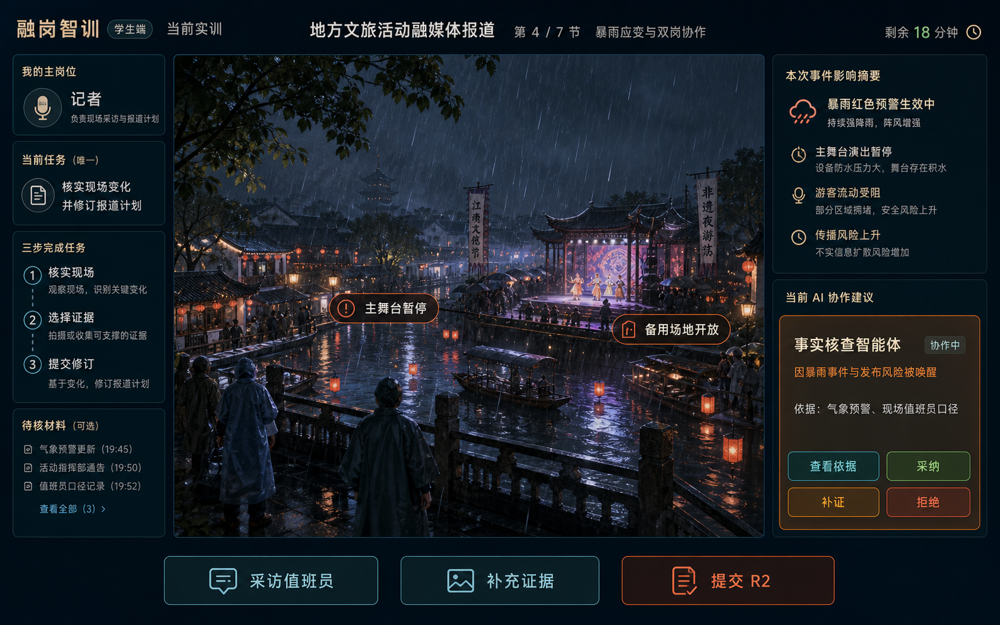
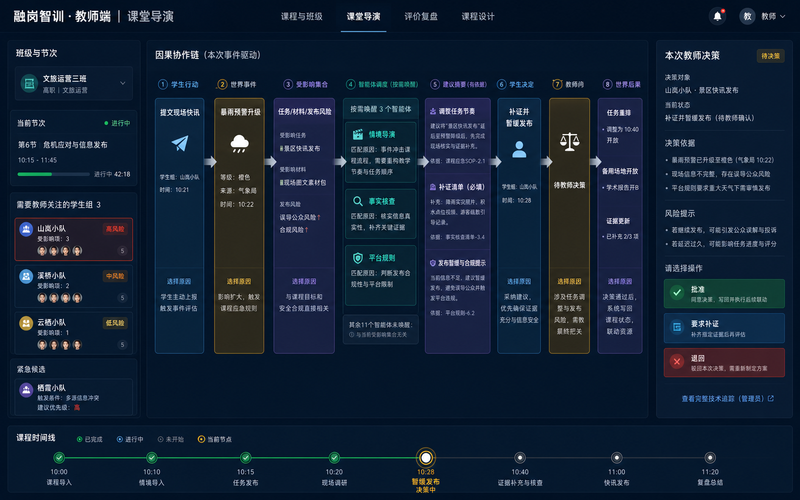

# 融岗智训 — 角色页面与视觉规格

> **适用范围更新（2026-09-07）**：本文保留对应旧阶段的设计和验收事实。新一轮本体开发以[02 当前计划](../02-项目规划.md)及[12 技术目标设计](../01-子文档/12-技术实现审查与冲刺架构.md)为准；旧阶段的固定节点、数量、版本和内部国金准入不自动延续为新周期要求。

> 该文档隶属于[02-项目规划.md](../02-项目规划.md)，冻结用户已经批准的 V2 学生、教师与管理员信息架构和三张概念稿。实现必须以业务操作为主、解释性文本为辅，不得恢复日志堆叠式工作台。
>
> **适用范围更新（2026-09-10）**：用户随后确认节点探索、人物一对一交谈、手机和采访本，已通过 `V2.5.52 / FE-017` 接入正式流程。本文第1、3、20节中的旧学生现场布局和配色保留为历史设计；当前规范及实测图只在[01第16节](../01-开发者文档.md#16-节点探索与正式实训接入)维护。教师、管理员的角色信息边界继续适用。

## 1. 全局视觉原则

1. 深海军蓝导航、浅灰蓝工作区、青色状态强调、白色内容卡是固定方向；卡片边界清楚、留白充足、正文保持高对比。
2. 每个页面只回答一个业务问题，首屏只有一个主要下一步；解释文案使用“你为什么来到这里—现在做什么—完成后发生什么”。
3. 学生和教师不显示 `STATE #`、哈希、请求 ID、供应方、Trace、技术日志或恢复控制；这些只进入管理员。
4. 桌面以 `1440×900` 为主基准；移动以 `390×844` 为硬门，页面本身不得横向溢出，不把桌面多栏机械堆成超长日志；作品标签等有明确边界和滚动提示的局部横向条带可以触控滚动。
5. 旧页面可以保留为一次跳转兼容层，但不得与 V2 页面同时渲染。

## 2. 学生课程空态

- 页面只显示“我的课程”、清楚的未认领说明、一个“浏览课程大厅”按钮和简短流程提示。
- 不请求投影、不展示课程卡、进度、任务、作品、日志或模拟数据。
- 课程大厅是独立状态；用户主动进入后才显示可认领课程。

## 3. 学生当前实训

- 顶部只显示离场、当前地点、剩余时间、适应性压力和两个岗位制作工具；主区保留现场人物与“本轮唯一工作焦点”。
- AI 建议以一张可展开卡出现，默认只显示最相关建议、依据摘要与 `采纳 / 补证 / 拒绝`。
- 状态必须由 `LearningActivity/2.0.0` 判别联合驱动；`ready` 不得渲染进行中任务，`active` 不得同时显示“暂无任务”。
- 任务简报、成果进度与最近回应使用可访问的按需展开区；不得以常驻三步栏、重复进度条或固定全宽操作坞覆盖现场。
- 作品、媒体与评价通过岗位工具或独立页面打开，不作为任务页常驻日志抽屉。V4 现场的四种主状态固定为自由行动、单条专业建议、等待教师门、进入评价复盘，并且必须互斥。
- V3 兼容现场仍可采用旧“现场—编辑部”双页面，但不得把兼容布局重新解释为 V4 当前规范。

## 4. 教师协作导演

- 主线按“事件 → 受影响集合 → 智能体建议 → 学生选择 → 教师门 → 世界后果”展开。
- 当前发生的链路优先；历史记录折叠；未发生阶段不占据大卡片。
- 无事件时显示一个紧凑等待态和可执行教学入口，不渲染八张 `not applicable` 卡。
- 教师可查看业务依据和跳过理由，但不能看到 Prompt、私有记忆、供应方密钥或原始 Trace。

## 5. 管理员智能体全景

管理员页以[04-智能体设计架构.md](../04-智能体设计架构.md)和现有 `doc/image/融岗智训-事件处理外壳与智能体群全景图-v2.svg` 为拓扑基准，由服务端 `AgentTopologyManifest` 动态标记六组十四智能体的 `idle / selected / running / skipped / degraded / failed` 状态。右侧详情按当前选中节点展示订阅事件、输入、输出、权限、禁止动作、教师门与最近 Run；底部仅管理员可展开技术 Trace。

## 6. 路由与代码拆分门

| 页面组 | 路由 | 加载规则 |
| --- | --- | --- |
| 学生课程 | `/student/courses` | 独立 chunk；无认领不加载训练投影 |
| 学生实训 | `/student/training/:sessionId` | 独立 chunk；只加载当前活动与单条建议 |
| 学生作品/复盘 | `/student/portfolio`、`/student/reviews/:sessionId` | 分别延迟加载 |
| 教师 | `/teacher/classes`、`/teacher/director/:sessionId`、`/teacher/reviews/:sessionId`、`/teacher/courses` | 各业务域按页面加载 |
| 管理员 | `/admin/*` | 管理员授权通过后才加载日志、Trace 与拓扑详情 |

旧 `App.tsx` 不再承担全部业务页面。每个页面至少拆分为路由入口、数据 hook/API adapter、业务组件和局部样式；共享壳只保留身份、一级导航与必要会话上下文。

## 7. 验收快照

- 学生未认领课程：只有空态与唯一 CTA。
- 学生 `ready`：课程已认领、尚未开始，无虚假任务。
- 学生 `active`：唯一任务、三步指引、现场、单条建议与主行动。
- 教师无事件：一个紧凑等待态。
- 教师有事件：完整业务因果链，无技术日志。
- 管理员：六组十四智能体拓扑、完整运行状态和可展开 Trace。
- `1440×900` 与 `390×844` 均无横向溢出、按钮可达、文字不被截断。

## 8. FE-007 实现与验收

`FE-007 / V2.0.6` 已按本规格交付学生四页并完成真实接口接线。`App.tsx` 只保留同步旧地址迁移、路由解析、演示认证和页面级懒加载；课程、实训、作品、评价各自为独立 chunk。未认领 `/student/courses` 只请求认证和认领列表，列表为空即停止，课程目录必须由用户点击唯一 CTA 后加载。认领后的 `/student/training/:sessionId` 只显示一个任务、严格三步指引、结构化现场、一条最相关建议和一个主行动，不恢复课程壳、共享抽屉、重复进度条或技术状态。

学生端只消费严格 `StudentTrainingContext`，不请求宽泛 `StateProjection`。认证、认领、活动、现场和 Episode 在 profile、主体、绑定、会话、课程发布、状态版本、情境和场景上失败关闭；建议按钮只提交服务端签发的 suggestion 和允许决定，主按钮只提交服务端当前行动引用。写入后必须等待事件波并以权威重读确认，页面不会根据 `2xx` 本地伪造完成状态。

真实浏览器已完成桌面和移动验收：空态进入课程大厅、认领泉州、展开建议依据、选择补证并执行主行动均可达；`1440×900` 保持任务/现场/建议清楚分区，`390×844` 收束为单列并保留唯一主行动。两视口横向溢出均为 `0`，控制台错误/警告为 `0`。本节只验收学生 V2 页面；教师、管理员仍以第 4—5 节规格作为 `FE-008` 完成门。

## 9. FE-008 实现与验收

`FE-008 / V2.0.7` 已把教师四页与管理员六页替换为真实接口页面。教师导演页不再用固定八卡表达流程，而是只渲染当前存在的事件、受影响集合、贡献、学生决定、教师门和写回；无事件时只显示一个紧凑等待容器。教师按钮提交批准、补证或退回后必须等待权威 Episode 前移，不根据 HTTP `2xx` 本地伪造完成。评价页在尚无专用 V2 评分接口时明确显示不可用态，零伪分数、零伪请求。

教师批准使当前业务链进入下一章时，页面顶部保留一个紧凑的“刚刚确认”双栏卡：左栏是刚批准的教师门，右栏是权威回读确认的新世界事件。它确保教师能连续看到“教师门—世界后果”，同时不把上一章整套卡片永久堆回页面；移动端双栏自动收束为单列。

管理员智能体页动态展示六组十四节点，节点选择联动声明边界与本轮运行结果；供应方、Trace 和后台运行细节只存在于管理员路由。管理员切换体验会导航到独立学生/教师 profile 并重新认证，不将 operator 权限复用为业务身份。桌面继续采用深海军蓝横向导演结构，移动端将业务链和拓扑折叠为单列，保留明确主行动与足够留白。

旧 URL 迁移只替换页面地址，不替换用户明确指定的身份。显式学生 profile 进入教师旧深链、显式教师 profile 进入管理员深链时，页面显示“身份与页面不匹配”且不发起另一角色的默认认证；只有没有 `profileId` 的公开演示入口才采用角色默认 profile。

真实组合态浏览器已经跑通学生三次主行动后的教师待审、教师退回补证、管理员拓扑节点选择和角色切换。教师与管理员在 `1440×900`、`390×844` 四组视口均满足 `document.scrollWidth === document.clientWidth`、`mainCount=1`、控制台/page error 为空；教师页面文本不含 `STATE #`、原始演示会话 ID、Trace 或供应方。教师退回补证后学生当前行动尚未恢复，页面明确显示“补证入口待接通”，不使用“等待学生操作”伪装为已可继续。概念稿规定的深海军蓝、青/沙金状态语义、任务聚焦和角色分层已经落地；图片、正式评分和不存在的运行数据没有为了视觉充实而伪造。

## 10. FE-009 四课程旅程实现与验收

`FE-009 / V2.0.11` 新增 `/student/courses/:courseId` 独立详情页，并将课程大厅统一为“课程卡 → 公开详情 → 唯一认领按钮”的单向旅程。课程卡不伪造封面、课时或进度；详情只显示公开来源、章节目标与任务、成果、证据要求、量规和迁移反思，不显示 `contentHash`、情境引用、隐藏事实、内部动作/事件、候选智能体或教师门。认领后必须权威重读，`claimed / in_progress / awaiting_review / completed` 分别进入等待开班、继续实训、查看复核和评价复盘。

学生作品与复盘页面已接真实进度、作品、证据和复核 DTO。没有真实成果或评分时保持单一业务空态，不显示“已归档”或模拟分数；无认领时只保留一个下一步，且不会请求课程目录、进度、作品、活动、现场或 Episode。教师复核页只从服务端任务队列选择待复核项，评分提交后以权威重读确认，不在页面保存另一套可变完成状态。

Web 类型检查、`27 files / 191 tests` 和生产构建通过，课程详情、作品、学生复盘与教师复核均为独立懒加载 chunk。真实 API 浏览器完成 fresh-data 空态、四课程大厅、公开详情、内容占位课程等待态、旗舰训练/作品/复盘和教师空队列检查；`1440×900` 与 `390×844` 均满足 `scrollWidth === clientWidth`，console/page error 与技术字段泄漏为零。后三门页面可浏览不等于运行情境已发布，必须继续保持诚实等待态，直至 `AI-010` 提供精确 ScenarioPackage 与不可变运行课程发布。

## 11. QA-006 / PM-006 角色页面最终状态

AI-010 发布后三门 `runtime.2` 后，四课程详情均可按目标 `courseId / courseReleaseRef / sessionId` 精确进入旅程。同一学生同时存在多门活动课程时，详情只选择当前课程 enrollment，不再要求账号全局唯一活动会话；账号级课程和作品聚合不会静默复用另一会话绑定，具体训练、评价和写入仍先重新建立目标 session 的记者绑定。

学生评价和教师复核对 `course-process-review:*` 使用“系统过程达成评估（专业复核待完成）”，并说明分值只表示量规项与冻结过程证据覆盖，不是内容专业评分；只有真实非 fallback 结果保留“教师复核结果”。页面不根据摘要文案猜类型，也不使用大号分数先造成教师已评分的错误归因。

最终 Web 为 `28 files / 203 tests`，生产构建通过。完整 built Chromium E2E `13/13` 覆盖 V1 兼容、泉州旗舰和第二轮多课程链；学生、教师、管理员在 `1440×900` 与 `390×844` 均无横向溢出，console/page error 与角色请求越界为零。Browser 插件独立控制通道两次连接及最小健康探针均返回 `Transport closed`，所以只登记仓库 Playwright 的真实结果，不虚报插件手工通过。

## 12. FE-010 R2 学生现场与编辑部工作台

`V2.1.6 / FE-010` 将泉州学生页从 R1 现场纵切升级为 R2 “采访现场—编辑部”双页面。采访现场继续使用原创蚵壳厝环境和人物资产，只展示当前目标、剩余时间、挑战等级、至多三个服务端相关行动、单条真实 Run 建议、采访本和定性世界脉搏；不展示技术日志、全局状态数值或十四节点后台。

编辑部工作台是独立 `main` 页面，不作为现场遮罩下的重复内容。左侧/移动端横向作品导航列出九类真实成果；正文区提供机器可读字段、公开证据选择、修订说明、机械完成检查和服务端哈希收据。保存产生不可变新版本，锁定后不能静默覆盖；专题稿进入编辑审阅、发布进入教师门时必须引用服务端真实 `revisionId + contentHash`，伪造证据、过期版本和浏览器自造引用均失败关闭。

真实浏览器已验证未认领真空态、四课程大厅、认领泉州、R2 现场、打开九成果工作台、填写选题简报、选择两条真实公开来源、保存 R1、锁定送审和刷新恢复。桌面信息层级清楚；`390×844` 页面 `scrollWidth` 不超过可视内容宽度，作品导航只在自身边界内触控滚动，发布按钮不挤压正文，console warning/error 为零。该结果只冻结学生代表性纵切；教师/管理员 V3 页面、全部九成果完整填报、四终局、专业评价和学习者数字分身仍由后续版本验收。

## 13. FE-011 V3 教师因果导演与管理员执行全景

`V2.1.7 / FE-011` 将泉州教师导演与管理员智能体页切到学生正在使用的同一条 V3 世界、Episode 和作品记录。教师页面只按实际存在阶段展开“事件—必要协作集合—岗位贡献—学生选择—教师门—世界后果”，不显示固定流程空卡；完全无事件时，首屏只有标题、课堂状态和一个紧凑等待容器，世界脉搏、作品和风险门均不渲染。事件出现后才展开定性世界指标、现场人物、真实作品修订与教师风险决定。

管理员页面从服务端取得 `simulation-agent-topology/3.0.0`，严格显示六组十四节点，并以真实 DispatchPlan/Contribution/Failure 标记本轮选择。右侧检查器只在管理员身份下披露执行模式、供应方/模型声明、Trace/Prompt 引用、延迟、成本、失败和恢复信息；教师页面与 DTO 不出现这些技术字段。V3 不存在的历史会话才回退旧 V2 页面，避免用兼容摘要冒充同源因果。

真实浏览器已核验教师等待态、学生行动后的三阶段业务链、管理员六组十四节点，以及教师/管理员 `390×844` 页面级零横向溢出。教师当前事件态不含 Task/Run ID、Trace、Prompt、供应方或成本；管理员移动端保留六个组和十四个可选节点。该结果冻结三角色披露与页面层级，不代表能力评价、挑战自适应、全部终局或真实用户体验已经完成。

## 14. AI-012 三角色证据评价页面

`V2.1.8 / AI-012` 将旗舰评价接入既有独立复盘/证据页面，不把评分卡塞回学生现场或教师导演：

- 学生 `/student/reviews/:sessionId` 只看当前结论、六维业务证据和一个下一步。证据不足时主标题固定为“暂不出分”，不显示 `0`、虚假等级或技术复算；页面不含语义收据、来源哈希、供应方、Trace、Prompt 或其他角色信息。
- 教师 `/teacher/reviews/:sessionId` 逐维显示证据来源、暂定判断、证据不足原因和确认/修订字段。只有证据充分维度可填修订分与等级；整场原因和逐维理由都由教师显式提交，页面不能编辑原始证据。
- 管理员 `/admin/evidence` 独占来源哈希、盲评边界、语义收据、逐维计算和挑战后置归一说明；它是复算与审计界面，不是替教师改分的后台捷径。

三页优先读取 V3 评价接口，只有服务端明确 `404` 才回退历史 V2 过程复盘。严格 wire parser 拒绝额外字段；教师写入带 CSRF、决定 ID 与 requestId，并以服务端权威回读确认。默认评价器和量规状态在页面明确写为“确定性演示 / 待专家复核”，不使用“AI 已完成专业评分”的视觉暗示。

独立 Playwright 从真空态认领泉州后验证学生“暂不出分＋一个成长下一步”、教师六维证据不足确认、管理员六维复算和三角色披露隔离，并在 `1440×900`、`390×844` 均满足页面级零横向溢出，`1/1` 通过。外部浏览器复用真实演示数据时，学生页显示 2 个真实证据 Episode、教师确认后仍不出分、管理员显示同源哈希/盲评回执/两版决定链，三端 console 技术泄漏检查为零。历史 V2 旗舰 E2E 仍含 R2 已删除的旧页面文案断言，不计入本版通过结果，统一由 `QA-007` 重写为最终 V3 黄金链。

## 15. AI-014 三角色自适应成长页面

`V2.1.9 / AI-014` 不新增一级菜单，也不把技术面板塞进现场。学生成长卡嵌入 `/student/reviews/:sessionId`，只显示下一挑战、透明上限、置信度、能力目标、练习意图、成功证据、支架触发/淡出和申诉；证据不足时只显示“暂不建立学习者模型”，画像、预测、挑战与方案均不渲染。教师成长卡嵌入 `/teacher/reviews/:sessionId`，提供方案确认、3—7 级有理由覆盖和申诉处理，不允许编辑原始证据或代理预测。管理员 `/admin/evidence` 才显示画像/模型哈希、代理候选、预测与校准、策略版本、教师覆盖、申诉和命令收据。

页面严格禁止“冲动型人格”“低能力学生”等固定标签。行为倾向必须写成带真实证据的可变观察；学生可申诉，教师覆盖必须留理由。下一轮 ChallengeAssignment 当前是服务端建议，页面不得写“课程已自动调整/新场次已创建”，只能写“建议下一挑战”。

全新数据浏览器验收显示泉州首次诊断为 4/7，六维证据不足时师生管理员三端均不建画像。外部 Edge/Chrome 桌面页面无横向溢出；真实 Chromium `390×844` 的学生、教师、管理员成长/审计页均 `scrollWidth === clientWidth === 390`、单一 `main`、console/page error 为零。完整充分证据页面由严格组件 fixture 和网关测试覆盖；最终跨场黄金链仍由 `QA-007` 验收。

## 16. QA-007 旗舰现场交互与结局冻结

`V2.1.10 / QA-007` 将现场主行动改为“服务端开放动作＋学生空白自写内容”。动作被选中后，灰色文案只作为情境提示；输入框初始为空，空内容不能执行，页面不得通过 state、默认值或测试 fixture 预填标准答案。提交后必须展示具体 NPC/岗位回应，再提供采纳、补证或拒绝；补证会恢复输入区并保持世界零写入。

学生页新增明确的四终局卡：可信合作使用可信完成语义；审慎延误、流量反噬和治理失败使用不同警示色、说明和迁移反思。终局文字必须由服务端 `endingRef` 映射，`completed` 与 `recoverable_failure` 均可显示其真实结局，不能把失败统一绘制成绿色成功。

最终浏览器质量门从未认领真空态开始，完成认领、门卫补证恢复、商户主动冲突、传承人采访、社区教师门、双来源核验、七项必交、专题稿双版本、发布教师门、可信合作结局、教师业务因果、管理员六组十四执行以及三端 `390×844` 零页面级横向溢出。学生/教师正文持续排除 STATE、Trace 和 Prompt；管理员确定性模式如实显示 `deterministic_demo`。

## 17. FE-012 自由行动与融媒体三角色工作台

`V2.2.6 / FE-012` 继续以第 2—5 节概念稿为硬基准，但将“受控行动按钮”升级为公共 V4 自由行动与真实媒体纵切。

### 17.1 与批准概念稿一致的部分

- 学生现场使用深海军蓝底、沙金任务提示和青色交互状态；桌面保持“左侧主岗位/唯一任务/三步—中央场景与人物—右侧一个下一步或一条建议—底部主行动”的布局。
- 顶部只显示当前地点、剩余时间和适应性压力，不出现全局日志、STATE 编号或智能体技术状态。
- 当前建议仍是单卡，学生必须写下岗位判断后选择采纳、补证或拒绝；未出现建议时只显示一个指导区。
- 教师只显示真实发生的业务阶段和本轮变化；管理员独占六组十四节点及完整执行详情。

### 17.2 有意升级而不是偏离的部分

- 底部不是概念稿中的固定行动选项，而是空白自然语言输入＋服务端签发对象；这样学生可以表达自己的观察、提问和协商，含糊时再澄清，高风险时明确拒绝。
- 中央人物与环境使用项目生成的 V4 仿真资产。页面和文件元数据均披露“教学仿真/AI 生成”，它们承担场所辨识、人物关系和素材加工任务，不作为无关装饰。
- 左侧“融媒体素材台”会实际打开图片、音频、视频处理页并生成派生文件、父版本、权利引用、哈希和字节数，不使用静态作品模板冒充加工结果。
- 自主 NPC 公开提示被收进现有“下一步指引”，不另加日志卡；浏览器不提供“继续世界”按钮。

### 17.3 当前差异账

- 桌面品牌标题比概念稿更克制，把首屏面积让给场景和人物；仍保留课程、地点、时间与难度的岗位语境。
- 概念稿右侧静态“最新现场变化”改成真正的单条 NPC/岗位建议；没有权威事件就保持等待态。
- `390×844` 隐藏桌面左栏，但顶部始终保留“打开融媒体素材台”，避免移动端功能消失；对象按钮收束为可点击短标签，人物职责允许省略号截断，不制造横向溢出。

### 17.4 浏览器验收事实

全新数据从未认领空态进入课程大厅并认领泉州后，首屏出现“林师傅主动开口”。学生输入“我是融媒体记者，先说明只拍公共巷道，不拍居民门内；请问哪些人愿意接受采访？”会得到条件准入，而不是要求背诵固定关键词；采纳后场景自动切到社区公共院落并出现吴姐的商业置换冲突，正文不存在“继续世界”。角色切换到教师/管理员再返回学生后，同一建议仍可恢复。

桌面学生、教师、管理员均在 `1440×900` 无页面横向溢出；学生空态、现场和素材台在 `390×844` 无页面横向溢出。教师正文不含 Trace、Prompt、Token、模型或私有记忆，管理员如实显示 `deterministic_demo` 和无外部供应方。该验收不替代 `QA-010` 的三路线、恢复、评价、第二场与完整黄金链冻结。

## 18. FE-013 三角色体验最终收口

`V2.3.7 / FE-013` 对照本文件第 1—7 节重新审查生产页面，没有新增角色、菜单、日志卡或模拟数据，而是删除重复说明并补齐业务识别：

- 学生课程空态、课程大厅、已认领列表及其加载/错误态都使用唯一语义主区；未认领时仍只出现真实空态和一个课程大厅入口。
- V4 现场保留左侧唯一任务和三步、中央人物世界、右侧一条现场指引/协作建议及底部一个主行动。右侧不再逐条复述左侧三步；`390×844` 底部操作坞只保留对象横条、自由表达与执行按钮，高度约 117px，不再以重复标题和辅助说明覆盖现场。
- 教师课程列表不再渲染五张同名班级卡，而是显示“地方文旅协作入门、泉州旗舰、贵州村超、AI 版权治理、暴雨应急”五个真实训练世界；当前授权世界排在首位，卡片不显示原始 session/release ID。进入导演后继续只读业务因果和教师门。
- 管理员智能体页继续完整呈现六组十四节点、运行模式、供应方、Trace、禁止动作和恢复信息；这些字段未进入学生或教师页面。

Web 类型检查、生产构建、三组定向 `23/23` 与 Web 全量 `35 files / 245 tests` 通过。真实生产页在 `1440×900` 与 `390×844` 复核：学生、教师、管理员均只有一个 `main`，页面无横向溢出，console warning/error 为零；移动管理员仍显示六组十四节点，移动教师当前授权的泉州旗舰入口位于第一项。完整 fresh-data 黄金链和全仓回归由 `QA-011` 单独冻结。

## 19. QA-011 角色入口与公开契约冻结

`V2.3.8 / QA-011` 不新增视觉区块，专门修复角色页面在真实启动链上的隐式探测和跨层 DTO 分叉：

- 学生训练页必须先读取本人课程认领；未认领时停留真实空态，不得请求 V3/V4 世界、投影或活动接口。只有与 URL `sessionId` 精确匹配且 binding 一致的认领，或服务端签发并符合共享 ID Schema 的第二场，才可进入现场。
- 教师导演页必须先读取已授权的会话总览，以服务端 `releaseId` 决定体验代际；不得用某个接口返回 404 作为正常分流手段，也不得给 V4 入口传空发布引用。
- 学习者适配与证据评价页面只消费 contracts 发布的严格公开 Schema。学生、教师 DTO 不得出现运行模式、供应方、模型、Trace、成本、哈希或管理员案例；管理员证据页才可显示独立质量运行与降级收据。
- API 公开出口与 Web 入口必须同时解析同一 Schema。服务对象发生字段漂移时服务端以内部错误失败关闭；浏览器收到未知/缺失字段时不得猜测、补默认值或继续渲染旧语义。
- fresh E2E 必须使用空闲的隔离本地端口与新数据目录；未知已运行服务不得被 `reuseExistingServer` 当作当前构建。当前独立 Chromium 全链为 `13/13`，Web 全量为 `35 files / 248 tests`。

该历史判断已由 `GAME-006 / CONTENT-011 / FE-014` 落实为受约束多轮 Episode、五幕岗位内容和三角色渐进披露；当前实现事实以下节为准，下一步只进行 QA-012 独立冻结。

## 20. FE-014 三角色渐进披露落实

### 20.1 学生：现场与本轮唯一工作焦点

- 桌面使用“环境人物主舞台＋本轮唯一工作焦点”两列；不再常驻课程导航壳、三步栏、共享任务抽屉、重复进度条或全宽底部操作坞。
- 自由行动、当前建议、等待教师门、终局复盘是四个互斥 `data-round-focus`。每个焦点恰好有一个主按钮；补证和拒绝仍是建议内的专业分支，不会与第二个现场主行动并行。
- 任务简报/成果进度、最近一次世界回应采用 `
` 渐进披露；报道作品与“图片 · 音频 · 视频”固定为顶部岗位制作工具，而不是后台状态卡。
- 建议、教师门或终局出现时人物按钮禁用。页面必须等待服务端权威状态，不允许学生通过点击人物绕过建议决定或教师门。

### 20.2 教师：已发生因果优先

- 首屏只展开当前业务因果链与风险教师门；因果链只渲染已经发生的阶段，不能用空卡补足完整流程。
- 本轮世界变量/人物、智能体质疑与知识依据、学生真实作品分别折叠；教师可以按需追查业务依据，但首屏不变成管理员 Trace 页。
- 无事件时仍只有一块等待态；没有作品、Grounded Move 或门时显示真实空态或不渲染，不生成占位内容。

### 20.3 管理员：真实业务运行集中展示

- 系统证据页首屏读取严格 `BusinessOperationReceipt/4.0.0` 列表，按会话展示操作类型、阶段、权威提交、Outbox 顺序、尝试次数、投递结果和下一恢复动作。
- 桌面收据采用 `auto-fit/minmax` 多列；移动端回到单列。列表只显示服务端真实收据；零收据固定写明“不以模拟日志填充”。
- Prompt、Trace、模型、供应方、成本和恢复继续只属于管理员；本次没有把这些字段复制到教师因果链或学生现场。

### 20.4 V2.4.6 浏览器事实

全新生产演示数据上的 Chromium 从未认领学生完成旗舰双场黄金链，页面运行时 warning/error 为零。`1440×900` 与 `390×844` 的关键学生、教师和管理员页面无根级横向溢出；移动端人物卡、仿真声明和剩余时间已人工截图复核无重叠。该结果是工程可达性证明，不是用户研究或视觉奖项评价；QA-012 仍需独立复跑全部完成门。
