# 融岗智训 — V3 权威底座与 V4 可编译旗舰世界架构

> **文档梗概**：说明 V3 权威世界—智能体—作品—评价—学习者底座、V4 公共双场体验，以及截至 `V2.4.7` 已形成、在 `V2.4.8` 根目录治理后复核并于 `V2.4.9` 形成全链演示证据的内容可编译运行时、受约束模型边界、目标/记忆驱动 NPC、三段九结局多轮人物 Episode、五幕岗位内容、灰度选择与发布后响应、统一候选选择、权利安全的多模态质量观察、可申诉学习者代理、冻结会话代际、跨 Store 业务恢复、三角色渐进披露投影、升级检查点重建和共享公开契约。当前可运行事实见[01-开发者文档](01-开发者文档.md)，未来任务与完成门见[02-项目规划](02-项目规划.md)，已发生的架构演进见[03-开发历史](03-开发历史.md)及[33-智能体架构版本演进记录](03-子文档/33-智能体架构版本演进记录.md)。
>
> **架构说明边界**：当前运行包为 `V3.0.0`。新增个人单课、三地区现场、真实MCP人物动作、跨场关系摘要、私有笔记提交边界和课前人物发布的权威结构见[17号架构说明](01-子文档/17-V3交互骨架与内容架构.md)。本文主体保留V2.4.9的历史V3/V4模块说明，不构成当前功能数量或验收结论；教师任务、开放采访、作品反馈、调用账本和窗口校准的唯一当前实现见[01当前实现](01-开发者文档.md)。2026-09-11新增[开放采访](01-开发者文档.md#18-开放采访样板课实现)：人物按局部资料与本人历史问答，程序事件与模型收据分别留痕，再由同一WorldEngine提交。问候、场景移动与资料消息不伪造十四智能体协作，原岗位协作、作品和评价继续复用。
>
> **具体规划法则**：当前结构由代码决定；历史目标设计保留在01子文档12，后续决策与设计入口由[02项目规划](02-项目规划.md)统一维护。旧版本节点数量与固定流程不构成后续开发上限。

> 按课成果、冻结核验上下文、作品为主的六维审读、显式重评和三地区后续训练，统一见[18号内容与评价手册](01-子文档/18-V3课程内容与作品评价.md)。V3成品体验和验证见[19号交付手册](01-子文档/19-V3成品交付与验收.md)。
>
> **最后一次更新时间**：2026-09-13
>
> **更新者**：主控与系统架构组

---

## 目录

- [0. 一句话架构](#0-一句话架构)
- [1. 当前完成边界](#1-当前完成边界)
- [2. 权威分层](#2-权威分层)
- [3. 真实世界模型](#3-真实世界模型)
- [4. 持久 NPC 与多智能体运行](#4-持久-npc-与多智能体运行)
- [5. 单一因果链](#5-单一因果链)
- [6. 学生真实工作](#6-学生真实工作)
- [7. 学习者数字分身与自适应](#7-学习者数字分身与自适应)
- [8. 能力证据与评价](#8-能力证据与评价)
- [9. 三角色投影](#9-三角色投影)
- [10. 模型、工具与确定性降级](#10-模型工具与确定性降级)
- [11. 存储、恢复与安全](#11-存储恢复与安全)
- [12. 代码地图与下一实现顺序](#12-代码地图与下一实现顺序)
- [13. 旗舰验收门](#13-旗舰验收门)
- [14. V2.4.9 演示证据映射](#14-v249-演示证据映射)

---

## 0. 一句话架构

本节保留历史底座的设计意图。当前V3成品已接入三地区开放采访、关系摘要、真实MCP人物动作与课前编辑；旧Episode API的接线边界不代表当前采访页面不可对话。当前能力和剩余限制以[01开发者文档](01-开发者文档.md)及其17—19号子文档为准，12号复审仅用于追溯当时的设计原因。

> **学生以记者身份在持续运行的蟳埔采访世界中真实观察、提问、核验、协商、写稿和发布；人物与环境由拥有局部视野、目标、记忆和关系的智能体持续驱动，受信的世界解析器负责时间、规则、冲突与后果结算；全过程真实行为与作品形成能力证据，证据更新学习者数字分身，再由隔离代理为下一轮选择 3—7 级挑战，但代理永远不能代替学生行动、造证据或直接评分。**

系统不是“十四个聊天机器人同时开会”，也不是“大模型直接扮演整个世界”。它由三个不同权威层共同完成：

1. **智能体提出意图**：人物回应、岗位建议、风险判断或教学候选；
2. **世界解析器结算**：检查状态版本、规则、资源、教师门和冲突，只由 `WorldEngine` 写正式状态；
3. **真实学生与教师负责决定**：学生完成工作，教师处理高风险门和最终评价。

## 1. 当前完成边界

| 架构对象 | 当前状态 | 不能误称为什么 |
| --- | --- | --- |
| 十四类 V3 Schema | **已实现** | 不是世界运行时已经实现 |
| V3 fixture 与跨契约闭环门 | **已实现** | 证明字段和引用闭合，不等于外部教学效度 |
| V1/V2 `WorldEngine`、Outbox、Scheduler、Task/Run | **已实现底座** | 旧 V2 Episode 仍不能冒充 V3 同源运行 |
| 六组十四 baseline 拓扑 | **已实现 R2 执行器** | 精确节点已有真实 Task/Run，不是十四个节点应当全量并发 |
| `WorldSimulationEngineV3` 与会话 Store | **已实现 R2 旗舰链** | 四终局可复算，不是任意自然语言世界或生产多用户服务 |
| `AgentStateStore` 与 NPC 认知循环 | **已实现纵切** | 十四个确定性 Handler 已覆盖，不是七角色自由社会仿真或 Live |
| R2 六组冲突、七角色、九类作品与 3—7 级内容 | **三角色主线已消费** | 55 分钟设计节奏与完整自动链存在，不是已获真实学生用时和体验证据 |
| `FlagshipStudentWorkServiceV3` 与 V4 工作台 | **已实现公共旗舰纵切** | 默认 4 级在当前 V4 主旅程暴露七类必需文字成果，专题稿具备 R1→编辑建议→R2；5 级以上再要求权利台账和多平台脚本，不把默认链冒充九项全量必交 |
| 教师因果导演与管理员执行全景 | **已实现同源投影** | 三角色从同一记录裁剪，不是专业评价或 Live 已完成 |
| LearnerTwin/Proxy/Challenge 运行时 | **已实现公共双场纵切** | 证据门、代理预测、双同意开班、差异世界和真实行动校准已运行；不是人格复制、预测有效性或教学效果实证 |
| 证据中心专业评价 | **已实现纵切** | 真实来源、缺证据不出分、盲评后归一和教师终裁已接通；不是量规已通过专家效度验证或自动评分可替代教师 |
| V4 自由语义行动 | **已实现公共纵切** | opaque 对象、安全澄清和确定性降级已接入学生页面与 V3 权威事件；不是开放域模型准确率或无限行动空间 |
| V4 自主世界与持续 NPC | **已实现受限模型决策纵切** | 内容门签发 32 个唯一计划中的合法候选，十名 NPC 每人至少三种主动回应且各有发布后计划；模型只依据各 NPC 局部观察选择/延迟/无动作；候选外、超时、超预算与异常可复算降级，跨轮哈希记忆、权威收据同步和服务端自动再调度已接入；浏览器无继续世界命令 |
| V4 关键人物多轮 Episode | **后端已实现，Web 未接线** | 门卫、传承人、商户共九条合法结局，每段至少两类拒绝与两类恢复；议题、事实披露、关系、承诺、退出、3—7 级时间窗、定义/世界漂移和中断续建已进入公共 API；不是十名 NPC 的无限开放域长对话 |
| V4 知识接地协作 | **已实现公共风险纵切** | 三类五步 Episode、精确十四派发、实际知识/证据、真实 Task/Run/Observation/Intent、角色裁剪和 A/B/C 观察已接入；不是外部 RAG、Live 或优势结论 |
| V4 三端媒体作品 | **已实现公共纵切** | 图片、音频、视频实际生成派生版本并锁定为同一送审包，权利/父版本/hash 由服务端复算；不是任意上传或专业非编系统 |
| V4 抗取巧多模态证据评价 | **已实现公共纵切** | 先从服务端结构化岗位事实盲评并执行全维证据/权利门；充分后才把哈希绑定的图像预览、音频频谱和视频关键帧交给视觉模型。挑战后置、建议零评分、教师同证据终裁和管理员媒体收据已接入；无 ASR，不是量规已获外部效度或自动评价可替代教师 |
| V4 首场—第二场浏览器闭环 | **已实现并冻结** | 从未认领空态经两道教师门、深作品与三端媒体、六维终裁、双同意开班到第二场实际行动和校准连续可达；最终约 36 秒自动化时间不是学生实测时长 |

V3 契约是后续实现的“护栏”。任何服务、页面或模型输出若无法通过这些契约和同链校验，都不能成为正式旗舰路径。

## 2. 权威分层

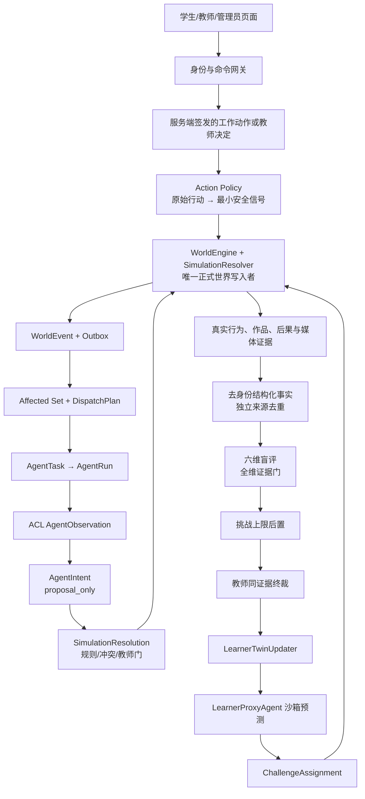

### 2.1 能写什么

| 主体 | 能做 | 绝对不能做 |
| --- | --- | --- |
| 浏览器 | 提交服务端签发的 `StudentWorkAction`、教师门决定 | 提交 Actor、Agent、分数、世界变量 delta、证据 ID 或内部引用 |
| NPC/专业智能体 | 输出绑定 Observation/Task/Run 的结构化 Intent | 直接改世界、直接完成学生任务、直接给学生最终分 |
| `SimulationResolver` | 采用/跳过 Intent，形成候选 delta 与后果 | 绕过 `WorldEngine` 或教师门直接落库 |
| `WorldEngine` | 校验并提交事件、变量、证据和状态版本 | 把模型文本或 HTTP `200` 当作事实 |
| LearnerProxyAgent | 在隔离副本预测候选挑战中的策略和过载风险 | 代答、代操作、生成评价证据或决定成绩 |
| 评价智能体 | 给出盲化、结构化的能力判断建议 | 修改原始证据或越过真实教师终裁 |

## 3. 真实世界模型

### 3.1 发布版与快照

`WorldSimulationRelease/3.0.0` 是不可变规则书，至少包含：

- 世界实体：人物、组织、地点、平台、来源、素材和作品；
- 世界变量：截稿压力、证据可信度、社区信任、编辑独立性、版权风险、平台风险、公众信任、传播潜力和更正债务；
- 触发规则、允许的智能体意图、确定性降级、风险等级与教师门；
- 动态事件模板、3—7 级适用范围、候选智能体和公开现场线索；
- 专业成功、可恢复失败、截稿失败、治理失败等结局；
- 课程/情境/模拟发布引用和内容哈希。

`WorldSnapshot/3.0.0` 是某一状态版本的可恢复快照，保存虚拟时间、实体状态、事实可信度、关系、资源、变量差量、学习挑战引用和结局状态。变量变化必须具备：

```text
before + delta = after
delta → causeRefs → StudentWorkAction / AgentIntent / TeacherDecision / SystemTime
```

快照只持有 `learnerTwinRef`、挑战等级、能力目标和支架级别，不嵌入完整学习者画像，避免 NPC 或普通世界 Agent 获得不必要的学生长期信息。

### 3.2 四类事件入口

1. **学生工作事件**：提问、查验、比较、协商、稿件修订或提交；
2. **NPC 主动事件**：人物根据目标、记忆、关系和时间主动联系、拒绝、加价、撤回授权或提供线索；
3. **系统时间事件**：截稿、客流、天气、平台窗口和延迟后果；
4. **教师干预事件**：高风险审批、补证要求、难度覆写或专业反馈。

### 3.3 Game Master 不是万能大模型

目标 `SimulationResolver` 承担环境结算职责，但必须是“确定性规则优先＋模型候选受限”的受信程序：

```text
WorldEvent
→ 读取冻结 Release 与当前 Snapshot
→ 计算受影响对象和允许的规则
→ 收集真实 AgentIntent
→ 解决互斥、资源、时间与风险门
→ 形成 ResolutionProposal
→ WorldEngine CAS 提交
→ 新 Snapshot / WorldEvent / Evidence
```

状态版本漂移、悬空引用、无授权对象、教师门未决或模型失败时必须失败关闭；不得降级成“看起来没发生事情”的普通成功。

### 3.4 内容可编译运行时

`V2.3.1` 在不可变世界发布与 API 应用编排之间新增一层 `FlagshipWorldRuntimeDefinitionV4`。它不是第二个世界状态，也不具备写入权，而是把“内容允许系统如何解释和桥接”冻结为可审计定义：

```text
CourseContentV4
  ├─ 地点 / NPC / 对象 / 媒体 / 知识 / 事件内容
  └─ FlagshipWorldRuntimeDefinitionV4
       ├─ PhaseActivation
       ├─ IntentBinding → EventTemplate
       ├─ EventTemplate → StudentWorkAction
       ├─ GroundedBinding
       ├─ AutonomyBinding
       └─ PortraitBinding
                │ 启动期编译、引用闭合、hash 校验
                ▼
       CompiledFlagshipWorldRuntimeV4
                │ 请求期只读查询
                ▼
       FlagshipExperienceServiceV4
                │ 候选动作 / 候选协作 / 候选自主事件
                ▼
       WorldEngine / Resolver / TeacherGate
```

契约位于 `packages/contracts/src/flagship-runtime-definition-v4.ts`，泉州实例位于 `packages/course-content/src/xunpu-flagship-v4/runtime-definition.ts`，编译器位于 `apps/api/src/flagship-world-runtime-v4.ts`。编译器必须在服务接收请求前拒绝内容引用漂移、重复绑定、悬空地点/NPC/对象/媒体、缺失动作、未知世界变量和不闭合的 Grounded/自主事件映射。API 门面只消费编译结果，不再按泉州 ID 使用 switch。它使第二课程能够复用同一应用层，但不能绕过现有权威世界、身份投影、模型接地或教师门。

## 4. 持久 NPC 与多智能体运行

### 4.1 六组十四 baseline

| 分组 | 智能体 | 旗舰职责 |
| --- | --- | --- |
| 教学与情境导演 2 | 教学导演、情境导演 | 支架/挑战候选；场景冲突与时间事件候选 |
| 采编与协作 2 | 采访对象、责任编辑 | 以局部视野和岗位利益参与采访与编辑协作 |
| 事实核查 1 | 事实核查 | 核验冻结来源、主张与证据边界 |
| 内容治理 4 | 版权方、版权治理、内容安全、平台规则 | 对素材、表述、权利和发布风险提出 Finding/Intent |
| 运营与分发 1 | 平台运营 | 模拟发布要求、渠道适配、互动与升级回执 |
| 评价与学习迁移 4 | 证据充分性、作品质量、职业协作、学习迁移 | 对盲化真实证据提出逐维建议，并从终评形成成长候选 |

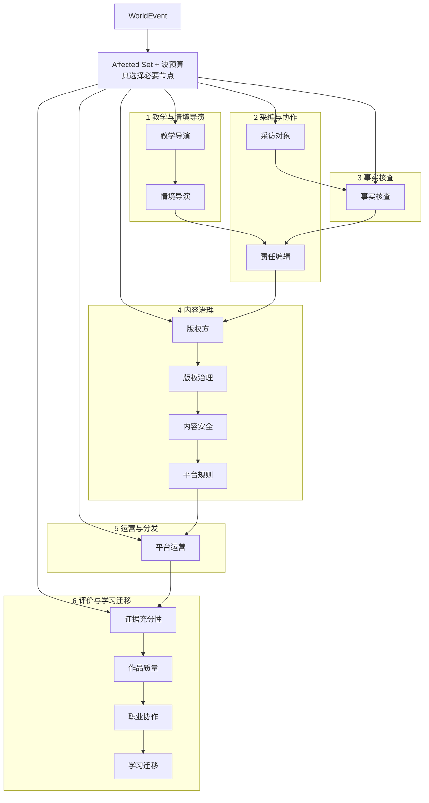

旗舰世界还允许门卫、传承人、游客、商户等角色 NPC 作为 `AgentTemplate → AgentInstance` 创建持久实例。数量不是卖点；一次事件只运行真正受影响的必要子集。

### 4.2 `AgentState` 循环

每个持久 NPC 具有：

- 当前目标与优先级；
- 对世界事实的局部信念及置信度；
- 仅服务端可读的事件、承诺、关系和计划记忆；
- 对其他实体的信任与紧张关系模型；
- 当前计划、披露策略、工具能力和剩余动作预算。

标准一轮为：

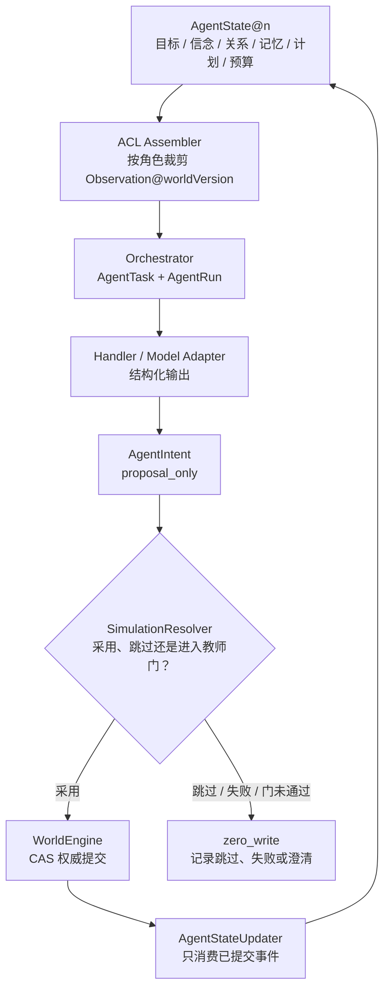

模型的自由文本不能直接成为记忆；只保存经过 Schema、权限和内容哈希校验的结构化状态更新。

### 4.3 学生自写行动的最小披露

泉州 R2 不把输入框中的原始话语直接复制给十四个智能体。`xunpu-action-policy-v3.ts` 在服务端将当前动作解释为版本化安全信号：

```text
StudentWorkAction（原始话语仅留学生作品域）
→ eventType 对应的专业标准匹配
→ quality: professional | incomplete | risky | not_applicable
→ matchedCriteria / missingCriteria / riskFlags
→ evidenceReferenceCount + 公开 worldIndicators + remainingMinutes
→ AgentObservation
```

安全信号只包含冻结 ID、计数和公开世界指标，不包含原始行动文本、反思、身份或私有资料；解析失败按无信号处理。执行器据此形成不同意图：门卫可以放行、要求说明或拒访，传承人可以深入回应或结束采访，权利治理可以提高风险，审慎等待会消耗时间。任何输出仍然只是 `proposal_only`，最终 delta 继续由 Resolver 与教师门结算。

### 4.4 V4 自由语义行动边界

V4 不再把关键词命中结果直接当成专业质量。当前隔离链为：

```text
学生原话 + 服务端 opaque 对象/材料 token + actionWindowHash
→ session / binding / worldVersion / expiry / HMAC 校验
→ 可选结构化语义模型（严格输出、引用必须落在当前窗口）
→ 模型不可用/异常/越界时 deterministic fallback
→ 岗位意图本体 + 仅 train 样本召回
→ 独立安全编译器覆盖所有候选
→ accepted proposal | clarification zero-write | refusal zero-write
```

内部可以区分 `record / annotate / replace / save_revision / request_evidence / reject_advice / correct` 等细粒度意图；对 V3 世界只编译为十类受控粗粒度 verb，完整内部意图留在服务端诊断收据。模型看到学生原话是完成解析所必需，但不会看到 NPC 私有记忆、其他学生数据、教师内部信息、Trace 或权威世界写入接口；面向学生的 DTO 不返回原话、token、训练样本、模型候选或安全规则细节。

当前实现通过冻结语料、服务端对象和额外安全改写，不等于“通用大模型已经自由理解世界”。FE-012 已把语义行动、自主候选、协作 Episode 和既有 Resolver 接成同一公共链：接受行动进入 V3 `StudentWorkAction`，非接受分支零写入，世界后果再同步到 V4 计划与记忆。浏览器自然表达回归已覆盖“只拍公共巷道、不拍居民门内”等非标准词面；这只证明代表性岗位改写可用，开放域泛化仍须独立盲测。

### 4.5 V4 自主计划、持续记忆与权威提交

`XunpuAutonomousWorldDirectorV4` 从当前内容清单第 4 版的十名 NPC 编译 32 个唯一计划，每人至少三种主动回应且各有一项发布后计划。`V2.3.3` 将“哪些计划合法”和“合法计划此刻是否应执行”拆成规则与模型两道不同权威：

```text
AutonomousWorldRecord@worldVersion
→ server scheduler / state threshold / npc plan / teacher event
→ 规则评估 24 个冻结触发器、延迟期与冲突预算
→ server-issued eligible candidates
→ optional live model（目标＋边界＋本 NPC 局部观察＋关系＋公开记忆）
→ select candidate | defer candidate | no_action
→ strict parser / cost gate / timeout
→ invalid / unavailable / over-budget → priority + deterministic seed fallback
→ scheduled candidate + response window | suppressed | failed
→ WorldEngine authoritative receipt（公共窄适配）
→ memory / commitment / local fact / plan state @worldVersion+1
```

模型观察没有学生/session 身份、其他 NPC 记忆、私有记忆原值或世界写入接口；每个候选只包含该 NPC 的公开目标、拒绝/恢复/披露边界、命中触发信号、相关世界变量、公开记忆摘要、承诺、局部事实与关系带。模型输出只有四个冻结字段；候选外计划、额外字段、非法延迟时间或不一致处置一律拒绝。

`AutonomousWorldRecordV4` 把十名 NPC 的局部知识白名单、允许记忆键、哈希记忆、公开摘要、承诺、局部事实和最近行动与 32 个计划状态一起持久化，并保存输入哈希、模式、处置、降级原因、私有 trace 引用、延迟与成本收据。内容哈希、NPC 角色、知识/记忆边界、变量集合和计划归属在每次读取与写入时复核；私有记忆原值不进入记录。3—7 级压力把回应窗口从 7 分钟逐级收紧为 3 分钟，超时只释放候选并保留可恢复路径；模型 `defer` 形成显式计划冷却，`no_action` 保持世界零写入。

导演没有正式写权：所有模型成功或确定性降级的执行决定都只产生 `candidate_only`；延迟和无动作是 `zero_write`。状态变化必须携带服务端 HMAC、严格单步 world version、实际 WorldEvent 引用，并在引用自主候选时命中仍开放的窗口；重复提交精确重放，异载荷复用、未知候选、未声明记忆、版本漂移和令牌伪造全部失败关闭。公共组合根只在统一网关健康为 `live` 时注入模型，旧存档读取和同循环 JSON 重启均不会重复收费或重复注入事件；V4 可从既有 V3 会话安全附着并逐条同步已提交后果，但不能领先、跨版本或绕开 V3 唯一写入者。

### 4.6 V4 受约束多轮人物 Episode

**当前接线边界（2026-09-07）**：下图描述后端引擎、API 和角色投影能力；当前 Web 尚未消费对话开始/继续接口。自主 NPC 同步中的承诺与局部事实更新仍为空，不能将下述字段存在理解为公共主链已贯通。修复入口见[12号文档 R01/R05](01-子文档/12-技术实现审查与冲刺架构.md#21-已确认缺陷与接线断点)。

自主计划回答“人物何时主动制造压力”，多轮 Episode 回答“学生怎样在一段连续交往中处理这份压力”。两者共用 NPC 与世界引用，但不共享私有提示或让人物状态越过权威边界：

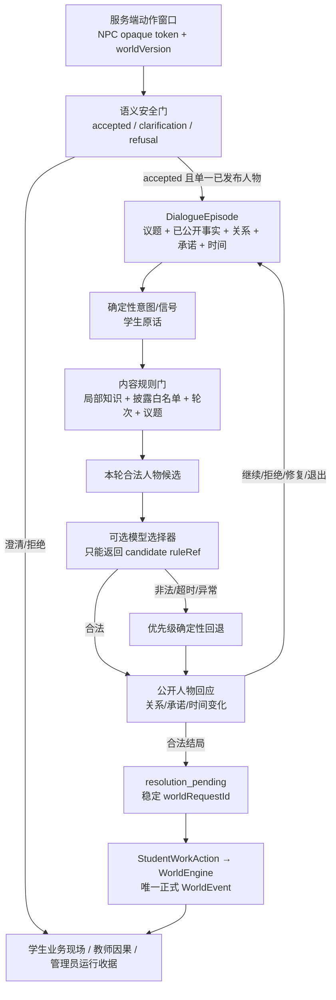

`DialogueSceneDefinitionV4` 是内容作者边界，不是 Prompt。每段场景必须声明 NPC 局部知识、不可披露边界 hash、必需议题、公开事实及其披露规则、允许意图、信号、3—7 级轮次/时间窗、拒绝、恢复、退出和至少两条合法路线。编译器拒绝未知知识、跨 NPC 角色、未知世界事件、事实越权披露、未满足必需议题的结算、定义 hash 漂移和任一意图/轮次缺少安全兜底。

`DialogueEpisodeEngineV4` 只持久化公开可复核状态与私有边界 hash，不保存 NPC 私有原文。每个回合绑定学生 subject hash、actor、membership binding、Episode revision、源 worldVersion、HMAC token、requestId 和 requestHash；相同请求同载荷精确重放，异载荷、错学生、错 binding、旧 revision、过期、世界或人物定义漂移都失败关闭。累计回合耗时真实消耗响应窗口，高挑战并不是换一句更凶的台词，而是更少轮次、更短恢复时间。

合法结局先原子保存为 `resolution_pending`，随后才把全部学生话语编译成一个既有 `StudentWorkAction`。进程在二者之间中断时，启动恢复使用稳定 `worldRequestId` 续建；世界事件已存在就确认同一事件，不存在且世界已前进则关闭为 `stale`。所以 NPC、选择器和恢复程序都不能直接改变量、事实、证据或结局。

后端支持从同一 Episode 按三角色投影：学生投影含当前问题、公开事实、关系带、议题、承诺与人物回应；教师看精确关系、未解决业务议题和已发生回合，不接收规则 ID；管理员额外看 definition/subject/boundary hash、候选规则、选中规则、模式、失败码、模型运行引用、延迟与成本。`V2.4.4` 已把统一 Live 选择器接入公共组合根：它只收到公开历史和本轮合法候选，只能回传候选规则引用；原话中的 Prompt 注入和候选外引用没有指令效力。`V2.4.5` 将三段内容扩为九条合法结局，并为每段提供两类拒绝和两类恢复；人物事实、结局和语言上限仍由内容规则模板决定，不能把一次 DeepSeek 协议冒烟或路线数量表述为“真实模型人物质量已经完成”。

#### 4.6.1 五幕内容如何约束智能体世界

五幕不是前端步骤条，而是内容层对时间、冲突、作品和可观察后果的编排合同；幕内仍由学生选择行动顺序，由世界状态决定哪条人物、专业智能体或教师门被激活：

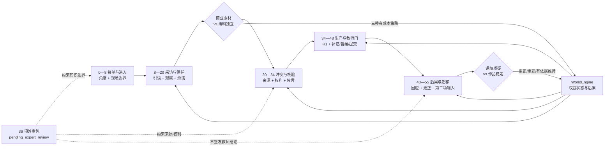

两组灰度困境均显式 `noSingleCorrectAnswer`。系统只检查选择引用合法、证据种类充分、机会成本与后续承诺是否兑现；它不能因为学生选择了预设选项 A 就加分。四条发布后回应弧分别读取社区语境、权利范围、来源链和公共服务更新时间线，发布不是世界结束，而是新的 NPC 目标、平台反馈和更正债的起点。专业复核包属于内容治理资料，不是一个有 `verified` 写权的智能体；外部复核发生前，全部 36 条记录继续保持待审。

### 4.7 V4 知识接地质疑与修订

`XunpuGroundedCollaborationServiceV4` 把 CONTENT-009 的三类风险 Episode 编译为严格五步协议，并复用 V3 六组十四拓扑：

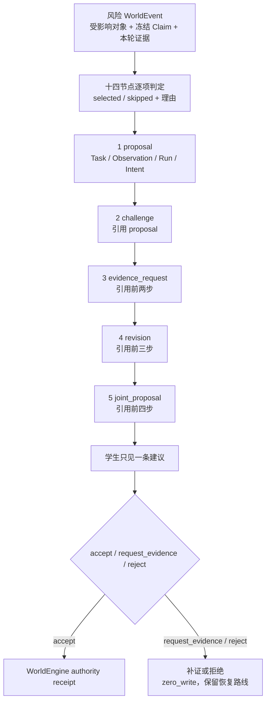

知识不是在页面里写几个链接：运行索引将 36 条发布记录与 12 个 Claim 闭合，每个高风险动作携带实际 `knowledgeRef + sourceUrl + locator + sourceContentHash + reviewStatus + supportsClaimRefs`，运行证据还必须绑定本轮受影响对象。未知、退役、悬空或证据种类不匹配时，在形成 Task 前失败关闭。当前索引来自冻结课程包，不是外部向量数据库或实时互联网检索。

三角色共享同一内部记录但投影不同。学生只得到一条可执行建议和有限来源，教师得到十四项业务选择理由与无技术字段的五步链，管理员才得到 Task/Run/Observation/Intent、执行模式、Prompt 模板引用、Trace、供应方、模型、成本和延迟。可选模型不能自由改写专业事实：只有精确返回当前位置、Claim、知识、证据与服务端批准表述时才成为 Live；任意扩写或伪引用降级且不进入建议。

所有智能体 Intent 和联合提案仍为 `proposal_only`。Episode 内部绑定目标学生哈希；学生决定与世界后果分别使用不同 HMAC，后者还必须匹配来源世界版本和严格 `+1` 权威版本。JSON Store 支持单进程重启，CAS、请求哈希和进行中 Promise 锁共同拒绝重复执行与并发异载荷。`single_agent / fixed_team / affected_set` 的对照观察保留真实失败、引用覆盖、越权写入、成本与延迟，不把空观察或失败组改写成优势。

### 4.8 FE-012 公共组合链

```text
学生原话 + opaque 对象 token
→ SemanticActionDecisionV4（accepted / clarification / refused）
→ accepted 才编译 StudentWorkAction
→ V3 WorldEngine 创建并结算 WorldEvent
→ 受影响集合选择 V3 Run 或 V4 Grounded Episode
→ 学生 accept / request_evidence / reject
→ V3 Resolver / TeacherGate 形成唯一权威后果
→ V4 自主记录按单步收据同步变量、信号与 NPC 哈希记忆
→ 服务端评估下一 NPC 候选并交回 V3 导演发布
→ 学生只看到人物回应、业务建议和下一行动
```

`apps/api/src/flagship-experience-v4.ts` 是这条链的组合门面，`world-simulation-v3-routes.ts` 在学生决定或教师门真正提交后调用世界安定回调。`apps/web/src/v2/pages/student-flagship-world-v4.tsx` 只消费角色安全 DTO；教师和管理员继续读取同一记录的不同投影。服务端只公开安全 `worldPulse`，不把自主计划、候选 ID、记忆键或内部信号下放浏览器。

## 5. 单一因果链

`AgentCollaborationEpisodeV3` 不再独立重算“谁被选中”或用课程字段合成贡献。唯一合法来源是：

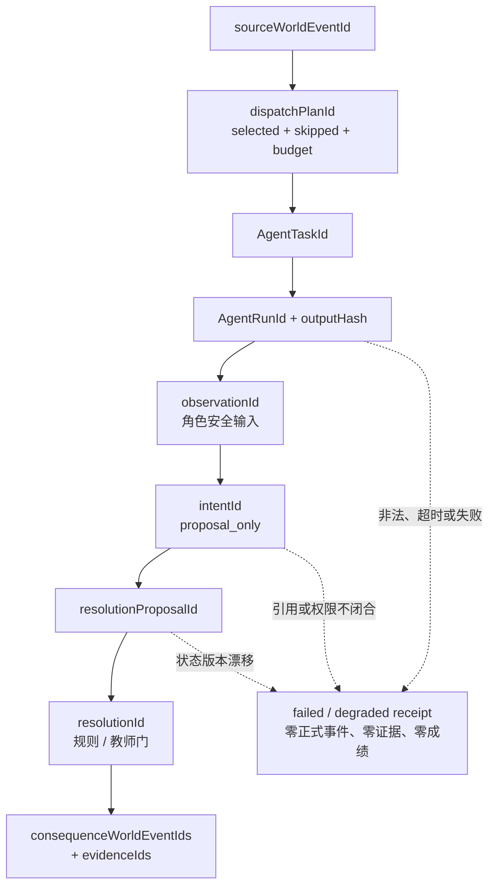

`V3SimulationContractBundleSchema` 在 authoring 和集成测试中同时校验课程/模拟哈希、会话、世界版本、AgentState、Observation、Run、Intent、Resolution、学生行为、证据、评价、学习者和挑战引用。它解决的不是字段格式问题，而是“同一屏展示的内容到底是不是同一轮真实运行”。

失败链必须留下失败代码与管理员 Trace，但不会创建正式世界事件、证据或成绩。确定性演示保留真实 Task/Run/Intent/Resolution 结构，执行模式明确写作 `deterministic_demo`，不得填写伪供应方。

## 6. 学生真实工作

`StudentWorkAction/3.0.0` 支持十类可自由组合的岗位动词：

| 动词 | 真实工作含义 |
| --- | --- |
| `observe` | 观察地点、人物、素材或现场变化 |
| `ask` | 向人物提出普通问题 |
| `probe` | 围绕矛盾、证据或模糊回答追问 |
| `inspect` | 查验单一来源、素材、授权或数据 |
| `compare` | 比较多个信源、版本或说法 |
| `negotiate` | 就采访、授权、披露或发布条件协商 |
| `draft` | 保存带 parent revision 和 content hash 的真实作品修订 |
| `wait` | 主动承担时间成本等待人物、核验或后果 |
| `escalate` | 带证据进入教师门或专业复核 |
| `submit` | 提交明确作品版本和证据集合 |

页面不能把这些动作重新压缩成固定“按钮一 → 建议三选一 → 按钮 X”。学生可以改变顺序和策略，但不能绕过专业约束：可用动作由当前世界状态、岗位权限、资源和服务端签发引用共同决定。

## 7. 学习者数字分身与自适应

技术依据与采用边界统一见[真实世界与学习者数字分身技术路线](../资料/03-智能体技术路线/01-真实世界与学习者数字分身技术路线.md)。对外术语固定为“证据约束的学习者数字分身/能力状态”和“隔离反事实代理”；早期讨论中的“人格建模、人格复制、蒸馏学生”均不得作为产品或技术主张，因为系统不应推断敏感人格，也不能让模型生成的学生替身代替本人行为。

### 7.1 两层结构

`LearnerTwinV4` 是证据化学习状态，不是固定人格复制：

- 六项岗位能力的终裁分数、档位和证据状态；
- 每项支持证据、反证、不确定性驱动、置信度和最近预测误差；
- 最近挑战、支架、下一能力目标、申诉与跨场校准历史；
- 明示“非固定人格、非心理诊断、只基于可观察岗位证据”的限制。

`LearnerProxyAgent` 只读取最小安全摘要并比较服务端签发的四个 3—7 级反事实候选，产出成长靶点、选中变体、成功概率、过载概率、成长价值、限制说明和后续校准误差。三个权限永远固定为：

```text
evidenceEligible = false
canActForStudent = false
canScoreStudent = false
```

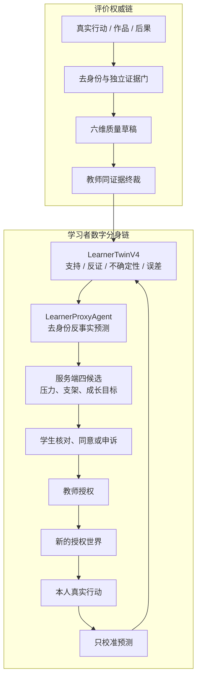

评价链和学习者链只能在“教师终裁结果”处单向衔接。代理预测、候选概率、学生是否采纳建议以及第二场结局都不能回到首场评分；第二场校准只更新预测误差和相关置信度。

### 7.2 挑战策略

| 压力级 | 本局积分上限 | 典型定位 |
| ---: | ---: | --- |
| 3 | 80 | 初学者：较清楚线索、较低角色冲突、较多支架 |
| 4 | 85 | 基础岗位训练：加入有限信息差与时间约束 |
| 5 | 90 | 标准旗舰：多源冲突、关系压力和截稿并存 |
| 6 | 95 | 高阶：NPC 主动冲突、更少支架、更强延迟后果 |
| 7 | 100 | 专家挑战：高密度挑刺、复杂治理和极窄决策余量 |

首次诊断只能进入 3—5 级；无教师覆写时单次最多升降一级。不同压力级的原始本局分不能直接横向排名，跨场比较使用岗位能力等级、证据强度和成长轨迹。高分上限是挑战机会，不是自动奖励。

### 7.3 当前运行时与失败关闭

V3 `LearnerAdaptationServiceV3` 保留历史兼容；当前公共泉州主线使用 `LearnerAdaptationServiceV4`。V4 只读取最终、六维充分且教师复核的 `EvidenceAssessmentDecisionV4` 和同一会话权威世界，构造带内容哈希的去身份 LearnerTwin。无充分决定时 Store 不创建记录，学生、教师和管理员看到的都是明确证据空态，而不是用旧 V3 结果补位。

预测器同时比较来源三角核验、授权协商、时效服务和编辑独立四种候选。健康 Live 时统一网关只接收去身份六维状态、支持/反证计数、不确定性、既往预测误差和冻结变体；敏感属性、原始身份、binding、学生原话、教师身份、Prompt/Trace 和私有记忆均不进入预测。模型只能输出成长靶点、一个现有候选、四候选概率与限制说明；额外候选、不适格靶点、敏感推断、超时、异常或预算耗尽均显式确定性降级。所有候选固定零代答、零造证据、零评分；自动调级最多相邻一级。

第二场使用学生同意与教师授权两个独立门。学生可拒绝或申诉，教师不能代替同意；开放申诉或要求重新评价时创建失败关闭。授权后由服务端派生内容寻址的新 release，依次建立 `SessionControl`、课程 membership、学生/教师稳定 binding、挑战分配和新的 V3/V4 世界，全部存在后才变为 `provisioned`。中途失败保留 authorization receipt，可用同一请求幂等续建；绝不把虚拟 URL、候选 ID 或半状态标为 active。

预测只在第二场出现同一学习者已接受的真实 `StudentWorkAction` 后校准，以预测成功率与实际动作对齐度形成绝对误差；只更新目标维度置信度、误差驱动和候选预测修订，首场分数与证据状态保持不变，并固定 `evidenceEligibleForScore=false`。这实现了“提出—同意—授权—开班—实际行为校准”的工程闭环；QA-010 已证明公共浏览器可从首场自然积累到六维充分证据并走到校准，但它不证明代理预测有效、教学增益成立或自适应优于固定课程。

## 8. 能力证据与评价

### 8.1 证据链

只有以下来源能进入 `CompetencyEvidenceEpisode`：

- 真实 `StudentWorkAction`；
- 真实作品修订及 content hash；
- 真实教师决定；
- 已提交的世界后果。

每条观察必须说明能力主张、支持/反驳/不足方向、可观察行为、来源引用、支架级别和评价置信度。代理预测、NPC 对学生的私有印象、模型自报分数和页面点击模拟不得成为能力证据。

### 8.2 评价输出

`AssessmentDecision` 同时但分开表达：

1. 是否完成本场工作；
2. 证据是否充分；
3. 本场挑战等级与积分上限；
4. 各岗位能力主张的 1—5 等级、分数、置信度与证据；
5. 首次表现、补救质量、支架使用和世界后果；
6. 教师确认或逐维修订；
7. 下一成长目标。

证据不足时分数和能力等级必须为空；最终状态必须有教师确认或修订。历史 V2 按覆盖给满权重的过程分不能迁入此契约冒充专业评价。

### 8.3 当前运行时

当前公共主线由 `FlagshipEvidenceAssessmentServiceV4` 把评价接到真实运行记录；V3 服务只保留历史场次兼容：

```text
World StudentWorkAction / Consequence
+ AgentCollaboration student decision / teacher gate
+ FlagshipStudentWork immutable revisions and review bundle
→ independent fact/compliance evidence gates for six criteria
→ if any gate fails: zero model call and all scores remain empty
→ rights/use/disclosure gate before any media read
→ hash-verified image preview + audio spectrogram + video keyframes
→ redacted work excerpts + bounded actual visual inputs
→ constrained six-criterion work-quality draft
→ second-layer evidence/ref/band validation
→ challenge ceiling, applied last
→ provisional AssessmentDecision
→ teacher confirm/revise on the same evidence
```

六个量规维度都必须分别达到独立来源和行为门；只要有一维不足，整场保持 `insufficient_evidence`，不存在用其余维度平均出一个看似完整的总分。建议 Agent 不能评价自己；只有学生对真实建议作出的选择及后续行为能成为证据。失败终局只是一条后果来源，不能直接换算为低分。

作品质量端口看不到身份、binding、session、挑战等级、实验条件、Agent 建议、教师目标分、供应方或 Trace。它先读取脱敏后的不可变文字摘录和真实媒体技术摘要；只有送审、用途、撤权、AI 显隐式标识与六维证据门全部通过，媒体准备器才读取实际派生字节，并复核 MIME 与 SHA-256。图像被降采样为最长边 512px 的预览，音频转换为真实频谱和电平摘要，视频在 20%/50%/80% 时间点抽取关键帧；每次至多 12 个视觉块，表示哈希在网关再次校验。作品文字、图片内容和 Base64 都按不可信数据处理，内嵌指令没有效力。

当前没有 ASR，因此音频频谱只能支持声学观察，不能推断语义；关键帧也不能替代连续视频和伴音。模型输出只允许六个逐维判断，不能给总分、替换证据或突破确定性档位；即使绕过适配器，决定签发器也会重新执行证据门。管理员可查看去标识输入/输出哈希、运行模式、降级原因、媒体准备状态、实际表示种类、是否随请求发送、私有 Trace、延迟和成本；学生与教师只看业务证据。量规仍标为 `pending_expert_review`，因此本运行时证明“评价权威边界、真实媒体绑定、失败关闭和可复算链成立”，不证明“系统已经评得准”。

模型线协议适配器不是任意容错解析器。DeepSeek 可能在合法提案旁复述提示中的量规元数据；`evaluation-semantic/1.0.7` 仅接受可选的 `label / weight / rule / evaluationKind`，并用 `dimensionId` 或唯一标签定位当前服务端冻结维度。四项中任何出现的值都必须逐字段精确相等，随后才剥离并记录 `server_removed_echoed_dimension_metadata`；错误维度、错误值或其他未知键直接转入显式降级。最终维度 ID、满分、证据引用和分数上限仍由后续 canonicalizer 与决定签发器重建，供应方不能通过“回显”重新定义量规。

## 9. 三角色投影

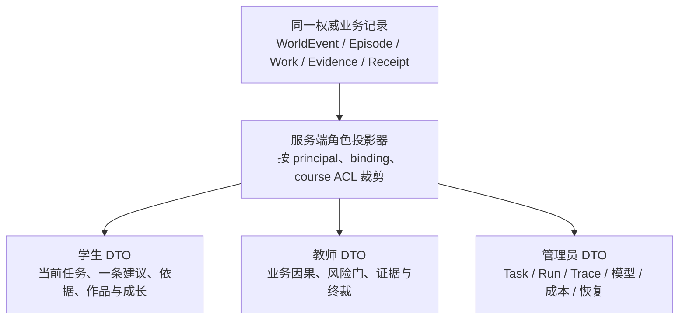

三端不是三套重新计算的业务逻辑。它们从同一记录裁剪不同信息；任何只存在于页面文案而不能回指同一 Episode、作品、证据或收据的内容，都不能进入正式视图。

### 9.1 学生

学生只看一个相关建议和可理解依据，不看拓扑、Trace、Prompt、供应方、私有记忆或其他角色私有信息。评价证据充分后，学生还可看下一挑战、能力目标、支架、置信度和申诉入口；证据不足时明确不建画像。学生看到的“技术力”来自世界真实响应和可解释成长，而不是后台日志。

### 9.2 教师

教师查看业务因果：事件、受影响集合、必要岗位贡献、学生决定、作品版本、风险门和世界后果。独立评价复核页逐维展示来源、暂定判断、证据不足原因和确认/修订入口；形成画像后还提供方案确认、有理由挑战覆盖和申诉处理。教师 DTO 不含语义收据、代理输入、逐分计算、Task/Run ID、Prompt、Trace、供应方、成本或 Agent 私有状态。

### 9.3 管理员

管理员在同一业务 Episode 外增加执行模式、供应方/模型、Trace 引用、Prompt 模板引用、失败智能体、延迟、成本和恢复动作，并独占查看画像哈希、去身份代理候选、预测校准、策略版本、教师覆盖、申诉和命令收据。`simulation-agent-topology/3.0.0` 由服务端精确输出六组十四模板，节点状态来自本轮 DispatchPlan/Contribution/Failure，不由浏览器推测。管理员可重新认证为学生或教师体验功能，但身份切换不会改变已记录 Actor，也不能代替真实学生或教师写业务事实。

## 10. 模型、工具与确定性降级

模型是执行层，不是世界权威。统一 Handler 必须：

1. 读取固定 `AgentObservation` 和版本化模板；
2. 通过模型无关端口调用 deterministic、讯飞星辰或其他受控模型；
3. 解析为结构化 Intent；
4. 校验对象、证据、权限、风险和状态版本；
5. 把原始 Trace 只留给管理员审计；
6. 交给 Resolver，不直接回写世界。

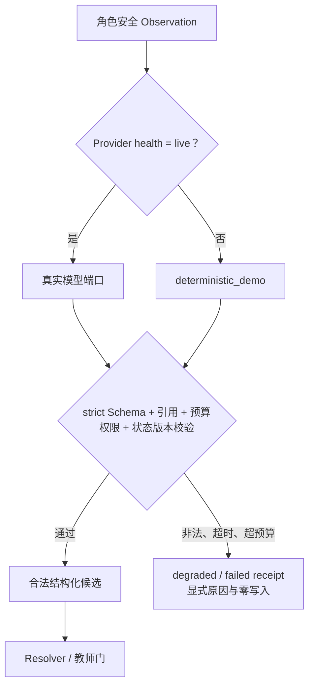

存在有效凭证和真实成功收据时才能标 `live`。缺失凭证使用 `deterministic_demo`；外部失败进入 `degraded/failed` 并保持零写回，不能用固定成功文案掩盖。

`V2.3.2` 新增语义与 Grounded 协作适配器，后续同一网关又承接受限 NPC 计划、学习者代理与作品草稿。`V2.4.4` 增加人物规则选择，并把文本与视觉能力拆成两个显式 Provider：文本模型承担结构化候选，视觉模型才允许接收经过权利和哈希门的图像块。所有结构化 DeepSeek 请求显式关闭供应方思维链，避免隐藏推理耗尽 JSON 预算；这不是把思维链暴露给应用，而是让业务只取得短、严格、可验证的最终结构。

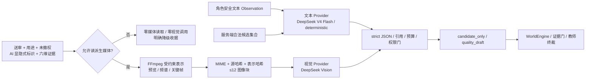

组合根仍只在 `ModelProviderHealth.mode=live` 时注入对应端口。语义结果受独立安全策略覆盖；协作、人物和学习者结果必须落在服务端候选与引用集合；作品输出必须保持六维证据与档位上限。结构化替身证明公共接线和普通角色零 Trace；本机受控 DeepSeek Live 最终以模型网关 `2/2`、智能体运行时 `4/4` 证明文本 JSON、真实图像块、人物候选及有限评价元数据投影协议可达。它没有形成专业质量、人物自然度、完整黄金链延迟或成本结论，不能据此宣称外部 Live 已整体验收。

## 11. 存储、恢复与安全

当前 `GAME-003—AI-014` 已实现：

- `SimulationSessionRecord`：同一会话内冻结 Release、Challenge、当前 Snapshot、事件队列、学生动作、解析、世界后果、未决教师门和幂等收据；
- `InMemorySimulationSessionStore`：测试与无文件纵切；
- `JsonFileSimulationSessionStore`：会话 ID 哈希文件名、临时文件写入、`fsync`、原子替换和记录修订 CAS；
- 新 Engine 实例可读取旧队列并继续产生同一权威状态链。
- `JsonFileSimulationCollaborationStoreV3` 持久保存 AgentState、Observation、DispatchPlan、Task、Run、Intent、Contribution、Episode 和学生建议决定；
- API 组合根在现有 `DATA_DIR` 目录租约下分别使用 `world-simulation-v3/` 与 `agent-collaboration-v3/`，重启后继续同一世界和协作链。
- 作品、评价和学习者自适应分别使用隔离的原子 JSON Store；画像历史、预测、挑战、成长方案、申诉和命令/策略收据可经 CAS 与重启恢复。
- 五个泉州 V3 Store 使用同一 `r2-runtime-3` 数据代，避免把旧 `runtime-1/2` 的固定挑战或旧行动语义与当前安全信号、四终局因果链混用；旧目录保留为历史，不做破坏性原地迁移。
- V4 自适应创建的第二场会话可先存在于 `SessionControl` 与 V3/V4 仿真 Store，而不要求注册进旧 `WorldEngine` 场景目录；进程关闭时，旧检查点协调器只处理能由旧引擎解析的会话，跳过这些 V3-only 新场，避免把架构分层误判为恢复失败。
- `BusinessOperationReceipt/4.0.0` 将作品送审、教师终裁和第二场创建拆成“一个权威 Store 提交＋有序幂等 Outbox”；追加式 JSONL 记录冻结请求、权威引用、每步结果、尝试次数和恢复动作，启动时先做帧与修订审计。

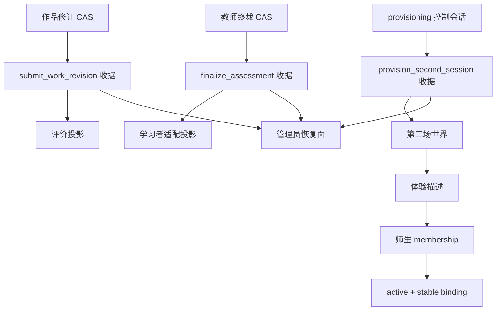

收据协调器不改变三权分离：Agent、NPC、模型和学习者代理依然没有权威写入权。投影失败只把操作标成可恢复，不撤销已经存在的学生作品、教师决定或控制会话；相同请求不同载荷、缺少冻结处理器、修订跳号和已投递步骤倒退全部失败关闭。

跨版本升级不直接接受旧派生检查点，也不把同一不可变锚点当成“忽略 hash 漂移”的理由。离线重建流程先创建并验证停机备份，再逐文件比较源 `DATA_DIR` 与备份清单的路径集合、大小和 SHA-256；仅在完全一致、旧检查点存在且独占租约成功时，才把旧 `recovery-checkpoints` 原子归档为带旧版本与备份指纹的目录，并写入审计标记。新运行版之后用自己的投影 Schema 建立检查点；回滚使用原备份中的旧目录。任何源变更、软链接、目标冲突、空检查点或租约冲突都失败关闭，因此该步骤是有证据的派生索引换代，不是数据清洗或篡改豁免。

它仍是本地单写者原型 Store，已经包含 NPC 私有状态、Task/Run、真实作品正文/修订、能力证据和学习者跨场状态。当前存储至少分离：

- `SimulationReleaseStore`：不可变内容寻址发布版；
- `WorldEventStore / WorldSnapshotStore`：权威世界与检查点；
- `AgentStateStore`：NPC 私有状态，按 Agent/Session ACL；
- `AgentTask/Run/TraceStore`：技术执行链；
- `StudentWorkStore`：作品、修订、对话和证据操作；
- `CompetencyEvidenceStore`：能力证据 Episode；
- `LearnerTwinStore`：跨场学习状态和申诉，独立访问域；
- `ChallengeAssignmentStore`：策略版本、依据和教师覆写。

同一 `DATA_DIR` 保持单写者和目录租约。所有提交使用状态版本 CAS、内容哈希、幂等请求和 append-only 收据；重启必须恢复虚拟时间、待处理事件、NPC 状态、任务/Run、未决教师门、作品版本和挑战分配，并产生相同可观察结果。

## 12. 代码地图与下一实现顺序

### 12.1 已存在

| 对象 | 文件 |
| --- | --- |
| V3 世界、状态、观察、意图、解析与工作契约 | `packages/contracts/src/world-simulation-v3.ts` |
| V3 证据、评价、画像、预测、挑战与方案契约 | `packages/contracts/src/learning-adaptation-v3.ts` |
| V3 三角色协作 Episode | `packages/contracts/src/agent-collaboration-episode-v3.ts` |
| V3 跨契约因果校验 | `packages/contracts/src/v3-simulation-contract-bundle.ts` |
| V1/V2 权威世界底座 | `packages/world-core/src/engine.ts` |
| V3 世界会话、队列、Resolver 与教师门 | `packages/world-core/src/simulation-v3.ts` |
| V3 内部会话记录与因果一致性校验 | `packages/world-core/src/simulation-v3-types.ts` |
| V3 内存/JSON CAS Store | `packages/world-core/src/simulation-v3-store.ts` |
| 泉州 V3 Release | `packages/course-content/src/xunpu-world-simulation-v3.ts` |
| 泉州 R2 完整内容清单与编译发布 | `packages/course-content/src/xunpu-flagship-content-v3.ts` |
| V3 受影响集合与 Agent 模板 | `packages/agent-runtime/src/simulation-runtime-v3.ts` |
| V3 AgentState、编排、同源 Episode 与 Store | `packages/agent-orchestrator/src/simulation-orchestrator-v3.ts`、`simulation-store-v3.ts` |
| 泉州学生行动安全解释 | `packages/agent-orchestrator/src/xunpu-action-policy-v3.ts` |
| 泉州 R2 执行器与发布终局策略 | `packages/agent-orchestrator/src/xunpu-simulation-agents-v3.ts` |
| V3 API 与主动世界导演 | `apps/api/src/world-simulation-v3-routes.ts`、`xunpu-world-director-v3.ts` |
| R2 作品 Store、证据与版本安全路由 | `apps/api/src/flagship-student-work-v3.ts`、`flagship-workspace-v3-routes.ts` |
| V3 证据、盲评、归一、教师裁决与 Store | `apps/api/src/flagship-assessment-v3.ts`、`flagship-assessment-v3-routes.ts` |
| 学习者画像、代理预测、挑战策略、方案、申诉与 Store | `apps/api/src/learner-adaptation-v3.ts`、`learner-adaptation-v3-routes.ts` |
| V3 学生现场与独立编辑部 | `apps/web/src/v2/pages/student-flagship-world-page.tsx`、`flagship-workbench-v3.tsx` |
| 教师/管理员 V3 安全投影路由 | `apps/api/src/flagship-role-views-v3-routes.ts` |
| 教师 V3 因果导演 | `apps/web/src/v2/pages/teacher-flagship-director-v3.tsx` |
| 管理员 V3 执行全景 | `apps/web/src/v2/pages/admin-topology-page.tsx`、`admin-models.ts` |
| 三角色 V3 评价严格 wire 与页面 | `apps/web/src/v2/assessment-v3.ts`、`pages/student-flagship-assessment-v3.tsx`、`pages/teacher-flagship-assessment-v3.tsx`、`pages/admin-evidence-page.tsx` |
| 三角色学习者成长严格 wire 与页面 | `apps/web/src/v2/learner-adaptation-v3.ts`、`pages/student-learner-growth-v3.tsx`、`pages/teacher-learner-growth-v3.tsx`、`pages/admin-evidence-page.tsx` |
| 六个显式组合根与会话体验描述 | `apps/api/src/platform-composition-roots.ts`、`session-experience-descriptor.ts`、`server.ts` |
| 业务收据、Outbox 与管理员恢复面 | `packages/contracts/src/business-operation-receipt.ts`、`apps/api/src/business-operation-receipt.ts`、`business-operation-routes.ts` |

### 12.2 已冻结并进入公共纵切的 V4 边界

| 对象 | 文件 | 运行边界 |
| --- | --- | --- |
| V4 内容总引用、语义行动、自主世界决定 | `packages/contracts/src/flagship-world-v4.ts` | 浏览器使用 opaque token；澄清/拒绝/抑制/失败零写入，Agent/NPC 仍只能提议 |
| V4 内容可编译运行时定义 | `packages/contracts/src/flagship-runtime-definition-v4.ts`、`packages/course-content/src/xunpu-flagship-v4/runtime-definition.ts`、`apps/api/src/flagship-world-runtime-v4.ts` | 阶段、意图—事件、动作、Grounded、自主信号和肖像由内容发布；启动期验证全部引用与 hash，请求期只读消费 |
| V4 供应方无关模型适配与多模态准备 | `packages/model-gateway/src/openai-compatible.ts`、`apps/api/src/flagship-model-adapters-v4.ts`、`flagship-multimodal-quality-v4.ts`、`flagship-experience-v4.ts`、`learner-adaptation-v4.ts`、`server.ts` | 仅健康 Live 注入文本/视觉对应端口；人物只选合法规则，媒体先过权利/证据/MIME/hash 门并转为受约束图像表示；业务服务验证候选并控制预算，模型异常不拥有旁路写权 |
| V4 语义行动解释与安全编译 | `packages/agent-orchestrator/src/semantic-action-v4.ts` | HMAC 对象、结构化模型端口、78 条 train 隔离回退、歧义澄清、高风险覆盖和候选编译；由 V4 公共体验路由接入 |
| V4 自主世界、记录与 Store | `packages/world-core/src/autonomous-world-v4.ts`、`autonomous-world-v4-types.ts`、`autonomous-world-v4-store.ts` | 十名 NPC/32 个唯一计划、每人至少三种主动回应及一项发布后计划、种子选择、3—7 级窗口、哈希记忆、服务端调度、JSON 重启与 HMAC 权威提交边界；由 V3 收据桥接入 |
| V4 多轮人物契约、内容、引擎与 Store | `packages/contracts/src/dialogue-episode-v4.ts`、`packages/course-content/src/xunpu-flagship-v4/dialogues.ts`、`packages/world-core/src/dialogue-episode-v4.ts`、`dialogue-episode-v4-store.ts` | 三名关键 NPC、九条合法路线、每段两类拒绝与两类恢复、局部知识/事实披露、议题/关系/承诺、退出、累计时间窗、角色安全投影、CAS/原子文件/重启恢复；结局仍经 V3 WorldEngine |
| V4 五幕、灰度困境、发布后回应与外审包 | `packages/course-content/src/xunpu-flagship-v4/experience-acts.ts`、`gray-dilemmas.ts`、`post-publication.ts`、`professional-review.ts`、`migration-sample.ts` | 连续 0—55 分钟、两组无唯一答案选择、四条按状态分支回应、36/36 pending 外审项及零服务特判村超样本；内容 hash/启动校验拒绝缺项和漂移，不能直接写世界或签发专业复核 |
| 知识接地三角色协作契约 | `packages/contracts/src/grounded-collaboration-v4.ts` | 十四节点精确派发、五步质疑修订、locator/hash、选择/跳过理由和角色裁剪 |
| V4 知识协作、记录与 Store | `packages/agent-orchestrator/src/grounded-collaboration-v4.ts`、`grounded-collaboration-v4-types.ts`、`grounded-collaboration-v4-store.ts` | 36 知识/12 Claim 索引、三 Episode、真实 Task/Run/Observation/Intent、三角色裁剪、学生/世界双授权、A/B/C 观察和单进程重启；按风险事件接入公共体验 |
| 媒体、盲评、评价与第二场契约 | `packages/contracts/src/media-assessment-adaptation-v4.ts` | 撤权失败关闭、盲化输入、六维证据充分性、教师终裁和真实新授权世界 |
| V4 角色安全评价/适配公开契约 | `packages/contracts/src/flagship-assessment-view-v4.ts`、`learner-adaptation-v4.ts` | API 与 Web 共用同一严格 DTO；普通端排除运行内部信息，管理员端保留运行、降级、终裁与校准审计 |
| V4 结构化证据与作品质量评价器 | `packages/agent-orchestrator/src/evidence-assessment-v4.ts`、`work-quality-assessment-v4.ts` | 表面信号零使用、建议零评分、独立证据去重、六维失败关闭、权利安全媒体输入校验、挑战后置；不读身份或教师期望分 |
| V4 评价来源、Store 与三角色投影 | `apps/api/src/flagship-assessment-v4.ts`、`flagship-assessment-v4-routes.ts` | 只接受权威作品/行为/后果/媒体；三端媒体包可独立成为送审作品，权利事实由服务端资产台账推导；来源漂移和跨主体失败关闭；教师只能同证据终裁，管理员先读安全摘要、就绪后独占案例审计 |
| V4 学习者模型、双同意门、Store 与第二场创建 | `apps/api/src/learner-adaptation-v4.ts`、`flagship-model-adapters-v4.ts`、`learner-adaptation-v4-routes.ts`、`apps/api/src/server.ts` | 六维最终证据才建模；支持/反证/不确定性显式，去身份模型比较四候选并严格降级；学生同意、教师授权后创建真实 release/membership/binding/session；中断可续建，同一学生第二场行动只校准预测、不改首场分数 |
| V4 三角色自适应投影与页面 | `apps/web/src/v2/learner-adaptation-v4.ts`、`pages/student-learner-adaptation-v4.tsx`、`pages/teacher-learner-adaptation-v4.tsx`、`pages/admin-evidence-page.tsx` | 学生核对/同意/拒绝/申诉，教师处理申诉与授权；管理员首屏按会话展示权威提交、有序 Outbox、恢复、哈希和候选；普通角色不见技术内部字段 |
| V4 公共组合服务与自主导演 | `apps/api/src/flagship-experience-v4.ts`、`xunpu-world-director-v3.ts` | 只读取最新当前 Episode；商户回应后才允许时钟推进，避免主动事件抢走学生选择；角色 DTO 从同一权威链裁剪 |
| V4 三角色渐进披露现场 | `apps/web/src/v2/pages/student-flagship-world-v4.tsx`、`teacher-flagship-director-v3.tsx`、`admin-evidence-page.tsx`、`student-flagship-world-v4.css`、`v2.css` | 学生四种焦点互斥且每轮一个主行动，任务/历史按需展开；教师首屏只见已发生因果与当前门；管理员独占收据与技术恢复。页面不复制世界、Episode 或业务恢复状态机 |
| V4 跨契约因果门 | `packages/contracts/src/v4-flagship-contract-bundle.ts` | 同一内容、学生、会话、作品与评价链；不允许拼装 DTO 或改名伪造第二场 |
| V4 内容与资产 | `packages/course-content/src/xunpu-flagship-v4/`、`apps/web/public/assets/flagship-world/v4/` | 120 条语义样本、10 NPC、三合法路线/一恢复路线、知识/作品/对抗样例及 27 项可复算媒体 |

V4 不是另建一套可绕过 V3 的世界写入器。它把自然语言、主动 NPC、专业协作、媒体成果、评价和第二场收紧为 V3 WorldEngine 之前和之后的受控层：模型、NPC、Agent、LearnerProxy 均只能产生候选；只有服务端授权、规则编译、Resolver 与教师门可以形成权威写回。

### 12.3 已发生顺序与当前入口

1. `GAME-003`（已完成隔离内核）：世界会话、状态快照、虚拟时钟、四入口事件队列、确定性 Resolver、教师门和重启恢复；
2. `AI-011`（已完成首个纵切）：接入 AgentState、Observation、Intent、真实 Task/Run 单一来源 Episode，并把 NPC/时钟事件真正生产到队列；
3. `CONTENT-008`（已完成内容冻结）：R2 已定义泉州六组完整冲突域、七角色、来源、九类作品、变量、结局和难度变体；
4. `FE-010`（已完成学生真实工作纵切）：实现作品 Store、版本/哈希/证据/锁定门、精确十四执行器和 R2 学生公共运行；
5. `FE-011`（已完成三角色同源投影）：教师因果导演和管理员执行全景消费同一条 V3 世界、Run、作品与风险门记录；
6. `AI-012`（已完成纵切）：证据中心岗位能力评价、挑战归一和教师逐维裁决；
7. `AI-014`（已完成纵切）：LearnerTwin、Proxy、Challenge、成长处方、申诉、教师覆盖和校准；
8. `QA-007`（已完成工程冻结）：黄金链、自写行动、补证恢复、3/5/7 内容差异、四终局、安全、性能和双视口已形成自动质量门。

`GAME-003 + AI-011 + CONTENT-008 + FE-010 + FE-011 + AI-012 + AI-014 + QA-007` 已形成 R2 三角色同源世界、真实作品、证据评价、自适应成长与多终局旗舰工程链，并接入原创蟳埔环境及门卫、传承人、商户人物资产。后续工作转向外部内容复核、真实用户、Live 与消融；不得用图片数量、节点数量、自动化通过或启发式评分替代专业评价效度和学习者成长证据。

V4 已发生顺序为：`CONTENT-009 → ARCH-010 → AI-015 → GAME-004 → AI-016 → FE-012 → AI-017 → AI-018 → QA-010 → ARCH-011 → AI-019 → GAME-005 → AI-020 → AI-021 → CONTENT-010 → FE-013 → QA-011 → ARCH-012 → DATA-003 → GAME-006 → AI-022 → CONTENT-011 → FE-014 → QA-012`。它已经形成并冻结自由行动、自主冲突、受影响集合协作、真实媒体、抗表面取巧评价、可申诉学习者模型、真实第二场、内容可编译运行时、唯一会话代际、六个组合根、三条关键业务恢复纵切、三名关键人物的九结局受约束多轮交互、五幕灰度岗位内容、统一人物候选选择、权利安全的多模态作品观察、三角色渐进披露、有限模型线适配和离线升级检查点重建；上述变化均不改变既有 DTO、世界写入权、证据权威或教师终裁边界。

V2.4的质量冻结及此后V2.6阶段交付均见[开发历史](03-开发历史.md)，本文保留对应版本的结构说明。新一轮内容讨论和实施安排只在[02-项目规划](02-项目规划.md)维护；工程检查、模型调用与专业质量仍按各自实际证据判断。

## 13. 旗舰验收门

旗舰世界至少必须同时证明：

- 同一开局有三种以上有效行动顺序，产生可观察的不同关系、事实、时间和结局；
- NPC 至少一次因自身目标和记忆主动发起冲突，而不是等待按钮触发固定台词；
- 每项可见智能体贡献都能回指真实 DispatchPlan、Task、Run、Observation、Intent 和 Resolution；
- 学生真正写出、修订和提交作品，内容哈希和证据可重放；
- `request_evidence` 能补证恢复，不形成永久死路；
- 难度 3/5/7 在冲突、支架和分数上限上真实不同，自动调节可解释且可由教师覆写；
- 代理预测与真实学生行为分离，并能在事后记录预测误差；
- 失败、漂移、模型降级和教师拒绝均零越权写入；
- 学生、教师、管理员投影严格隔离；
- 重启后世界、NPC、作品、未决门、证据和挑战状态一致；
- `1440×900` 与 `390×844` 可完成主链且无横向溢出；
- 专业内容、评价效度、多智能体优势和真实教学效果没有外部证据时明确标为未验证。

达到这些门，才能把产品称为“可流畅运行的旗舰世界演示”；仅有 Schema、日志、卡片、固定按钮或测试数量均不足以通过。

## 14. V2.4.9 演示证据映射

V2.4.9 没有增加智能体能力，而是把上述架构映射到一次可复验浏览器链。完整 77 页手册见[《融岗智训 V2.4.9 全功能架构与交互演示手册》](../演示/融岗智训-V2.4.9-全功能架构与交互演示手册.pdf)，48 个节点的结构化底稿见[演示节点清单](../演示/源文件/演示节点清单.md)。

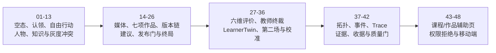

本次页面链使用隔离 `DATA_DIR` 与 deterministic 模式，真实发生两次教师门、专题稿 R1 不足后的继续修订、七项成果锁定、85 分终裁、双同意第二场和一个新场行动校准；没有编辑数据库伪造结果。它还暴露了课程进度/作品汇总旧投影没有完全消费 V4 证据的缺口，因此截图 43-44 保留原始不一致，当前权威仍以 V4 工作台、评价与管理员证据页为准。
