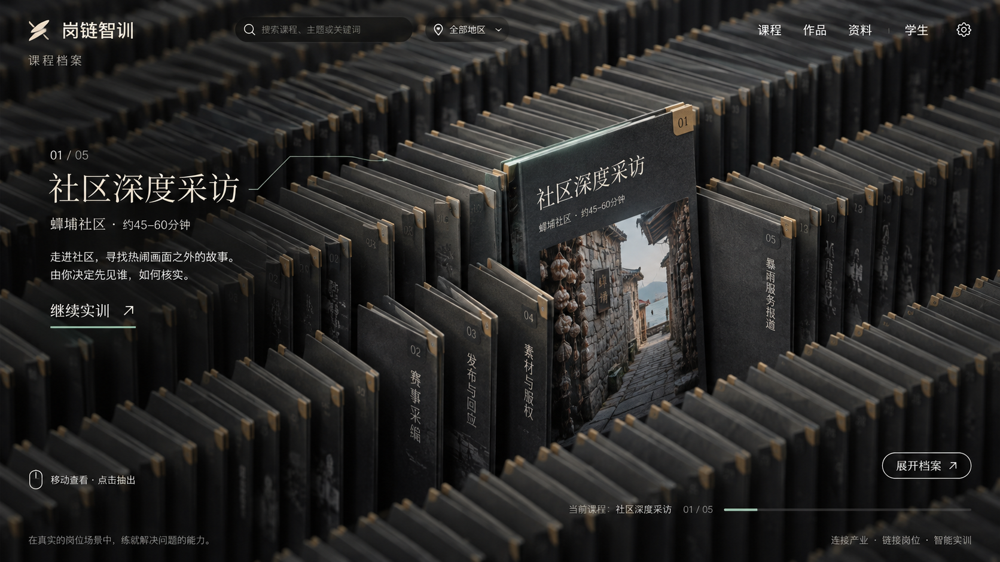
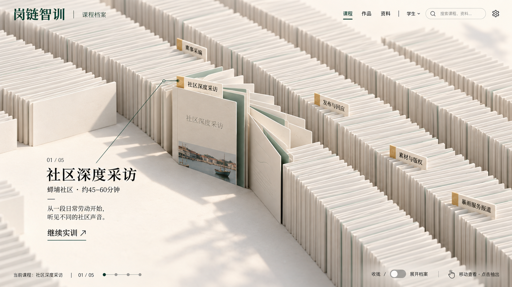
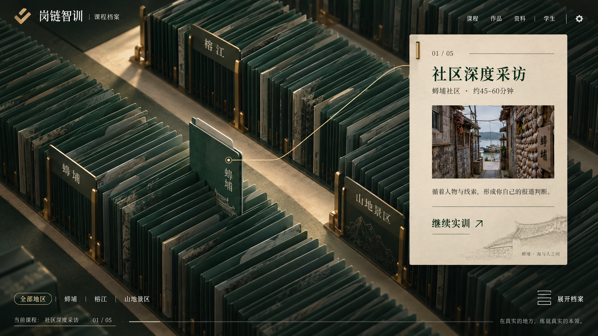

# 档案首页 · 三种概念方向

日期：2026-09-13。状态：**初版方向存档，尚未实现**。用户随后提出沿黑色风格深化波浪、局部悬停和横向抽出，最新稿见[黑色交互设计](../2026-09-13-黑色交互稿/README.md)。三图均由内置Image Gen独立生成，原始提示词见[生成提示词](生成提示词.md)。原图复制到本目录后逐一核对SHA-256，未修改生成文件。

共同方向是俯斜视角、成片薄档案、局部抬升及克制的辅助界面。图中展示学生首页的悬停状态；选定后将同一空间语言用于教师学生档案。下一步先明确收拢、悬停、展开与抽出四个状态，再复刻到正式前端。

| 方案 | 构图 | 主要区别 |
| --- | --- | --- |
| [A · 深色密集阵列](01-深色密集阵列.png) | 深石墨色档案铺满画面，中央局部抬升，左侧展示预览 | 最贴近原参考的密集阵列与空间纵深 |
| [B · 纸白阶梯阵列](02-纸白阶梯阵列.png) | 浅色档案形成阶梯与折线留白，局部扇形展开 | 明亮、轻盈，正文与控制信息更容易阅读 |
| [C · 墨绿分区阵列](03-墨绿分区阵列.png) | 三个地区形成独立档案区，右侧弹出纸面预览 | 地区组织清楚，延续项目的墨绿与纸面视觉 |

## A · 深色密集阵列

## B · 纸白阶梯阵列

## C · 墨绿分区阵列

## 选型后的复刻依据

用户选择构图后，以选定图为视觉依据细化交互状态；如组合不同方案，应先形成一张明确的最终稿。现有产品名称、正式Logo与五门真实课程是内容依据，图中细字、装饰编号和标语尚未作为产品文案冻结。阵列中的无名薄片是空间组织元素，不能生成虚假的课程或学生记录。

正式实现采用可交互的档案几何、真实文本及控件，不能把整幅概念图当作不可交互的网页背景。完成后按同尺寸实拍对照构图、档案尺度、排列密度、文字层级、光影、悬停和抽出状态；功能通过与视觉吻合分别检查。

本轮只生成概念与整理资料，没有改动正在运行的首页。旧样板合并与清理核对见[接入记录](../旧前端接入核对.md)。
