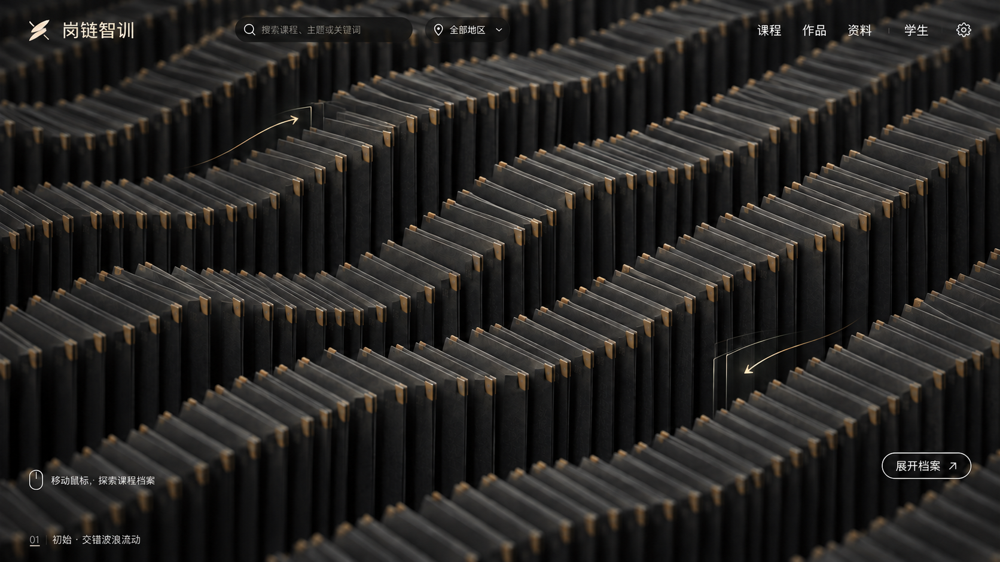
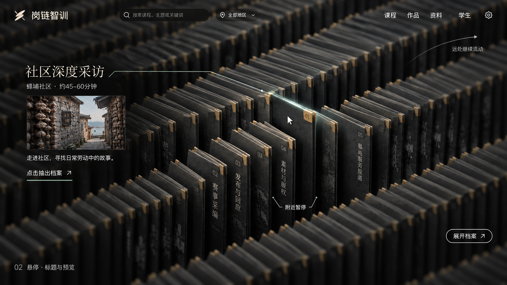
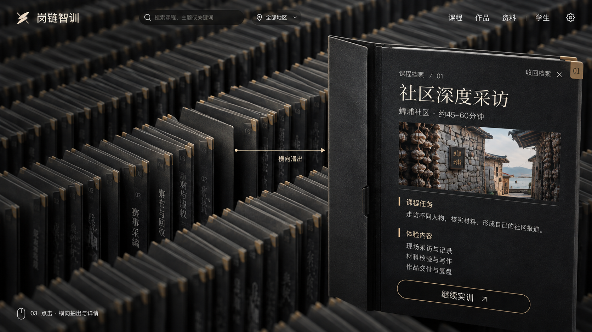

# 黑色档案首页 · 交互设计稿

日期：2026-09-13。**用户已确认本稿并授权精细复刻。下列三图仍是静态设计基准，不能冒充运行截图。** 风格沿黑色A方案深化，完整提示词见[生成提示词](生成提示词.md)，使用内置Image Gen。实现与比对记录见[复刻规格](复刻规格.md)。

## 1. 已确认的交互方向

用户提出黑色档案阵列：初始时大量文件夹交替形成波浪式移动；鼠标移到某处文件夹时暂停移动，展示标题和预览；点击后文件夹横向取出，展示详细信息。追加确认是**只暂停鼠标附近，远处继续流动**。

三张图是一套界面的连续状态，供检查波浪形态、暂停范围、抽出方向和信息层级。

## 2. 初始：交错波浪流动

画面由密集、薄而有厚度的黑色档案构成，档案边缘交替错位，形成连续波峰与波谷。此时不展示选中课程的封面、预览或详情。

静态稿用于参考空间、材质和交互层次。用户最新明确的动态规则为：逐行沿画面右下→左上、左上→右下反向连续循环，移出后从另一端接续，节奏一致；保留降低约一半的模型数量。档案保持硬质薄片，实际运动和设备负担以[复刻规格](复刻规格.md)及其链接的实现说明为准；图上的细箭头和残影仅为设计注解。

## 3. 悬停：附近停住，远处继续

光标命中的档案与邻近一小簇停止，周边较远的档案继续波动。焦点以细边缘和少量高亮辨认，目标保持在原队列中，尚未抽出。

预览只提供课程标题、地区、预计时长、小图与简短说明。轻提示“点击抽出档案”说明下一步。实现按邻近一小簇处理，远处继续流动。

## 4. 点击：横向抽出与详情

选中文件夹从原槽位**向屏幕右侧横向滑出**，稍作转向进入可读位置；原队列留下可辨的空位。课程详情位于这份档案的阅读面上，保留黑色封面与纸页边缘的物体关系。

用户已确认向右抽出，实现保留了该方向和轻微转向。箭头为设计说明，不是正式界面要显示的移动轨迹。详情展示课程任务和体验内容，并提供“继续实训”及“收回档案”。

“点击档案只打开详情，点击详情中的实训按钮才进入课程”已获用户确认并接入；查看详情本身不会开始新课或放弃当前课程。

## 5. 状态衔接提案

| 触发 | 画面变化 | 信息层级 |
| --- | --- | --- |
| 尚未指向档案 | 连续交错波动 | 保留全局入口，不显示课程详情 |
| 指向某份档案 | 附近减速至静止，远处继续 | 标题、小图及短预览 |
| 移开光标 | 原焦点区域恢复波动，预览收起 | 回到阵列浏览 |
| 点击目标 | 目标横向抽出至阅读位 | 展示该课程详细信息 |
| 收回档案 | 档案归位，收起详情 | 按当前光标位置恢复浏览或悬停 |
| 点击实训按钮 | 沿真实课程入口继续或开始 | 既有单门在学规则继续生效 |

上述交互已在工作区实现，键盘、触屏和减少动态模式一并承接。实际运行页面与检查见[黑色首页实现说明](../../doc/01-子文档/17-V3交互骨架与内容架构.md#black-archive-implementation)；本次未建立新的发布标签。

## 6. 阅读设计稿时的边界

图中波形、细箭头和残影用于表达运动方向，不能用静态图声称动画已实现。正式产品名称、Logo、课程标题与内容仍以主程序原件为准，生成图中的细字不自动成为最终文案。无名档案片形成视觉阵列，不生成虚假的课程、学生或完成进度。

任务与最新确认只在[项目规划](../../doc/02-项目规划.md)维护；此前三种方向见[初版概念](../2026-09-13-首页概念/README.md)。
