# 真实世界与学习者数字分身技术路线

> 目的：给每项智能体机制一个必要性和权威边界。模型数量不是创新；能否在真实岗位冲突中形成可追溯、可恢复、可申诉的教学后果才是创新。

## 1. 采用的技术依据

| 来源 | 对本项目的启发 | 采用边界 |
| --- | --- | --- |
| [Generative Agents](https://arxiv.org/abs/2304.03442) | 人物智能体以观察、记忆、反思和计划形成相对一致的行为 | 只用于候选行为；事实和正式后果仍由规则与世界引擎结算 |
| [MultiAgentBench](https://arxiv.org/abs/2503.01935) | 多智能体应评价协作过程、里程碑和拓扑，而不只看最终答案 | 管理员记录必要性、选中/跳过、无关调用、延迟和成本 |
| [AgentBoard](https://arxiv.org/abs/2401.13178) | 用细粒度进展和失败位置解释任务成功/失败 | 事件—任务—运行—意图—写回形成统一收据链 |
| [Embracing Imperfection](https://arxiv.org/abs/2505.19997) | 学习者模拟不能默认生成“完美学生”，应显式建模不同认知水平和真实错误 | 只模拟候选策略和过载风险，不生成学生行为或评价证据 |
| [UNESCO 生成式 AI 教育指南](https://www.unesco.org/en/articles/guidance-generative-ai-education-and-research) | 人本、隐私、伦理与教学验证优先于自动化 | 学习者模型最小化、可申诉，教师终裁，敏感属性禁推断 |
| [讯飞星辰开发指南](https://www.xfyun.cn/doc/spark/Agent03-%E5%BC%80%E5%8F%91%E6%8C%87%E5%8D%97.html) | 工作流、知识库、工具、决策节点和第三方模型可组合 | 星辰是候选执行层，不成为第二个世界事实源 |

## 2. 当前目标架构

```mermaid
flowchart LR
    Student["学生真实行动"] --> Observe["最小授权观察"]
    WorldEvent["WorldEvent 事件波"] --> Impact["受影响集合"]
    Observe --> Impact
    Impact --> Select["选择必要 Agent / NPC"]
    Select --> Candidate["规则 / 星辰 / DeepSeek 候选"]
    Candidate --> Guard["Schema + 引用 + 权限 + 预算 + 风险门"]
    Guard --> Resolve["Resolver / 教师门"]
    Resolve --> Engine["WorldEngine 唯一正式写入"]
    Engine --> Evidence["行为—作品—后果证据"]
    Evidence --> Twin["证据约束的学习者数字分身"]
    Twin --> Proxy["LearnerProxy 反事实比较"]
    Proxy --> Consent["学生同意 + 教师授权"]
    Consent --> Next["3—7 级下一场"]
    Next --> Calibrate["新行动校准预测"]
    Calibrate --> Twin
```

### 世界智能体群

- NPC 只拥有局部知识、目标、关系、承诺和可公开边界；
- 调度器根据事件影响集合选择必要子集，未受影响者必须留下“未唤醒理由”；
- Agent、NPC、星辰和 DeepSeek 只能提出候选，不能直接改世界、造证据或评分；
- 教师只在真实风险门和终裁点介入，管理员才看供应方、Trace、成本、失败和恢复。

### 学习者数字分身

- 输入只来自已终裁的真实行为、作品和世界后果；
- 每项能力同时保存支持证据、反证和不确定性；
- 预测只比较服务端签发的候选挑战，不能代替学生行动；
- 学生可查看、同意或申诉，教师授权后才能创建第二场；
- 第二场只校准预测，不反向篡改第一场分数。

因此，对外禁用“人格克隆、人格蒸馏、复制一个学生”等表述。准确说法是“证据约束的学习者能力状态 + 隔离反事实代理”。

## 3. 当前实现与关键缺口

| 模块 | 当前实现 | 缺口/调整 |
| --- | --- | --- |
| 权威世界 | 事件溯源、版本/哈希门、幂等收据、恢复和教师门 | 保持，不再让新模型形成旁路写入 |
| 人物与冲突 | 十名人物内容清单；三名关键人物有九结局多轮 Episode | 扩展前先证明新增人物会改变信息、关系或职业后果，拒绝无用聊天 |
| 多智能体过程 | 受影响集合、选择/跳过、AgentTask/Run/Intent 和管理员收据 | 将过程指标从日志转成“协作必要性、里程碑、无关调用、越权、成本”的可读结论 |
| 学习者代理 | 六维证据、四个 3—7 级候选、双同意门、申诉和校准 | 增加“容易犯的真实错误/过度完美输出”反例门，继续禁止敏感人格推断 |
| 模型供应方 | DeepSeek 受控 Live；星辰 Handler 已接公共启动链 | 缺少已发布星辰工作流 ID/ServiceID、版本与真实调用收据 |
| 消融 | 单智能体、固定多智能体、事件驱动群的协议和证据底座存在 | 只报告过程指标和失败结果；不达门时不得宣称多智能体更优 |

## 4. 下一轮技术优先级

1. 冻结一个星辰工作流实例，输入输出严格匹配现有结构化候选契约；
2. 让管理员页把运行收据翻译成协作质量，而不是增加原始日志；
3. 将学习者模型投影到岗位能力图谱和下一场机制变化，并保留不确定性和申诉；
4. 为 LearnerProxy 增加“过度完美、无证据自信、敏感属性推断、候选外建议”的拒绝测试；
5. 新增 Agent 或 NPC 前必须写明其独有观察、可改变变量和未唤醒条件。
