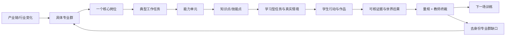

# 专业群—岗位—任务—评价设计依据

> 目的：用职业教育标准约束课程，不把普通案例包装成岗位实训。

## 1. 采用的权威来源

| 来源 | 采用内容 |
| --- | --- |
| [教育部：融媒体技术与运营专业教学标准（高职专科）](https://www.moe.gov.cn/s78/A07/zcs_ztzl/2017_zt06/17zt06_bznr/bznr_zyjyzyjxbz/gdzyjy_zk/zk_xwcbdl/xwcbdl_gbysl/202502/P020250207548141306012.pdf) | 真实生产项目、典型工作任务、项目式/情境式教学，以及采编、运营、审核、视听和数据能力 |
| [全媒体运营师国家职业标准（2023 年版）](https://www.mohrss.gov.cn/xxgk2020/fdzdgknr/rcrs_4225/jnrc/202312/W020231205397300830298.pdf) | 信息加工、匹配、分发、传播和反馈；创意策划、视听运营、直播运营、流量运营、数据分析等职业方向 |
| [教育部关于深化职业教育教学关键要素改革的意见](https://www.moe.gov.cn/srcsite/A07/zcs_zhgg/202602/t20260212_1428773.html) | 破解职教与行业产业脱节、专业课程适配性不足；企业岗位课程转化为学校课程，专业、课程、教材、教师和实训联动 |
| [教育部：职业教育专业简介问答](https://www.moe.gov.cn/jyb_xwfb/s271/202209/t20220907_659060.html) | 从岗位任务分析提炼职业能力，推进岗课赛证综合育人 |

## 2. 本项目要解决的职教痛点

1. 实训被做成步骤演示，学生很少面对有限信息、冲突目标、延迟后果和真实返工；
2. 课程知识与岗位任务分离，完成章节不等于能胜任岗位；
3. 评价偏结果或教师印象，缺少行为、作品、证据和后果的同源链；
4. 个性化往往只是推荐资源，不能根据真实工作行为改变下一场机制；
5. 专业群负责人看不到学生共性缺口怎样反馈课程与培养方案。

## 3. 课程设计的强制逻辑

任一新章节都必须能沿这条链回答：它训练哪项真实工作任务、需要什么知识与技能、学生做什么、怎样留下证据、错误会造成什么后果、结果如何改变下一次训练。答不出来的事件、卡片、日志或 Agent 不进入主链。

## 4. 对当前设计的修正

| 当前设计 | 依据后的判断 | 修正方向 |
| --- | --- | --- |
| 旗舰世界聚焦融媒体记者 | 符合“一专业群、一岗位”方向，但专业群名称尚未绑定真实院校设置 | 先确认目标专业群正式名称；核心岗位统一称“融媒体记者（全媒体采编岗位）”，全媒体运营师标准作为能力依据之一 |
| 四门课程共 60 条知识 | 达到数量门，但数量本身不是专业质量 | 旗舰高风险知识优先绑定标准页码/条款和复核角色；迁移课程不继续为凑数扩张 |
| 六维学习者模型与第二场 | 比普通资源推荐更接近“千生千面” | 将六维明确映射岗位能力单元，并让机制变化可被学生感知和复盘 |
| 教师看因果，管理员看全日志 | 角色边界正确 | 新增的专业群聚合视图应面向教师/专业负责人，不把管理员技术日志搬过去 |
| 世界冲突丰富 | 有利于岗位感，但部分机制可能只增加热闹 | 每个冲突必须改变信息、关系、时效、作品要求、风险门或评价证据中的至少一项 |

## 5. 专业群反馈的最小产品形态

未来“专业群建设”输出不应是大模型凭空写培养方案，而应由去身份聚合证据生成：

- 岗位任务覆盖率：哪些典型任务已被课程和作品覆盖；
- 能力缺口分布：支持、反证和不确定样本分别有多少；
- 课程缺口：哪些知识/技能经常在世界后果中暴露但课程支架不足；
- 建议变更：增加、调整或合并哪项学习任务，并附对应证据和来源；
- 人工审批：专业负责人确认、驳回或要求补证后才能成为培养方案建议。

这能把“学生创新反哺专业建设”落到数据链上，同时避免用单个学生画像推断整个专业群。
