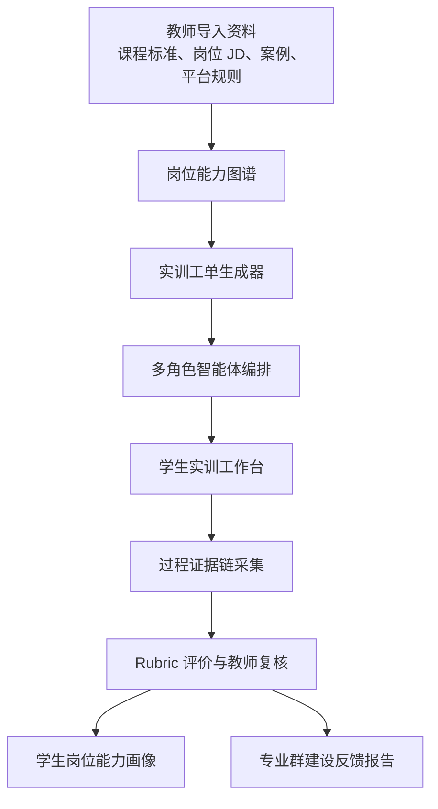

# 融媒职训 Agent Studio 项目企划书（v0.2）

面向智能融媒体内容生产与治理专业群的岗位实训智能体开发平台

赛题编号：XA-202603  
赛题名称：面向职业教育高水平专业群建设的教学实训与岗位技能智能体开发  
发榜单位：科大讯飞  
拟申报单位：浙江传媒学院学生团队

## 一、项目概述

### 1.1 项目名称

融媒职训 Agent Studio：面向智能融媒体内容生产与治理专业群的岗位实训智能体开发平台

### 1.2 一句话定义

本项目面向中高职数字媒体、网络新闻与传播、融媒体技术与运营等相关专业群，构建“岗位能力图谱 - 实训工单生成 - 多角色智能体协作 - 过程证据评价 - 专业群改进反馈”的平台型系统，让教师能够把真实融媒体内容生产与治理岗位任务，快速转化为可训练、可评价、可复用的智能体实训项目。

### 1.3 项目边界声明

本项目不是做一个宽泛的职业教育问答助手，也不是就业指导工具。它的核心对象是职业教育中的“专业群实训”，核心任务是帮助教师和专业负责人把岗位技能转化为实训智能体，并沉淀为专业群建设证据。

本项目选择“智能融媒体内容生产与治理岗位群”作为样板场景，原因有三点：

1. 与浙江传媒学院新闻传播学、艺术学（戏剧与影视）、信息与通信工程、公共管理学等省一流学科基础有天然关联。
2. 与职业教育中的数字媒体、网络新闻与传播、融媒体技术与运营、广播影视节目制作等专业方向有明确对应关系。
3. 与当前 AIGC 内容生产、事实核查、版权合规、平台审核、舆情风险识别等岗位变化高度相关，便于形成真实可信的实训任务。

### 1.4 推荐定位

如果最终只保留一个主方案，本方案更适合作为主申报方向。它比单一场景更贴合“高水平专业群建设”和“智能体开发”，也更容易展示科大讯飞所关注的产品化、平台化和可迁移价值。

## 二、核心洞察

### 2.1 痛点分析：职业院校不是缺 AI 工具，而是缺可落地的岗位实训体系

痛点一：岗位变化很快，课程实训更新很慢。  
融媒体岗位已经从“会剪辑、会发布”扩展到选题策划、AIGC 辅助生产、事实核查、版权审查、平台规则判断、传播风险预判等复合任务，但很多实训仍停留在作品制作层面，缺少完整岗位流程。

痛点二：教师难以把岗位要求转化为工单化训练。  
职业教育强调任务驱动和项目化教学，但真实岗位任务往往是模糊的、跨环节的。教师需要拆岗位、拆能力点、写任务书、设计评价表，耗时很高，且不同教师之间标准不稳定。

痛点三：内容治理能力在教学中经常被边缘化。  
学生可能会做视频、写文案、生成图片，但不一定理解事实核查、版权来源、平台审核、舆情风险和公共传播责任。内容治理不是“作品完成后的检查”，而应成为融媒体岗位训练的一部分。

痛点四：实训评价常看结果，不看过程证据。  
作品好看不代表岗位能力达标。职业教育更需要看到学生如何选题、如何引用来源、如何修改风险提示、如何协作完成任务。缺少过程证据，教师很难判断学生真实能力。

痛点五：实训成果没有反哺专业群建设。  
高水平专业群建设不仅要有课堂工具，还要能形成课程调整、能力短板、岗位变化、实训资源建设等反馈。本项目要把学生训练数据和任务执行证据转化为专业群改进建议。

### 2.2 预期改善目标

以下指标作为项目试点目标，后续需要通过职业院校教师访谈和样例班级试用继续校准。

| 痛点 | 解决方式 | 试点目标 |
| --- | --- | --- |
| 岗位任务转化成本高 | 岗位能力图谱自动拆解，生成实训工单和 Rubric | 教师设计一套实训任务的时间减少 40% 以上 |
| 实训任务缺乏岗位真实性 | 引入真实岗位 JD、平台规则、内容治理案例和课程标准 | 每个样板工单至少对应 3 类真实来源 |
| 内容治理训练薄弱 | 建立事实核查、版权合规、平台风险、舆情判断智能体 | 学生提交物中的风险项识别覆盖率达到 80% |
| 评价只看最终作品 | 建立过程证据链，记录输入、修改、引用、审核意见 | 每个学生形成一份岗位能力画像 |
| 专业群建设缺少反馈 | 汇总实训结果，输出课程缺口和能力短板报告 | 形成 1 份样板专业群改进建议报告 |

### 2.3 数据与资料支撑

| 支撑类别 | 当前状态 | 用法 |
| --- | --- | --- |
| 赛题要求 | 已确认核心题目为 XA-202603，发榜单位为科大讯飞 | 确定项目必须服务职业教育、专业群、实训、岗位技能、智能体开发 |
| 浙江传媒学院学科基础 | 已核到“十四五”省一流学科：新闻传播学 A 类、艺术学（戏剧与影视）A 类、信息与通信工程 B 类、公共管理学 B 类 | 支撑融媒体、视听生产、智能技术、公共传播治理的交叉优势 |
| 职业教育专业方向 | 待继续采集专业教学标准、人才培养方案、课程标准 | 支撑“高水平专业群”而不是单课工具 |
| 岗位资料 | 待采集融媒体编辑、内容审核、AIGC 运营、版权审核等岗位 JD | 支撑岗位能力图谱和实训工单真实性 |
| 平台规则与治理案例 | 待采集短视频平台社区规则、版权规则、事实核查案例 | 支撑内容治理智能体 |
| 对标材料 | 已独立整理挑战杯、中国国际大学生创新大赛、揭榜挂帅等赛事的年份、主题、赛道和相关案例 | 支撑项目定位、创新点和评审策略 |

## 三、相关赛事调研与本项目定位

本节基于挑战杯、中国国际大学生创新大赛和中国青年科技创新“揭榜挂帅”擂台赛的公开信息独立整理，不再沿用其他团队企划书中的获奖项目表。我们重点关注年份、赛事主题、赛道类别和与本项目的相关性。

### 3.1 相关赛事语境

| 年份 | 赛事 | 主题/导向 | 赛道/类别 | 对本项目的启示 |
| --- | --- | --- | --- | --- |
| 2025 | 中国国际大学生创新大赛 | 主题为“我敢闯，我会创” | 主体赛事含高教主赛道、青年红色筑梦之旅、职教赛道、产业赛道、萌芽赛道 | 申报材料要讲清真实需求、成果转化、合规真实性 |
| 2025 | 中国国际大学生创新大赛 | 职教赛道强调推进职业教育领域创新创业教育改革，培养技术赋能、跨界融合的新时代大国工匠 | 职教赛道，分创意组和创业组 | 职教项目必须突出岗位技能、真实工序和原型实效 |
| 2025 | 第十九届“挑战杯”全国大学生课外学术科技作品竞赛 | “人工智能+”专项赛关注 AI 与经济社会各领域融合 | “人工智能+”专项赛应用赛，研究方向含“人工智能+教育教学” | AI+教育教学是明确竞赛语境，但不能停留在泛教育助手 |
| 2025 | 中国青年科技创新“揭榜挂帅”擂台赛 | 聚焦关键核心技术、社会重大问题和现实问题，由企事业单位提出需求、团队揭榜打擂 | 新一代信息技术领域，21 个榜题，设学生赛道和青年科技人才赛道 | 必须精准回应发榜需求，准备原型、样例数据和可验证结果 |
| 2026 | 中国青年科技创新“揭榜挂帅”擂台赛 | 发榜单位为科大讯飞，题目指向职业教育高水平专业群建设 | 新一代信息技术领域，XA-202603 | 本项目必须围绕职业教育实训、岗位技能和智能体开发 |

### 3.2 可对标案例

| 年份 | 赛事 | 赛道/类别 | 奖项/类别 | 项目名称 | 院校 | 对本项目的启示 |
| --- | --- | --- | --- | --- | --- | --- |
| 2025 | 中国国际大学生创新大赛 | 职教赛道 | 金奖 | 光影BOX--影视光效生态聚合解决方案创导者 | 上海市曹杨职业技术学校 | 影视/媒体类项目在职教赛道可以成立，但必须有具体工具、流程和应用对象 |
| 2025 | 中国国际大学生创新大赛 | 职教赛道 | 金奖 | AI智媒时代商业创意广告的破局者 | 浙江同济科技职业学院 | AI 智媒已有相关项目，不能再泛泛讲“AI+媒体”，必须切到职业教育实训评价 |
| 2025 | 中国国际大学生创新大赛 | 职教赛道 | 金奖 | 绯想云盾--基于光流多模态的 AI 视频审查安全卫士 | 武汉信息传播职业技术学院 | 视频审查已有产业工具型路径，本项目要差异化为教学训练、岗位能力和专业群建设 |
| 2025 | 中国国际大学生创新大赛 | 职教赛道 | 金奖 | 灵犀智检--新一代工业智能检测方案的开拓者 | 天津职业大学 | 职教赛道高奖项目往往抓住真实工序和岗位技能，不是泛教育叙事 |
| 2025 | 中国国际大学生创新大赛 | 职教赛道 | 金奖 | 智轨灯塔--基于多模态 AI 算法的数智化轨道安全防护系统 | 南京铁道职业技术学院 | 多模态 AI 项目需要明确对象、部署场景和评价指标 |
| 2025 | 第十九届“挑战杯” | “人工智能+”专项赛应用赛 | 研究方向 | 人工智能+教育教学 | 赛事方向 | AI+教育要落到具体教学流程、学习证据和可验证原型 |
| 2025 | 中国青年科技创新“揭榜挂帅”擂台赛 | 新一代信息技术领域 | 主擂台赛，21 个榜题 | 同领域榜题群 | 多发榜单位 | 同领域竞争密度高，必须让项目与科大讯飞榜题强绑定 |

### 3.3 揭榜挂帅奖项机制对本项目的启示

2025 年新一代信息技术领域学生赛道拟授擂主 21 个、特等奖 72 个、一等奖 92 个、二等奖 111 个、三等奖 132 个、优胜奖 53 个。该领域共 21 个榜题，学生赛道擂主数量也为 21 个，说明“擂主”基本对应每个榜题中最被发榜方认可的最高解决方案。

因此，本项目不能只按“能获奖”的标准设计，而要按“冲特等奖、争擂主”的标准倒推：

| 目标层级 | 对项目的要求 |
| --- | --- |
| 特等奖级 | 选题边界清楚，职业教育场景真实，原型可演示，智能体链条完整，有基础调研和样例工单 |
| 擂主级 | 在特等奖基础上，进一步具备职业院校试点反馈、科大讯飞能力结合点、可复用平台结构和明确推广路径 |

对融媒职训 Agent Studio 而言，擂主级关键不在“功能多”，而在能否证明：它真正解决科大讯飞榜题中“高水平专业群建设、教学实训、岗位技能、智能体开发”之间的断裂问题。

### 3.4 独立调研后的判断

1. “AI+媒体”已经不是新鲜标签。职教赛道中已经出现商业创意广告、影视光效、AI 视频审查等相关项目，因此本项目不能只靠融媒体题材取胜。
2. “内容审查工具”也不是空白方向。我们要避开单纯产业审核工具路线，把内容治理转化为职业教育中的岗位训练、过程证据和技能评价。
3. 职教赛道高奖项目更强调真实工序。我们的核心表达应从“做一个平台”改为“让教师把一个真实岗位转化为可训练、可评价、可复用的实训工单”。
4. 揭榜挂帅更看重发榜响应。项目必须紧扣科大讯飞题目中的职业教育、高水平专业群、教学实训、岗位技能和智能体开发五个关键词。

### 3.5 本项目定位

本项目不与同学的非遗垂类大模型路线竞争，也不复制已有的 AI 智媒、视频审查或影视工具项目。它的定位是：以智能融媒体内容生产与治理岗位群为样板，把浙江传媒学院的新闻传播、影视艺术、智能媒体技术和公共传播治理能力，转译为职业院校可使用的岗位实训智能体开发平台。

因此，本项目的关键差异不是“媒体题材”，而是“职业教育训练体系”：岗位工单、智能体协作、过程证据链、Rubric 评价和专业群反馈。

## 四、学科对标与职业教育落点

### 4.1 浙江传媒学院学科能力转译

| 浙传学科基础 | 可转译能力 | 对应职业教育训练场景 |
| --- | --- | --- |
| 新闻传播学 A 类 | 选题策划、事实核查、传播伦理、平台传播 | 融媒体编辑、内容运营、新闻采编、平台账号运营 |
| 艺术学（戏剧与影视）A 类 | 视听表达、镜头语言、剪辑叙事、影像审美 | 短视频制作、节目策划、数字影像制作 |
| 信息与通信工程 B 类 | 智能媒体技术、音视频处理、AIGC 工具链 | AIGC 内容生成、素材处理、智能审核辅助 |
| 公共管理学 B 类 | 公共传播、风险治理、舆情判断、应急沟通 | 内容治理、平台合规、公共议题传播 |

### 4.2 职业教育对应专业与岗位群

本项目优先对接以下职业教育专业方向：

| 专业方向 | 对应岗位 | 实训任务示例 |
| --- | --- | --- |
| 数字媒体技术 | AIGC 内容制作员、短视频制作、素材管理员 | 生成短视频脚本、制作素材包、完成版权标注 |
| 网络新闻与传播 | 融媒体编辑、事实核查编辑、新媒体运营 | 热点选题判断、信息来源核验、平台发布方案 |
| 融媒体技术与运营 | 账号运营、数据运营、平台内容审核助理 | 多平台内容适配、评论风险识别、传播数据复盘 |
| 广播影视节目制作 | 编导助理、剪辑助理、制片助理 | 分镜设计、素材管理、成片初审 |

### 4.3 为什么这才是“职业教育”

职业教育的重点不是“帮学生找工作”，也不是“给专科院校做工具”。它强调的是技术技能人才培养，尤其是把真实岗位任务转化为课程、实训、评价和证书能力。本项目的关键设计单位不是“学生问题”，而是“岗位工单”。

因此，本项目会把每个训练任务都拆成：

1. 对应岗位。
2. 对应能力点。
3. 对应课程模块。
4. 对应实训工单。
5. 对应智能体角色。
6. 对应评价 Rubric。
7. 对应过程证据。
8. 对应专业群反馈。

## 五、解决方案

### 5.1 产品架构

### 5.2 核心模块

| 模块 | 功能 | 展示重点 |
| --- | --- | --- |
| 岗位能力图谱 | 将岗位 JD、课程标准和平台规则拆解为能力点 | 图谱节点、能力层级、岗位匹配关系 |
| 实训工单生成器 | 自动生成任务书、提交物、时间线、评分 Rubric | 工单模板、任务流程、评价表 |
| 智能体编排台 | 配置选题导师、事实核查员、版权审核员、平台审核员、复盘教练等角色 | 多智能体协作过程 |
| 学生实训工作台 | 学生按工单完成选题、内容生成、核查、修改和提交 | 过程记录、提交物、修改轨迹 |
| 证据链评价系统 | 记录来源、提示词、引用、修改、审核意见和最终作品 | 证据链时间轴 |
| 专业群反馈报告 | 汇总班级能力短板，输出课程和实训资源改进建议 | 专业群建设仪表盘 |

### 5.3 样板工单设计

| 工单名称 | 对应岗位 | 任务说明 | 智能体配置 | 主要评价维度 |
| --- | --- | --- | --- | --- |
| AIGC 短视频选题策划与合规审查 | 融媒体编辑、内容审核助理 | 围绕公共议题设计短视频方案，并完成事实核查和平台风险判断 | 选题导师、事实核查员、平台审核员 | 选题价值、事实准确性、风险识别、表达策略 |
| 城市文旅账号内容生产工单 | 新媒体运营、短视频制作 | 生成城市文旅短视频脚本、分镜、素材清单和版权说明 | 编导助理、版权审核员、审美教练 | 视听表达、素材合规、传播适配 |
| 突发公共议题信息核验工单 | 事实核查编辑、舆情分析助理 | 对网络传言进行来源追踪、证据评级和澄清稿撰写 | 核查员、舆情观察员、编辑教练 | 证据质量、判断逻辑、公共表达 |
| 多平台发布与复盘工单 | 账号运营、数据运营 | 将同一内容适配不同平台，并根据模拟数据完成复盘 | 平台策略师、数据分析员、复盘教练 | 平台适配、数据解释、改进建议 |

### 5.4 与科大讯飞能力的结合点

本项目适合接入科大讯飞的大模型、语音识别、文本生成、智能体编排和知识库能力。可展示的结合点包括：

1. 课程资料、岗位资料和规则资料的 RAG 检索。
2. 教师语音讲解转写为结构化实训补充材料。
3. 学生作品和过程材料的智能初评。
4. 多角色智能体围绕同一工单协作。
5. 生成可追溯的评价报告和能力画像。

## 六、核心创新点

### 6.1 从“AI 助教”转向“岗位工单智能体开发平台”

多数职业教育 AI 项目容易停留在答疑、批改、推荐资料。本项目把智能体的单位设置为“岗位工单”，教师不是调用一个助手，而是在开发一套可复用的岗位训练系统。

### 6.2 建立“岗位 - 课程 - 工单 - 证据 - 评价”的结构化链条

项目不是只生成内容，而是把岗位能力、课程模块、实训任务、过程证据和评价 Rubric 绑定起来，回应高水平专业群建设对课程体系和评价体系的要求。

### 6.3 将内容治理嵌入融媒体生产过程

内容治理不再是作品提交后的附加检查，而是贯穿选题、生成、核查、发布、复盘全过程。学生在训练中同时学习“会做内容”和“会判断内容能不能发、该不该发、怎样发”。

### 6.4 用过程证据链解决职业技能评价难题

系统不仅保存最终作品，还记录来源选择、事实核查、版权说明、AI 使用痕迹、风险提示、修改记录和教师复核意见。这比单纯打分更符合岗位技能评价需要。

### 6.5 让实训数据反哺专业群建设

通过班级和任务维度的能力统计，系统可以输出课程短板、岗位能力缺口和实训资源建设建议，使项目从课堂工具上升为专业群建设工具。

### 6.6 形成可迁移的专业群样板

本项目以融媒体内容生产与治理为样板，但“岗位能力图谱 + 工单智能体 + 证据链评价”的方法可迁移到电商运营、数字文旅、智能制造、养老服务等其他职业教育专业群。

## 七、项目相似性与对标优势

### 7.1 与已调研同类方向的关系

| 对比对象 | 已有项目/赛道特点 | 本项目差异 |
| --- | --- | --- |
| 职教赛道影视工具类项目 | 如 2025 中国国际大学生创新大赛职教赛道金奖“光影BOX”，强调影视光效工具和产业对象 | 本项目不做单一影视工具，而是做岗位工单、智能体协作和技能评价 |
| AI 智媒内容生产类项目 | 如 2025 职教赛道金奖“AI智媒时代商业创意广告的破局者”，强调 AI 与商业创意广告 | 本项目不以广告生产为核心，而以融媒体内容治理岗位群的实训体系为核心 |
| AI 视频审查类项目 | 如 2025 职教赛道金奖“绯想云盾”，偏视频审查安全工具 | 本项目不只做审核工具，而是训练学生如何完成事实核查、版权合规、平台风险判断 |
| 挑战杯 AI+教育教学方向 | 强调人工智能与教育教学融合 | 本项目把 AI+教育落到职业教育专业群、工单实训和岗位技能评价 |
| 揭榜挂帅新一代信息技术领域 | 2025 年同领域 21 个榜题，强调发榜需求和擂台展示 | 本项目紧扣科大讯飞 XA-202603，突出可演示原型和试点路径 |

### 7.2 与相关赛事评审偏好的对标优势

| 评审偏好 | 本项目优势 |
| --- | --- |
| 真实问题清楚 | 对准职业院校教师实训设计、技能评价、专业群反馈三类问题 |
| 技术链条完整 | 覆盖资料导入、岗位能力图谱、工单生成、多智能体协作、证据链评价、专业群报告 |
| 展示与验证明确 | 可展示图谱、工单流、智能体协作界面、能力画像和专业群仪表盘 |
| 职教表达充分 | 以岗位、工序、能力点、Rubric 和教师复核组织项目，而不是泛教育叙事 |
| 赛题响应度高 | 直接回应职业教育、高水平专业群、教学实训、岗位技能和智能体开发 |

### 7.3 与普通职业教育 AI 项目的差异

| 常见项目 | 问题 | 本项目做法 |
| --- | --- | --- |
| 职教问答助手 | 只覆盖答疑，不覆盖实训过程 | 以岗位工单组织训练 |
| 就业指导助手 | 偏简历、面试、岗位推荐 | 训练学生在校内获得岗位能力 |
| 自动批改系统 | 只看作业结果 | 记录完整过程证据 |
| 通用实训平台 | 场景过宽，缺少特色 | 聚焦智能融媒体内容治理岗位群 |

## 八、预期成果

### 8.1 系统成果

1. 融媒职训 Agent Studio 原型系统 1 套。
2. 智能融媒体内容生产与治理岗位能力图谱 1 套。
3. 样板实训工单 4 个。
4. 多角色智能体模板 6 到 8 个。
5. 过程证据链评价模型 1 套。
6. 专业群建设反馈报告模板 1 套。
7. 演示视频 1 支，展示教师端、学生端、评价端和专业群反馈端完整流程。

### 8.2 内容成果

| 成果 | 数量目标 | 说明 |
| --- | --- | --- |
| 岗位资料样本 | 30 到 50 条 | 融媒体编辑、AIGC 运营、内容审核、版权审核等岗位 |
| 课程与标准资料 | 5 到 10 份 | 专业教学标准、课程大纲、实训任务书 |
| 平台规则资料 | 10 到 20 条 | 社区规范、版权规则、内容审核案例 |
| 典型案例库 | 20 到 30 个 | 事实核查、版权争议、平台风险、传播复盘案例 |
| 评价 Rubric | 4 套 | 对应四类样板工单 |

### 8.3 预期效果指标

| 指标 | 目标值 | 说明 |
| --- | --- | --- |
| 实训工单设计效率 | 提升 40% 以上 | 以教师从零设计任务书和评价表的时间为对比 |
| 风险识别覆盖率 | 达到 80% | 在样例任务中识别事实、版权、平台规则、舆情风险 |
| 过程证据完整率 | 达到 85% | 每个任务至少记录来源、修改、审核、提交和复盘 |
| 教师初评负担 | 减少 40% | 系统生成初评和证据摘要，教师进行复核 |
| 学生能力画像可读性 | 试用教师满意度达到 80% | 通过 2 到 3 名教师访谈或问卷验证 |
| 专业群反馈产出 | 形成 1 份报告 | 输出课程短板、实训资源建设和岗位能力改进建议 |

## 九、预期效应

### 9.1 对学生

学生不只是完成一个作品，而是经历完整岗位流程。系统帮助学生理解内容生产的上下游关系，形成“会策划、会生产、会核查、会合规、会复盘”的复合能力。

### 9.2 对教师

教师可以更快生成任务书、评分表和示例材料，并通过证据链减少重复性评价工作。系统保留教师最终复核权，避免 AI 直接替代教学判断。

### 9.3 对专业群

系统把实训结果转化为专业群建设材料，包括课程缺口、学生能力短板、岗位变化趋势和资源库建设建议，服务高水平专业群建设。

### 9.4 对发榜单位

项目能展示讯飞大模型、语音识别、RAG、智能体编排和教育场景落地能力，且具备从一个样板专业群扩展到多个职业教育专业群的产品化潜力。

## 十、赛题贴合度评估

| 赛题关键词 | 贴合度 | 说明 |
| --- | --- | --- |
| 职业教育 | 高 | 面向中高职和职业本科相关专业群 |
| 高水平专业群建设 | 高 | 输出专业群能力图谱和建设反馈报告 |
| 教学实训 | 高 | 以实训工单作为核心产品单位 |
| 岗位技能 | 高 | 从岗位 JD 和真实任务拆解能力点 |
| 智能体开发 | 高 | 教师可配置多角色智能体和任务模板 |
| 新一代信息技术 | 高 | 使用大模型、RAG、语音识别、智能体编排和数据分析 |

综合判断：本方案贴题性强、平台价值高、可扩展性好。主要挑战是需要在短时间内把样板工单做扎实，避免平台概念过大。

## 十一、风险与应对

| 风险 | 表现 | 应对 |
| --- | --- | --- |
| 概念过大 | 平台功能太多，演示不聚焦 | 只做融媒体内容治理样板，先跑通 4 个工单 |
| 职业院校数据不足 | 缺真实课程和岗位材料 | 优先利用河北及周边职业院校资源访谈，补充公开标准和岗位资料 |
| 内容治理规则变化快 | 平台规则动态更新 | 把规则作为可替换知识库，不写死在系统中 |
| AI 评价可信度不足 | 教师不认可自动评分 | AI 只做初评和证据摘要，教师保留复核权 |
| 展示不够直观 | 平台逻辑强但视觉冲击弱 | 做能力图谱、协作台、证据链时间轴和仪表盘四类可视化 |

## 十二、实施计划

| 阶段 | 时间 | 任务 |
| --- | --- | --- |
| 第一阶段：资料采集与需求确认 | 第 1 到 2 周 | 采集岗位 JD、课程标准、平台规则，访谈 2 到 3 名职业院校教师 |
| 第二阶段：知识结构与工单设计 | 第 3 到 4 周 | 完成岗位能力图谱、4 个样板工单和 Rubric |
| 第三阶段：原型开发 | 第 5 到 7 周 | 开发教师端、学生端、智能体协作和证据链模块 |
| 第四阶段：试用与优化 | 第 8 到 9 周 | 邀请教师和学生试用，修正工单和评价逻辑 |
| 第五阶段：申报材料与演示 | 第 10 周 | 完成企划书、PPT、演示视频和答辩脚本 |

## 十三、团队分工建议

| 角色 | 任务 |
| --- | --- |
| 项目负责人 | 把控赛题贴合度、项目边界、答辩逻辑和外部沟通 |
| 产品与文档组 | 完成需求访谈、工单设计、企划书、PPT 和演示脚本 |
| 技术开发组 | 完成知识库、智能体编排、前后端原型和数据统计 |
| 内容与规则组 | 采集岗位资料、课程资料、平台规则和案例库 |
| 视觉与演示组 | 设计界面、流程图、能力画像、演示视频 |
| 试点联络组 | 对接河北及周边职业院校资源，组织访谈和试用反馈 |

## 十四、经费预算

| 项目 | 预算 | 说明 |
| --- | --- | --- |
| 大模型与语音 API | 500 到 800 元 | 用于 RAG、智能体协作、语音转写和评价摘要 |
| 云服务器与数据库 | 300 到 500 元 | 原型部署和知识库测试 |
| 数据采集与标注 | 200 到 400 元 | 岗位资料整理、案例标注、规则结构化 |
| 演示视频与视觉材料 | 300 到 500 元 | 录屏、剪辑、界面包装 |
| 调研交通与沟通 | 300 到 600 元 | 职业院校访谈和试用沟通 |
| 合计 | 1600 到 2800 元 | 可根据实际资源压缩 |

## 十五、结论

融媒职训 Agent Studio 的关键价值，是把“职业教育高水平专业群建设”从一个抽象口号落到岗位工单、智能体协作、技能评价和建设反馈上。它既能利用浙江传媒学院的融媒体与视听传播学科特色，又能避免只做题材包装；既能展示 AI 技术，又能回答职业教育最关心的真实问题。

本方案适合走“主项目”路线：以平台型能力回应赛题，以智能融媒体内容治理作为样板专业群，最终形成可演示、可试点、可迁移的职业教育实训智能体开发方案。
