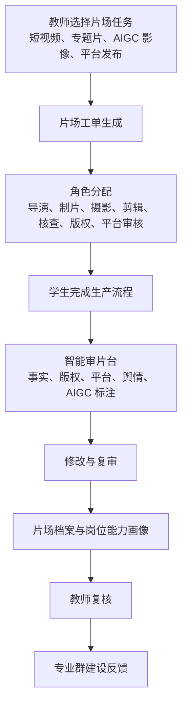

# 智审片场项目企划书（v0.2）

面向虚拟制片与融媒体内容治理岗位群的实训智能体

赛题编号：XA-202603  
赛题名称：面向职业教育高水平专业群建设的教学实训与岗位技能智能体开发  
发榜单位：科大讯飞  
拟申报单位：浙江传媒学院学生团队

## 一、项目概述

### 1.1 项目名称

智审片场：面向虚拟制片与融媒体内容治理岗位群的实训智能体

### 1.2 一句话定义

本项目以“模拟虚拟片场”为实训媒介，将短视频、融媒体节目、AIGC 影像和平台发布流程转化为职业教育岗位工单，配置导演、制片、摄影、剪辑、事实核查、版权合规、平台审核等多角色智能体，让学生在一个可视化片场中完成内容生产、治理审查和岗位评价。

### 1.3 项目边界声明

本项目不是单纯做虚拟制片工具，也不是影视作品生成器。它的核心是职业教育实训：通过“片场任务”训练学生在融媒体内容生产与治理中的岗位能力。

本项目聚焦三类能力：

1. 视听内容生产能力：脚本、分镜、拍摄计划、素材管理、剪辑说明。
2. 内容治理判断能力：事实核查、版权合规、AIGC 标注、平台规则、舆情风险。
3. 岗位协作与证据提交能力：按岗位工单完成流程记录、修改说明和评价材料。

### 1.4 推荐定位

如果希望项目更有浙传气质、更容易在答辩现场展示画面感，本方案有优势。它比方案一更像一个“可进入的训练场景”，但也更容易被误解成影视工具。因此申报时必须反复强调：片场只是媒介，职业教育岗位实训才是核心。

## 二、核心洞察

### 2.1 痛点分析：职业院校影视与融媒体训练常常“会做片，不会审片”

痛点一：学生重作品效果，轻岗位流程。  
在数字媒体和影视制作类实训中，学生往往把精力放在成片上，但对选题依据、素材来源、版权授权、平台规则、传播风险等流程性要求理解不足。

痛点二：虚拟制片与 AIGC 工具进入课堂后，治理问题更复杂。  
AIGC 让脚本、图片、视频、配音和剪辑效率提升，但也带来版权归属、虚假信息、肖像权、风格挪用、平台限流和审核风险。职业教育不能只教“怎么生成”，还要教“怎么判断生成物是否可用”。

痛点三：影视制作实训成本高，岗位角色难完整模拟。  
真实片场需要设备、场地、人员和时间，职业院校很难频繁组织完整流程训练。学生可能只体验某一环节，缺少导演、制片、摄影、剪辑、审核等角色之间的协作关系。

痛点四：内容审核岗位训练缺少情境。  
如果只让学生看规则文本，训练会很枯燥。把审核放进片场流程中，学生会更清楚：每一条规则都对应实际生产决策。

痛点五：评价标准容易偏审美，缺少职业能力证据。  
影视作品好看不等于岗位能力完整。职业教育需要评价学生是否会做计划、会管素材、会查证据、会写修改说明、会复盘。

### 2.2 预期改善目标

以下指标作为项目试点目标，需要在后续样例班级试用中继续修正。

| 痛点 | 解决方式 | 试点目标 |
| --- | --- | --- |
| 片场流程训练不完整 | 用虚拟片场工单串联策划、制片、制作、审核、发布 | 任务流程提交完整率达到 80% |
| 内容治理学习枯燥 | 把事实核查、版权合规、平台审核嵌入片场节点 | 风险识别覆盖率达到 80% |
| 实训成本高 | 用智能体模拟多岗位协作和教师初评 | 教师组织一次流程训练的准备时间减少 40% |
| 评价偏最终作品 | 建立素材来源、修改记录、审核意见证据链 | 每组形成一份完整片场档案 |
| 专业群建设缺反馈 | 汇总班级在生产与治理环节的短板 | 形成课程改进和实训资源建设建议 |

### 2.3 数据与资料支撑

| 支撑类别 | 当前状态 | 用法 |
| --- | --- | --- |
| 赛题要求 | 已确认项目需回应职业教育、专业群、教学实训、岗位技能、智能体开发 | 确定“片场”必须服务职业教育实训，而不是单纯影视创作 |
| 浙传学科基础 | 已核到新闻传播学 A 类、艺术学（戏剧与影视）A 类、信息与通信工程 B 类、公共管理学 B 类 | 支撑视听表达、智能媒体技术和公共传播治理的交叉设计 |
| 职业教育专业方向 | 待采集数字媒体、影视制作、网络新闻与传播等专业标准 | 支撑工单与课程体系对接 |
| 平台与合规规则 | 待整理版权、AIGC 标识、平台社区规范、事实核查案例 | 支撑审核智能体 |
| 对标材料 | 已独立整理挑战杯、中国国际大学生创新大赛、揭榜挂帅等赛事的年份、主题、赛道和相关案例 | 支撑项目定位和创新判断 |

## 三、相关赛事调研与本项目定位

本节基于挑战杯、中国国际大学生创新大赛和中国青年科技创新“揭榜挂帅”擂台赛的公开信息独立整理，不再沿用其他团队企划书中的获奖项目表。对智审片场而言，最重要的不是证明“影视题材能获奖”，而是证明“影视/媒体/AIGC 审查方向已有竞争，我们必须把它转化为职业教育实训系统”。

### 3.1 相关赛事语境

| 年份 | 赛事 | 主题/导向 | 赛道/类别 | 对本项目的启示 |
| --- | --- | --- | --- | --- |
| 2025 | 中国国际大学生创新大赛 | 主题为“我敢闯，我会创” | 主体赛事含高教主赛道、青年红色筑梦之旅、职教赛道、产业赛道、萌芽赛道 | 项目需要有清楚用户、原型形态、应用价值和合规真实性 |
| 2025 | 中国国际大学生创新大赛 | 职教赛道强调推进职业教育领域创新创业教育改革，培养技术赋能、跨界融合的新时代大国工匠 | 职教赛道，分创意组和创业组 | 片场必须变成岗位技能训练场，而不是影视创作展示 |
| 2025 | 第十九届“挑战杯”全国大学生课外学术科技作品竞赛 | “人工智能+”专项赛关注 AI 与经济社会各领域融合 | “人工智能+”专项赛应用赛，研究方向含“人工智能+教育教学” | AI+教育要落到教学流程、学习证据和可验证原型 |
| 2025 | 中国青年科技创新“揭榜挂帅”擂台赛 | 聚焦关键核心技术、社会重大问题和现实问题，由企事业单位提出需求、团队揭榜打擂 | 新一代信息技术领域，21 个榜题，设学生赛道和青年科技人才赛道 | 智审片场必须与科大讯飞榜题强绑定，而不是自选影视工具 |
| 2026 | 中国青年科技创新“揭榜挂帅”擂台赛 | 发榜单位为科大讯飞，题目指向职业教育高水平专业群建设 | 新一代信息技术领域，XA-202603 | 本项目必须围绕职业教育实训、岗位技能和智能体开发 |

### 3.2 可对标案例

| 年份 | 赛事 | 赛道/类别 | 奖项/类别 | 项目名称 | 院校 | 对智审片场的启示 |
| --- | --- | --- | --- | --- | --- | --- |
| 2025 | 中国国际大学生创新大赛 | 职教赛道 | 金奖 | 光影BOX--影视光效生态聚合解决方案创导者 | 上海市曹杨职业技术学校 | 影视相关项目在职教赛道可成立，但要有明确工具链和产业对象 |
| 2025 | 中国国际大学生创新大赛 | 职教赛道 | 金奖 | AI智媒时代商业创意广告的破局者 | 浙江同济科技职业学院 | AI 智媒已有项目，我们不能只讲 AI 内容生产，而要加入岗位训练与评价 |
| 2025 | 中国国际大学生创新大赛 | 职教赛道 | 金奖 | 绯想云盾--基于光流多模态的 AI 视频审查安全卫士 | 武汉信息传播职业技术学院 | 视频审查已有产业安全路线，智审片场要转向“审查能力怎么教、怎么练、怎么评” |
| 2025 | 中国国际大学生创新大赛 | 职教赛道 | 金奖 | 灵犀智检--新一代工业智能检测方案的开拓者 | 天津职业大学 | 职教高奖项目往往围绕真实岗位工序，智审片场也应围绕片场工序和审核工序 |
| 2025 | 第十九届“挑战杯” | “人工智能+”专项赛应用赛 | 研究方向 | 人工智能+教育教学 | 赛事方向 | 片场智能体应服务教学，而不是只做生产效率工具 |
| 2025 | 中国青年科技创新“揭榜挂帅”擂台赛 | 新一代信息技术领域 | 主擂台赛，21 个榜题 | 同领域榜题群 | 多发榜单位 | 擂台赛更重视需求响应和现场展示，智审片场需要强演示和强贴题 |

### 3.3 揭榜挂帅奖项机制对本项目的启示

2025 年新一代信息技术领域学生赛道拟授擂主 21 个、特等奖 72 个、一等奖 92 个、二等奖 111 个、三等奖 132 个、优胜奖 53 个。该领域共 21 个榜题，学生赛道擂主数量也为 21 个，说明“擂主”基本对应每个榜题中最被发榜方认可的最高解决方案。

因此，智审片场不能只追求“现场展示好看”，而要按“冲特等奖、争擂主”的标准设计：

| 目标层级 | 对智审片场的要求 |
| --- | --- |
| 特等奖级 | 片场任务清楚，职业教育场景真实，分镜板、审片台、风险标记和能力画像可演示 |
| 擂主级 | 在特等奖基础上，进一步证明片场工单能服务职业院校专业群建设，并能接入科大讯飞智能体/知识库/语音能力 |

对本方案而言，擂主级风险在于被看成影视工具。必须反复强调：片场只是实训媒介，目标是训练岗位技能并形成可评价证据。

### 3.4 独立调研后的判断

1. 影视、智媒和视频审查方向都已经有获奖参照，说明方向可行，也说明竞争不小。
2. 智审片场不能被写成“AI 视频生成”或“视频审核工具”，否则会和已有项目撞车。
3. 本项目的差异化应放在职业教育：学生如何在片场任务中学习导演助理、制片助理、内容审核助理、平台运营等岗位技能。
4. 答辩展示可以强调片场界面、分镜板、审片台和风险标记，但评价逻辑必须回到工单、证据链、Rubric 和教师复核。

### 3.5 本项目定位

智审片场不是重复非遗题材，也不是普通影视工具。它的定位是：以虚拟片场为媒介，把浙传的影视制作、融媒体传播、智能媒体技术和内容治理能力，转化为职业院校可使用的岗位实训智能体。

因此，本项目的关键差异不是“片场好看”，而是“片场可训练”：每一个镜头、素材、审核意见和修改记录，都能对应职业岗位能力和教学评价证据。

## 四、学科对标与职业教育落点

### 4.1 浙江传媒学院学科能力转译

| 浙传学科基础 | 可转译能力 | 在智审片场中的体现 |
| --- | --- | --- |
| 艺术学（戏剧与影视）A 类 | 导演思维、镜头语言、影像叙事、制片流程 | 虚拟片场、分镜板、拍摄计划、成片初审 |
| 新闻传播学 A 类 | 选题判断、事实核查、传播伦理、平台传播 | 选题审查、来源核验、发布策略 |
| 信息与通信工程 B 类 | 音视频技术、智能媒体处理、AIGC 工具链 | AIGC 素材生成、元数据管理、智能审核 |
| 公共管理学 B 类 | 公共议题判断、风险治理、舆情沟通 | 舆情风险标注、公共表达建议、危机传播复盘 |

### 4.2 职业教育对应专业与岗位群

| 职业教育专业方向 | 对应岗位 | 片场实训任务 |
| --- | --- | --- |
| 广播影视节目制作 | 导演助理、制片助理、剪辑助理 | 脚本拆解、分镜制作、拍摄计划、素材归档 |
| 数字媒体技术 | AIGC 素材制作、数字资产管理 | 生成素材、标注来源、检查版权与元数据 |
| 网络新闻与传播 | 融媒体编辑、事实核查编辑 | 判断选题真实性、核查信息来源、撰写发布说明 |
| 融媒体技术与运营 | 平台运营、内容审核助理 | 多平台适配、审核风险识别、数据复盘 |

### 4.3 职业教育体现方式

本项目把“片场”拆成岗位训练单元，而不是让学生自由创作。每个任务都明确：

1. 岗位身份：学生扮演导演助理、制片助理、审核助理等角色。
2. 工作任务：完成脚本、分镜、素材表、审查表、发布方案。
3. 提交证据：每一步都要提交来源、修改说明和判断理由。
4. 智能体协作：系统用不同岗位智能体给出建议和审核意见。
5. 教师评价：教师根据 Rubric 复核学生岗位能力。
6. 专业群反馈：系统汇总班级短板，反哺课程和实训项目建设。

## 五、解决方案

### 5.1 产品架构

### 5.2 核心模块

| 模块 | 功能 | 展示重点 |
| --- | --- | --- |
| 虚拟片场任务台 | 教师选择或生成片场实训任务 | 任务卡、岗位卡、流程地图 |
| 分镜与素材工作区 | 学生完成脚本、分镜、素材清单、拍摄计划 | 分镜板、素材库、元数据 |
| 多角色片场智能体 | 导演、制片、摄影、剪辑、核查、版权、平台审核等角色协作 | 角色意见流 |
| 智能审片台 | 对作品和过程材料进行事实、版权、平台、舆情风险检查 | 风险标记、证据来源、修改建议 |
| 片场档案 | 保存完整任务过程和提交物 | 证据链、版本记录、审核记录 |
| 岗位能力画像 | 根据 Rubric 输出个人和小组能力报告 | 能力雷达图、短板分析 |

### 5.3 样板任务设计

| 任务名称 | 对应岗位 | 任务说明 | 智能体角色 | 评价维度 |
| --- | --- | --- | --- | --- |
| 城市公共议题短视频片场 | 编导助理、事实核查编辑 | 围绕公共议题完成脚本、分镜、素材和发布说明 | 导演、核查员、平台审核员 | 选题判断、事实准确、公共表达、平台风险 |
| AIGC 文旅宣传片片场 | 制片助理、数字资产管理员 | 使用 AIGC 辅助完成文旅短片方案，并完成版权和素材说明 | 制片、版权官、审美教练 | 素材来源、视觉统一、版权合规 |
| 校园突发信息澄清片场 | 融媒体编辑、舆情分析助理 | 对模拟网络传言进行核验，制作澄清短视频 | 核查员、舆情观察员、剪辑指导 | 证据质量、表达清晰、风险控制 |
| 多平台发布审片任务 | 内容审核助理、平台运营 | 将同一视频适配不同平台，完成审核和发布策略 | 平台审核员、运营教练、数据分析员 | 平台适配、标签策略、复盘能力 |

### 5.4 智能体角色配置

| 智能体 | 主要职责 |
| --- | --- |
| 导演智能体 | 判断故事结构、镜头逻辑和表达效果 |
| 制片智能体 | 检查任务进度、素材清单、人员分工和交付完整性 |
| 摄影指导智能体 | 给出构图、镜头运动、光线和拍摄建议 |
| 剪辑教练智能体 | 检查节奏、转场、字幕和叙事连贯性 |
| 事实核查智能体 | 要求学生提供来源，判断证据等级和事实风险 |
| 版权合规智能体 | 检查素材来源、AIGC 标注、授权和引用说明 |
| 平台审核智能体 | 根据平台规则判断标题、画面、话题和评论风险 |
| 复盘教练智能体 | 汇总问题，生成修改清单和能力画像 |

## 六、核心创新点

### 6.1 把“片场”变成职业教育岗位训练媒介

项目不是模拟一个好看的影视场景，而是把片场拆成岗位、任务、证据和评价。学生在片场中学习的是职业流程，而不是只交一个作品。

### 6.2 将虚拟制片与内容治理合并训练

现有实训往往把影视制作和内容审核分开。本项目把二者放在同一任务链中，让学生理解内容生产从一开始就要考虑真实性、版权、平台规则和传播风险。

### 6.3 多角色智能体还原岗位协作关系

系统不是一个单一 AI 老师，而是用多个岗位智能体模拟片场协作。每个智能体代表一个职业角色，学生必须在多方意见中做判断和修改。

### 6.4 用片场档案沉淀过程证据

每个任务都会形成片场档案，包括脚本版本、分镜板、素材清单、来源说明、审核意见、修改记录和最终作品。这为职业技能评价提供可复核证据。

### 6.5 让浙传影视学科特色服务职业教育

项目利用浙传影视与融媒体优势，但不是做本科艺术创作项目，而是把这些优势转化为职业院校可使用的实训范式。

### 6.6 视觉呈现强，适合答辩展示

相比纯平台型方案，智审片场更容易做出直观界面：虚拟片场、分镜板、素材库、审片台、风险标记和能力画像都适合短时间展示。

## 七、项目相似性与对标优势

### 7.1 与已调研同类方向的关系

| 对比对象 | 已有项目/赛道特点 | 智审片场差异 |
| --- | --- | --- |
| 职教赛道影视工具类项目 | 如 2025 中国国际大学生创新大赛职教赛道金奖“光影BOX”，强调影视光效工具和产业对象 | 智审片场不只展示影视工具，而是把片场拆成岗位工单、提交物和评价证据 |
| AI 智媒内容生产类项目 | 如 2025 职教赛道金奖“AI智媒时代商业创意广告的破局者”，强调 AI 内容生产与商业创意 | 智审片场把内容生产和治理审查放在同一流程中训练 |
| AI 视频审查类项目 | 如 2025 职教赛道金奖“绯想云盾”，偏视频审查安全工具 | 智审片场强调“审查能力如何教学化”，包括事实核查、版权合规、平台审核和教师复核 |
| 挑战杯 AI+教育教学方向 | 强调人工智能与教育教学融合 | 智审片场将 AI+教育落到职业院校影视与融媒体实训课堂 |
| 揭榜挂帅新一代信息技术领域 | 2025 年同领域 21 个榜题，强调发榜需求和擂台展示 | 智审片场通过强可视化场景回应科大讯飞职业教育实训智能体题目 |

### 7.2 与相关赛事评审偏好的对标优势

| 评审偏好 | 智审片场的优势 |
| --- | --- |
| 真实问题清楚 | 对准职业院校影视与融媒体实训中“生产强、治理弱”的问题 |
| 技术链条完整 | 覆盖片场工单、角色智能体、素材证据、智能审片、修改复核和能力画像 |
| 展示与验证明确 | 片场界面、分镜板、审片台、风险标记和片场档案适合答辩展示 |
| 职教表达充分 | 每个任务都绑定岗位身份、提交物、Rubric 和教师复核 |
| 赛题响应度高 | 以职业教育岗位技能训练为中心，不把片场做成自选影视工具 |

### 7.3 与普通影视 AI 项目的差异

| 常见项目 | 问题 | 本项目做法 |
| --- | --- | --- |
| AI 视频生成器 | 只生成作品，不训练岗位能力 | 以片场工单组织训练 |
| 虚拟制片演示 | 偏技术展示，离教学评价较远 | 每个流程都有提交物和 Rubric |
| 内容审核工具 | 偏规则判断，缺少生产语境 | 把审核嵌入脚本、素材、发布流程 |
| 影视教学平台 | 偏课程资源，缺少智能体协作 | 用多角色智能体还原岗位协作 |

## 八、预期成果

### 8.1 系统成果

1. 智审片场原型系统 1 套。
2. 虚拟片场任务台 1 套。
3. 智能审片台 1 套。
4. 样板片场任务 4 个。
5. 岗位智能体角色 8 个。
6. 片场档案与过程证据链模板 1 套。
7. 岗位能力画像与教师复核报告模板 1 套。
8. 项目演示视频 1 支。

### 8.2 内容成果

| 成果 | 数量目标 | 说明 |
| --- | --- | --- |
| 片场任务脚本 | 4 套 | 对应公共议题、文旅宣传、信息澄清、多平台发布 |
| 审核规则库 | 30 到 50 条 | 包括事实、版权、平台、舆情、AIGC 标注 |
| 素材元数据模板 | 1 套 | 记录素材来源、用途、授权、生成方式 |
| Rubric 评价表 | 4 套 | 对应四类任务 |
| 片场档案样例 | 4 份 | 用于答辩和试点展示 |

### 8.3 预期效果指标

| 指标 | 目标值 | 说明 |
| --- | --- | --- |
| 流程提交完整率 | 达到 80% | 学生按要求提交脚本、分镜、素材表、审查表、修改说明 |
| 内容风险识别覆盖率 | 达到 80% | 覆盖事实、版权、平台、舆情、AIGC 标注等风险 |
| 教师准备时间 | 减少 40% | 系统生成任务工单、角色提示和评价表 |
| 片场档案完整率 | 达到 85% | 每组形成可复核的过程证据 |
| 试用满意度 | 达到 80% | 通过教师和学生问卷或访谈获取 |
| 专业群反馈产出 | 形成 1 份报告 | 指出课程训练缺口和资源建设方向 |

## 九、预期效应

### 9.1 对学生

学生从“交一个视频”转向“完成一次岗位协作任务”。他们会在片场中理解导演、制片、剪辑、审核、运营等岗位如何协作，也会学会为每个生产决策提供证据。

### 9.2 对教师

教师可以用片场工单快速组织课堂实训，减少准备任务、解释规则和整理评价材料的重复劳动。教师仍负责最终判断，系统负责提供初评、证据摘要和修改建议。

### 9.3 对职业院校专业群

项目可帮助数字媒体、影视制作、网络传播、融媒体运营等专业群建立共同实训平台，让不同课程围绕同一片场任务协作，提升专业群内部课程关联度。

### 9.4 对发榜单位

项目能展示科大讯飞在教育场景中的多模态、智能体、语音和知识库能力。片场场景直观，适合做演示，也适合继续扩展到虚拟仿真实训和职业技能评价产品。

## 十、赛题贴合度评估

| 赛题关键词 | 贴合度 | 说明 |
| --- | --- | --- |
| 职业教育 | 高 | 面向职业院校影视、数字媒体、融媒体相关专业 |
| 高水平专业群建设 | 中高 | 可作为专业群共同实训平台，但需补充专业群反馈模块 |
| 教学实训 | 高 | 以片场任务和岗位工单组织实训 |
| 岗位技能 | 高 | 明确对应导演助理、制片助理、审核助理、运营等岗位 |
| 智能体开发 | 高 | 多角色岗位智能体协作 |
| 新一代信息技术 | 高 | 使用大模型、AIGC、知识库、智能审核和多模态处理 |

综合判断：本方案展示力强、浙传特色明显、答辩可视化优势突出。主要短板是平台普适性略弱于方案一，因此需要在申报中把“智审片场”定义为智能融媒体内容治理专业群的样板实训场，而不是单一影视工具。

## 十一、风险与应对

| 风险 | 表现 | 应对 |
| --- | --- | --- |
| 被误解为影视生成工具 | 评委认为偏离职业教育 | 所有材料都以岗位工单、实训评价和专业群反馈为中心 |
| 视觉展示强但教育深度不足 | 看起来好看，但像演示片 | 每个界面都绑定岗位能力点和评价 Rubric |
| 审核规则不够权威 | 内容治理判断缺来源 | 引入平台规则、版权规范、事实核查案例，并保留出处 |
| 开发工作量偏大 | 虚拟片场界面可能耗时 | 先做二维流程化片场，不做复杂 3D 场景 |
| 试点资源不足 | 缺职业院校真实反馈 | 优先联系河北及周边职业院校教师，做小范围访谈和试用 |

## 十二、实施计划

| 阶段 | 时间 | 任务 |
| --- | --- | --- |
| 第一阶段：需求与规则采集 | 第 1 到 2 周 | 采集专业教学标准、岗位资料、平台规则和审核案例 |
| 第二阶段：任务与角色设计 | 第 3 到 4 周 | 完成 4 个片场任务、8 个智能体角色和 Rubric |
| 第三阶段：原型开发 | 第 5 到 7 周 | 开发片场任务台、分镜素材区、智能审片台和档案模块 |
| 第四阶段：试用优化 | 第 8 到 9 周 | 邀请教师和学生试用，修正规则、界面和评价逻辑 |
| 第五阶段：申报与演示 | 第 10 周 | 完成企划书、PPT、演示视频和答辩脚本 |

## 十三、团队分工建议

| 角色 | 任务 |
| --- | --- |
| 项目负责人 | 控制赛题贴合度、项目边界、答辩逻辑 |
| 产品设计组 | 设计片场任务、岗位工单、用户流程和界面结构 |
| 技术开发组 | 开发原型、知识库、智能体协作和审片规则模块 |
| 内容规则组 | 整理影视流程、平台规则、版权案例和事实核查案例 |
| 视觉演示组 | 制作片场界面、分镜样例、演示视频和 PPT |
| 试点联络组 | 对接职业院校教师，获取试用反馈和应用证明 |

## 十四、经费预算

| 项目 | 预算 | 说明 |
| --- | --- | --- |
| 大模型与语音 API | 500 到 800 元 | 智能体协作、文本生成、语音转写、审核摘要 |
| 云服务器与数据库 | 300 到 500 元 | 原型部署和规则库测试 |
| 视觉与素材制作 | 400 到 800 元 | 片场界面、分镜素材、演示样片 |
| 数据采集与标注 | 200 到 400 元 | 规则、案例、岗位资料整理 |
| 调研沟通 | 300 到 600 元 | 职业院校访谈和试用 |
| 合计 | 1700 到 3100 元 | 可根据实际开发范围压缩 |

## 十五、结论

智审片场的核心价值，是把浙传最有辨识度的影视与融媒体优势，转化为职业教育可训练、可评价、可展示的岗位实训场景。它不是重复越剧题材，也不是做一个泛泛的职业教育助手，而是抓住“虚拟制片 + 内容治理 + 岗位工单”这个交叉点，形成足够清楚的创新媒介。

本方案适合走“展示型样板”路线：用强画面和强场景吸引评委，再用职业教育工单、证据链和 Rubric 证明项目不是概念展示，而是能服务高水平专业群建设的实训智能体。
